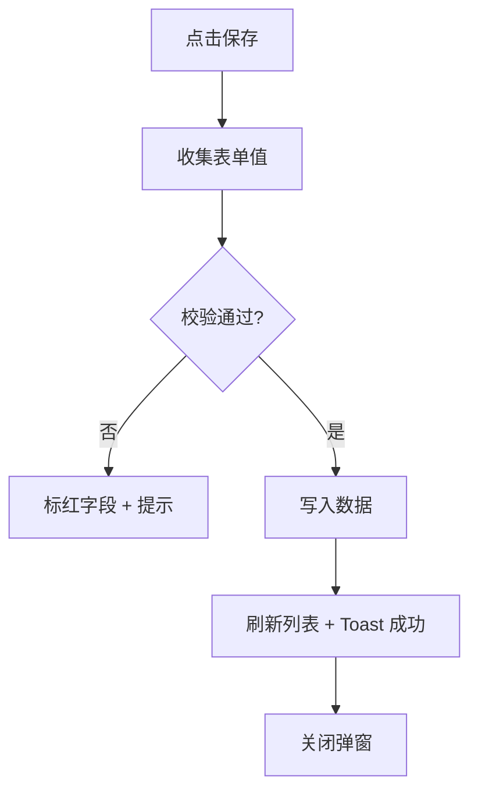

# 表单组件

弹窗表单与行内表单。样式见 [css-styles.md](../css-styles.md) §表单，模态框见 [modal.md](modal.md)。

## 字段布局

```html
<div class="grid grid-cols-1 md:grid-cols-2 gap-4">
  <div>
    <label class="block text-sm font-medium text-neutral-600 mb-1">
      <span class="text-danger">*</span> 名称
    </label>
    <input type="text" id="fieldName" class="erp-input" placeholder="请输入名称">
    <p class="text-xs text-danger mt-1 hidden" id="fieldNameError">名称不能为空</p>
  </div>
</div>
```

## 输入类型

| 类型 | 元素 | 类名 |
|------|------|------|
| 文本 | `<input type="text">` | `erp-input` |
| 数字 | `<input type="number">` | `erp-input` |
| 下拉 | `<select>` | `erp-input` |
| 日期 | `<input type="date">` | `erp-input` |
| 日期时间 | `<input type="datetime-local">` | `erp-input` |
| 多行 | `<textarea>` | `erp-input` |

## 校验规则

1. 提交前统一校验，失败时字段标红 + 显示错误文案
2. 必填字段标签加红色 `*`
3. 校验通过后才关闭弹窗 / 提交数据
4. 错误信息具体化（"名称不能为空"，不写"校验失败"）

## 提交流程


