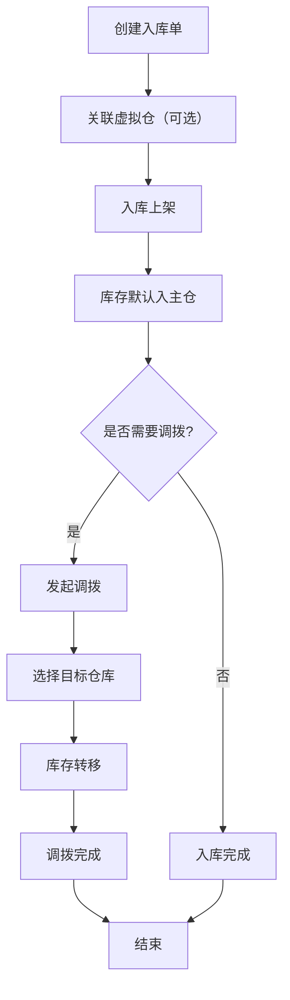
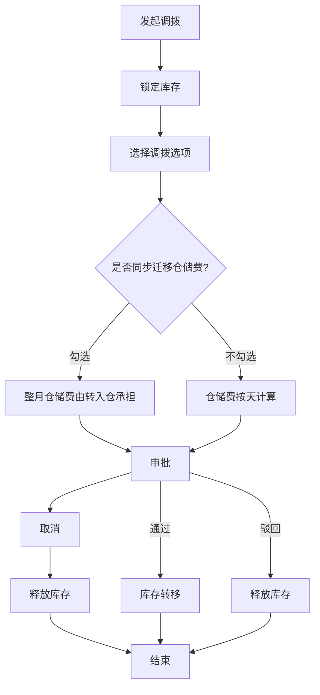
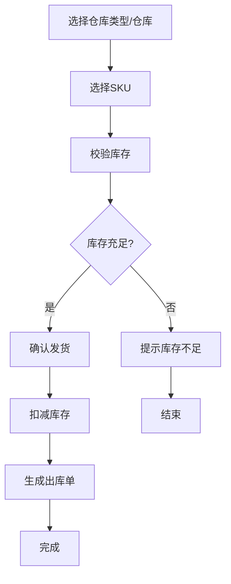
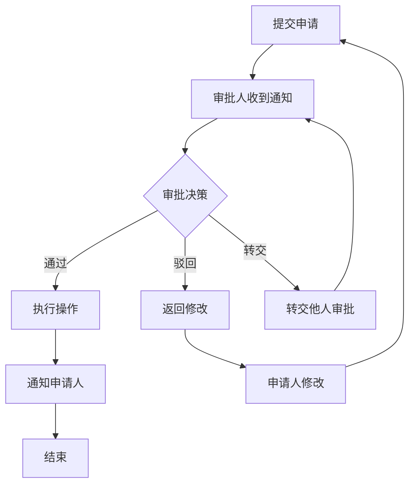
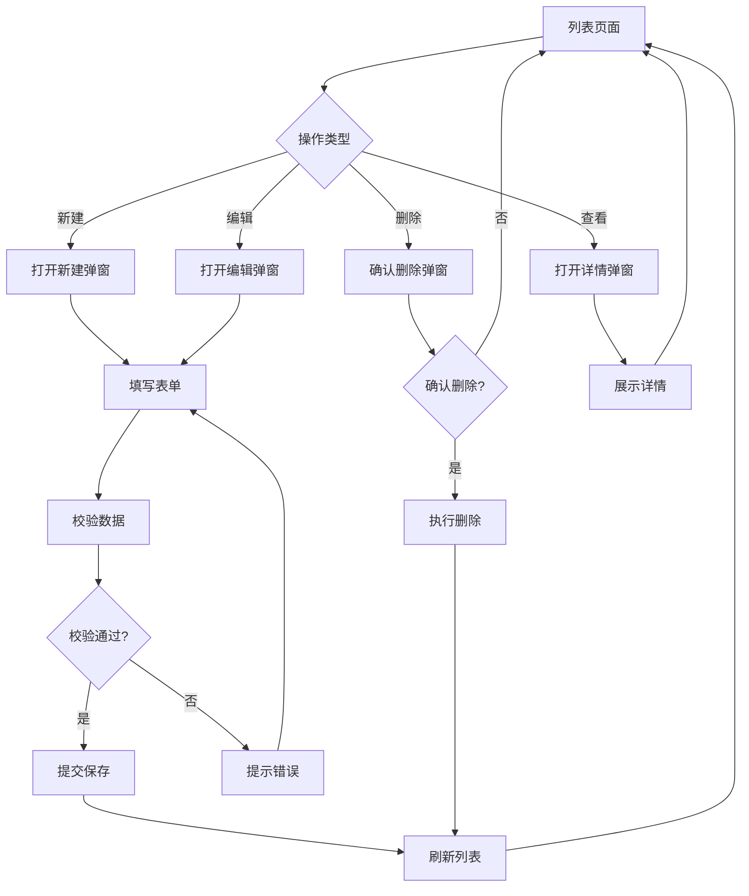

# PRD 文档规范

本文件定义TOB产品的 PRD（产品需求文档）规范，确保所有模块的 PRD 文档保持一致的结构和质量。

> **说明**：本文档中的示例内容仅供参考，实际使用时请替换为具体业务内容。

## 1. 文档基本信息

每个 PRD 文档开头应包含以下基本信息：

```markdown
# [模块名称] PRD

| 版本 | 日期 | 变更内容 | 变更人 | 审核人 | 备注 |
|------|------|----------|--------|--------|------|
| V1.0 | YYYY-MM-DD | 初始版本 | [变更人] | [审核人] | - |

---
```

## 2. 文档结构

### 2.1 完整目录结构

```
1. Executive Summary 执行摘要
   1.1 Problem Statement 问题陈述
   1.2 Proposed Solution 解决方案
   1.3 Success Criteria 成功指标

2. User Experience & User Flows 用户体验与用户流程
   2.1 User Personas 用户画像
   2.2 User Journey Map 用户旅程图
   2.3 User Flows 用户流程

3. Functional Modules 功能模块
   3.0 功能清单汇总
   3.1 [模块名称1]
   3.2 [模块名称2]
   ...

4. Functional Logic Details 功能模块详细逻辑
   4.1 [模块名称1]
   4.2 [模块名称2]
   ...
```

## 3. Executive Summary 执行摘要

### 3.1 Problem Statement 问题陈述

描述当前业务面临的问题和痛点。

```markdown
### Problem Statement 问题陈述

面向业务：[业务领域]，
现状：[当前情况描述]
痛点：[具体痛点列表]
```

**示例**：
```markdown
### Problem Statement 问题陈述

面向业务：海外仓业务，
现状：客户库存统一归属在公司层面，无法按部门细分管理。
痛点：部门无法独立运营、查询库存、调配发货，导致库存管理混乱、账单无法分部门结算。
```

### 3.2 Proposed Solution 解决方案

描述解决方案的核心要点。

```markdown
### Proposed Solution 解决方案

1、[解决方案要点1]
2、[解决方案要点2]
...
```

**示例**：
```markdown
### Proposed Solution 解决方案

1、构建虚拟仓管理系统，支持客户自建组织架构（公司→部门），为每个部门关联独立虚拟仓库。
2、虚拟仓通过库位实现逻辑隔离，支持部门内/部门间库存调拨，按部门生成发货账单。
```

### 3.3 Success Criteria 成功指标

定义可量化的成功指标。

```markdown
### Success Criteria 成功指标

| 指标 | 目标值 |
|------|--------|
| [指标名称] | [目标值] |
```

**示例**：
```markdown
### Success Criteria 成功指标

| 指标 | 目标值 |
|------|--------|
| 库存查询响应时间 | < 500ms（万级SKU） |
| 数据隔离准确率 | 100%（无跨部门数据泄露） |
| 调拨处理时间 | < 2s |
| 账单生成准确率 | 100% |
| 系统可用性 | >= 99.9% |
```

## 4. User Experience & User Flows 用户体验与用户流程

### 4.1 User Personas 用户画像

定义目标用户角色。

```markdown
### User Personas 用户画像

| 角色 | 描述 | 目标 | 痛点 |
|------|------|------|------|
| [角色名称] | [角色描述] | [用户目标] | [用户痛点] |
```

**示例**：
```markdown
### User Personas 用户画像

| 角色 | 描述 | 目标 | 痛点 |
|------|------|------|------|
| 公司管理员 | 公司级账号，管理整体业务 | 查看所有部门库存、统筹调配 | 无法按部门查看库存、无法分部门结算 |
| 部门运营 | 部门级账号，负责日常运营 | 管理本部门虚拟仓、发货操作 | 库存无法隔离、发货无法独立 |
| 仓库操作员 | 执行出入库操作 | 根据虚拟仓指令操作实体库存 | 库存归属不清、操作混乱 |
| 财务人员 | 负责账单结算 | 按部门导出发货账单 | 无法按部门出账单、结算困难 |
```

### 4.2 User Journey Map 用户旅程图

使用 Mermaid 绘制用户旅程图。

```markdown
### User Journey Map 用户旅程图

\`\`\`mermaid
graph TD
    A["[步骤1]"] --> B["[步骤2]"]
    B --> C["[步骤3]"]
    ...
\`\`\`
```

**示例**：
```markdown
### User Journey Map 用户旅程图

\`\`\`mermaid
graph TD
    A["创建部门/关联账号"] --> B["创建虚拟仓"]
    B --> C["入库单关联"]
    C --> D["库存调拨"]
    D --> E["库存管理"]
    E --> F["发货出库"]
    F --> G["账单结算"]
\`\`\`
```

### 4.3 User Flows 用户流程

详细描述核心业务流程。

```markdown
#### 4.3.1 [流程名称]

\`\`\`mermaid
graph TD
    A["[步骤1]"] --> B["[步骤2]"]
    B --> C{"[判断条件]"}
    C -->|"是"| D["[分支1]"]
    C -->|"否"| E["[分支2]"]
    ...
\`\`\`

**流程说明**：
- [说明1]
- [说明2]
```

**示例**：
```markdown
#### 4.3.1 入库流程

\`\`\`mermaid
graph TD
    A["创建入库单"] --> B["关联虚拟仓（可选）"]
    B --> C["入库上架"]
    C --> D["库存默认入主仓"]
    D --> E{"是否需要调拨?"}
    E -->|"是"| F["发起调拨"]
    E -->|"否"| G["入库完成"]
    F --> H["选择目标仓库"]
    H --> I["库存转移"]
    I --> J["调拨完成"]
\`\`\`

**流程说明**：
- 入库单创建时需要关联虚拟仓
- 入库上架后，库存默认进入主仓
- 主仓库存可以调拨到其他虚拟仓
- 调拨完成后，库存归属变更到目标仓库
```

## 5. Functional Modules 功能模块

### 5.1 功能清单汇总

使用表格汇总所有功能点。

```markdown
### 5.0 功能清单汇总

| 模块名称 | 功能点 | 功能描述 | 优先级 |
|----------|--------|----------|--------|
| [模块名] | [功能名] | [描述] | P0/P1 |
```

**优先级说明**：
- **P0（核心功能）**：系统必须实现的基础功能，影响核心业务流程
- **P1（重要功能）**：提升用户体验和系统效率的功能

**示例**：
```markdown
### 5.0 功能清单汇总

| 模块名称 | 功能点 | 功能描述 | 优先级 |
|----------|--------|----------|--------|
| 组织架构管理 | 公司管理 | 创建、查看、编辑公司信息 | P0 |
| 组织架构管理 | 部门管理 | 创建、编辑、删除部门，支持多级部门结构 | P0 |
| 虚拟仓管理 | 主仓管理 | 公司创建时自动生成主仓，支持配置 | P0 |
```

### 5.2 功能模块详细描述

每个功能模块应包含以下内容：

```markdown
### 5.X [模块名称]

**模块概述**：[模块简要描述]

**功能列表**：
```
[模块名称]
├── [子功能1]
├── [子功能2]
└── [子功能3]
```

**功能逻辑描述**：

| 按钮/操作 | 触发条件 | 约束条件 | 逻辑描述 | 预期结果 |
|-----------|----------|----------|----------|----------|
| [按钮名] | [条件] | [约束] | 1.步骤1<br>2.步骤2<br>3.步骤3 | [结果] |

**示例**：
```markdown
**功能逻辑描述**：

| 按钮/操作 | 触发条件 | 约束条件 | 逻辑描述 | 预期结果 |
|-----------|----------|----------|----------|----------|
| 新建部门 | 点击"新建部门" | 公司管理员权限 | 1.打开弹窗 2.填写信息 3.校验 4.保存 | 创建成功 |
| 编辑部门 | 点击编辑 | 公司管理员权限 | 1.预填数据 2.修改 3.保存 | 更新成功 |
| 删除部门 | 点击删除 | 无关联虚拟仓 | 1.确认 2.软删除 | 状态变为停用 |
```

## 6. Functional Logic Details 功能模块详细逻辑

### 6.1 初始化页面数据展示逻辑

```markdown
#### 6.X.1 初始化页面数据展示逻辑

| 逻辑项 | 说明 | 数据来源 | 展示规则 |
|--------|------|----------|----------|
| [逻辑项] | [说明] | [数据表] | [规则] |
```

**示例**：
```markdown
#### 6.1.1 初始化页面数据展示逻辑

| 逻辑项 | 说明 | 数据来源 | 展示规则 |
|--------|------|----------|----------|
| 部门树加载 | 页面加载时默认展示部门树形结构 | 部门表(department) | 一级部门→二级部门→三级部门，按层级缩进展示 |
| 根部门展示 | 根部门为"NBFX"，默认展开 | 部门表 | 根部门固定在顶部，不可删除 |
```

### 6.2 模块按钮逻辑

```markdown
#### 6.X.2 模块按钮逻辑

| 按钮 | 位置 | 触发动作 | 前置条件 | 后续操作 |
|------|------|----------|----------|----------|
| [按钮名] | [位置] | [动作] | [条件] | [操作] |
```

**示例**：
```markdown
#### 6.1.2 模块按钮逻辑

| 按钮 | 位置 | 触发动作 | 前置条件 | 后续操作 |
|------|------|----------|----------|----------|
| 新建部门 | 部门管理页面右上角 | 打开新建部门弹窗 | 无 | 填写表单后提交，刷新部门树 |
| 编辑 | 每行数据操作列 | 打开编辑部门弹窗，填充当前数据 | 无 | 填写表单后提交，更新部门树 |
| 删除 | 每行数据操作列 | 确认弹窗 | 是否有下级部门/关联虚拟仓 | 确认后删除，刷新部门树 |
```

### 6.3 字段取值逻辑

```markdown
#### 6.X.3 字段取值逻辑

| 字段 | 数据来源 | 取值规则 | 显示格式 |
|------|----------|----------|----------|
| [字段名] | [来源] | [规则] | [格式] |
```

**示例**：
```markdown
#### 6.1.3 字段取值逻辑

| 字段 | 数据来源 | 取值规则 | 显示格式 |
|------|----------|----------|----------|
| 部门名称 | department.name | 直接取值 | 文本显示 |
| 部门编码 | department.code | 自动生成，格式：父编码-序号 | NBFX001-01-01 |
| 虚拟仓数量 | warehouse表count | 统计该部门关联的虚拟仓数量 | 数字 |
| 创建时间 | department.create_time | 时间戳转日期 | YYYY-MM-DD |
```

### 6.4 弹窗属性描述

```markdown
#### 弹窗属性描述

| 字段 | 输入方式 | 必填 | 取值规则 |
|------|----------|------|----------|
| [字段名] | [方式] | 是/否 | [规则] |
```

**示例**：
```markdown
#### 弹窗属性描述

| 字段 | 输入方式 | 必填 | 取值规则 |
|------|----------|------|----------|
| 调出仓库 | 手工选择 | 是 | 从下拉列表选择，仅显示有库存的虚拟仓 |
| 调入仓库 | 手工选择 | 是 | 从下拉列表选择，不能与调出仓库相同 |
| SKU | 手工选择 | 是 | 从下拉列表选择，仅显示调出仓库中有库存的SKU |
| 调拨数量 | 键盘输入 | 是 | 必须大于0且不超过调出仓库中该SKU的可用数量 |
```

## 7. Markdown 格式规范

### 7.1 标题层级

```markdown
# 一级标题（文档标题）
## 二级标题（主要章节）
### 三级标题（子章节）
#### 四级标题（详细内容）
```

### 7.2 表格格式

```markdown
| 列1 | 列2 | 列3 |
|------|------|------|
| 内容1 | 内容2 | 内容3 |
```

### 7.3 代码块格式

使用三个反引号包裹代码块，并指定语言：

```markdown
\`\`\`mermaid
graph TD
    A --> B
\`\`\`

\`\`\`javascript
const x = 1;
\`\`\`
```

### 7.4 强调格式

```markdown
**粗体文本**
*斜体文本*
`行内代码`
```

### 7.5 列表格式

```markdown
- 无序列表项1
- 无序列表项2

1. 有序列表项1
2. 有序列表项2
```

## 8. Mermaid 流程图规范

### 8.1 基本语法

```markdown
\`\`\`mermaid
graph TD
    A["步骤A"] --> B["步骤B"]
    B --> C{"判断条件"}
    C -->|"是"| D["分支D"]
    C -->|"否"| E["分支E"]
\`\`\`
```

### 8.2 节点形状

| 形状 | 语法 | 用途 |
|------|------|------|
| 矩形 | `A["文本"]` | 普通步骤 |
| 圆角矩形 | `A("[文本]")` | 开始/结束 |
| 菱形 | `A{"文本"}` | 判断条件 |
| 圆形 | `A(("文本"))` | 连接点 |

### 8.3 连接线类型

| 类型 | 语法 | 用途 |
|------|------|------|
| 实线箭头 | `-->` | 默认流程 |
| 无箭头实线 | `---` | 关联关系 |
| 虚线箭头 | `-.->` | 可选流程 |
| 粗线箭头 | `==>` | 重要流程 |

### 8.4 常用流程图示例

#### 8.4.1 入库流程



#### 8.4.2 调拨流程



#### 8.4.3 出库流程



#### 8.4.4 审批流程



#### 8.4.5 CRUD操作流程



#### 8.4.6 用户旅程图


## 9. 文档评审检查清单

在提交 PRD 评审前，请确保：

- [ ] 文档基本信息完整（版本、日期、状态）
- [ ] 问题陈述清晰，痛点明确
- [ ] 解决方案具体可行
- [ ] 成功指标可量化
- [ ] 用户画像完整
- [ ] 用户流程图清晰
- [ ] 功能清单完整，优先级合理
- [ ] 功能逻辑描述详细
- [ ] 字段取值规则明确
- [ ] 文档格式规范统一
