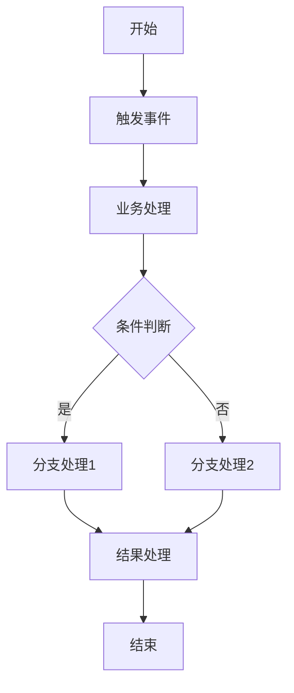
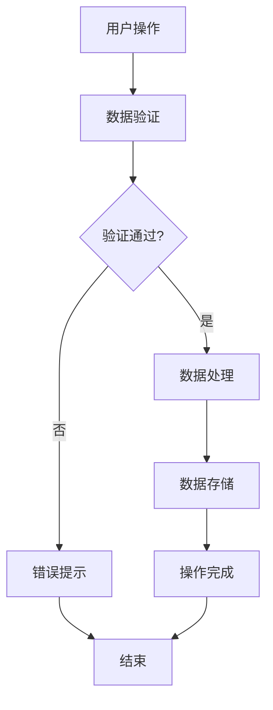
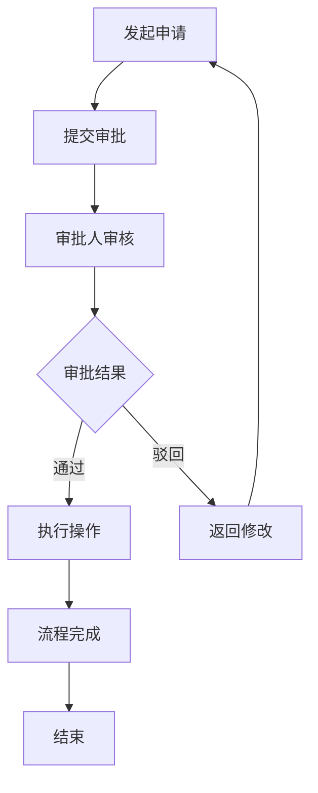

# System Design Generator

This skill generates system design components for various types of requirements by extracting design details from existing files and providing templates. It includes prototype structure, PRD documentation, and test case templates that can be adapted for different systems and modules.

## When to Use

Invoke this skill when:
- User needs to create new system components for any type of application
- User wants to extend existing system functionality
- User needs to generate PRD documentation for new features
- User needs test case templates for new functionality
- User wants to maintain consistency across system components
- User needs to standardize design and documentation processes
- User wants to accelerate development of new requirements

## System Architecture

### Core Module Structure

| Module Type | Description | Key Features |
|-------------|-------------|-------------|
| **User & Permission Management** | User accounts, roles, and access control | Multi-level permission structure, role-based access |
| **Core Business Logic** | Main business operations and workflows | Process automation, business rules enforcement |
| **Data Management** | Data storage, retrieval, and manipulation | CRUD operations, data validation, integrity |
| **Integration & API** | External system integration and API endpoints | RESTful APIs, third-party service integration |
| **Reporting & Analytics** | Data analysis and reporting capabilities | Custom reports, dashboards, data visualization |
| **System Administration** | System configuration and maintenance | Settings management, audit logs, monitoring |

### System Component Types

| Component Type | Description | Use Case |
|----------------|-------------|----------|
| **Core Components** | Essential system elements | Required for basic system functionality |
| **Extension Components** | Optional system features | Enhance system capabilities based on specific needs |
| **Integration Components** | External system connectors | Enable data exchange with other systems |
| **Custom Components** | Project-specific elements | Tailored to unique business requirements |

## Prototype Structure

### HTML Structure

```html
<!DOCTYPE html>
<html lang="zh-CN">
<head>
    <meta charset="UTF-8">
    <style>
        /* PRD Markdown 渲染样式 */
        .prose { 
            color: #374151; 
            line-height: 1.8; 
            font-size: 0.95rem;
            max-width: 100%;
        }
        .prose h1 { 
            font-size: 2rem; 
            font-weight: 700; 
            color: #1e293b; 
            margin-bottom: 1.5rem; 
            padding-bottom: 1rem; 
            border-bottom: 3px solid #2a3b7d;
            background: linear-gradient(135deg, #667eea 0%, #2a3b7d 100%);
            -webkit-background-clip: text;
            -webkit-text-fill-color: transparent;
            background-clip: text;
        }
        /* More styles... */
    </style>
    <meta name="viewport" content="width=device-width, initial-scale=1.0">
    <title>系统设计原型</title>
    <link rel="preconnect" href="https://cdn.jsdelivr.net">
    <link rel="preconnect" href="https://cdn.tailwindcss.com">
    <link href="https://cdn.jsdelivr.net/npm/font-awesome@4.7.0/css/font-awesome.min.css" rel="stylesheet" media="print" onload="this.media='all'">
    <script src="https://cdn.tailwindcss.com"></script>
    <!-- Markdown 解析库 -->
    <script src="https://cdn.jsdelivr.net/npm/marked@4/marked.min.js"></script>
    <!-- Mermaid 图表库 -->
    <script src="https://cdn.jsdelivr.net/npm/mermaid@10/dist/mermaid.min.js"></script>
    <script>
        // 初始化Mermaid
        mermaid.initialize({
            startOnLoad: true,
            theme: 'default',
            securityLevel: 'loose',
            logLevel: 3
        });
        
        // 配置Marked
        const renderer = new marked.Renderer();
        renderer.code = function(code, language) {
            if (language === 'mermaid') {
                return `<div class="mermaid-container" onclick="openMermaidModal(this)">
                    <div class="mermaid">${code}</div>
                    <span class="mermaid-hint"><i class="fa fa-search-plus mr-1"></i>点击放大</span>
                </div>`;
            }
            return `<pre><code class="language-${language}">${code}</code></pre>`;
        };
        
        marked.setOptions({
            renderer: renderer,
            breaks: true,
            gfm: true
        });
    </script>
    <script>
        tailwind.config = {
            theme: {
                extend: {
                    colors: {
                        primary: '#2a3b7d',
                        'primary-light': '#3a4ca7',
                        secondary: '#36CFC9',
                        accent: '#722ED1',
                        success: '#00B42A',
                        warning: '#FF7D00',
                        danger: '#F53F3F',
                        dark: '#1D2129',
                        'light-bg': '#FFFFFF',
                        'card-bg': '#FFFFFF',
                        border: '#E5E7EB'
                    },
                    fontFamily: {
                        inter: ['Inter', 'system-ui', 'sans-serif'],
                    },
                    boxShadow: {
                        'card': '0 2px 8px rgba(0, 0, 0, 0.05)',
                        'card-hover': '0 10px 25px -5px rgba(42, 59, 125, 0.1)',
                        'dropdown': '0 4px 16px rgba(0, 0, 0, 0.1)',
                        'header': '0 2px 4px rgba(0, 0, 0, 0.05)'
                    }
                },
            }
        }
    </script>
    <style type="text/tailwindcss">
        @layer utilities {
            .content-auto {
                content-visibility: auto;
            }
            .text-shadow {
                text-shadow: 0 2px 4px rgba(0, 0, 0, 0.1);
            }
            .btn-primary {
                @apply bg-primary text-white px-4 py-2 rounded-lg transition-all hover:bg-primary-light focus:outline-none focus:ring-2 focus:ring-primary/50 focus:ring-offset-2;
            }
            /* More utilities... */
        }
    </style>
</head>
<body class="font-sans bg-gray-50 text-neutral-800 min-h-screen">
    <!-- 切换标签 -->
    <div class="tabs fixed bottom-8 right-8 z-40">
        <button id="tab-prototype" class="tab active" onclick="switchMainTab('prototype')">原型</button>
        <button id="tab-prd" class="tab" onclick="switchMainTab('prd')">PRD</button>
        <button id="tab-testcases" class="tab" onclick="switchMainTab('testcases')">测试用例</button>
    </div>
    
    <!-- PRD 内容 -->
    <main id="main-prd" class="main-content" style="display: none;">
        <!-- PRD content structure -->
    </main>
    
    <!-- 测试用例内容 -->
    <main id="main-testcases" class="main-content" style="display: none;">
        <!-- Test cases content structure -->
    </main>
    
    <!-- 原型页面 -->
    <main id="main-prototype" class="main-content active flex-1 overflow-y-auto bg-gray-50">
        <!-- Prototype content structure -->
    </main>
</body>
</html>
```

### JavaScript Functions

```javascript
// 切换主标签
function switchMainTab(tab) {
    console.log('switchMainTab called with tab:', tab);
    var header = document.querySelector('header');
    var prototypeTabBtn = document.getElementById('tab-prototype');
    var prdTabBtn = document.getElementById('tab-prd');
    var testCasesTabBtn = document.getElementById('tab-testcases');
    var mainPrototype = document.getElementById('main-prototype');
    var mainPrd = document.getElementById('main-prd');
    var mainTestCases = document.getElementById('main-testcases');
    
    // 重置所有标签按钮状态
    prototypeTabBtn.className = 'tab';
    prdTabBtn.className = 'tab';
    testCasesTabBtn.className = 'tab';
    
    // 隐藏所有主内容
    mainPrototype.style.display = 'none';
    mainPrd.style.display = 'none';
    mainTestCases.style.display = 'none';
    
    if (tab === 'prototype') {
        header.style.display = 'block';
        prototypeTabBtn.className = 'tab active';
        mainPrototype.style.display = 'block';
        console.log('Switched to prototype tab');
    } else if (tab === 'prd') {
        header.style.display = 'none';
        prdTabBtn.className = 'tab active';
        mainPrd.style.display = 'block';
        console.log('Switched to PRD tab, calling loadPRD()');
        loadPRD();
    } else if (tab === 'testcases') {
        header.style.display = 'none';
        testCasesTabBtn.className = 'tab active';
        mainTestCases.style.display = 'block';
        console.log('Switched to test cases tab, calling loadTestCases()');
        loadTestCases();
    }
    window.scrollTo({ top: 0, behavior: 'smooth' });
}

// 加载并渲染 Markdown PRD
let prdLoaded = false;

function loadPRD() {
    if (prdLoaded) return;
    
    console.log('开始加载PRD...');
    const prdContentDiv = document.getElementById('prd-content');
    
    // 使用XMLHttpRequest加载PRD文件
    const xhr = new XMLHttpRequest();
    xhr.open('GET', 'prd.md', true);
    xhr.onreadystatechange = function() {
        if (xhr.readyState === 4) {
            if (xhr.status === 200) {
                const markdown = xhr.responseText;
                console.log('PRD内容长度:', markdown.length);
                
                try {
                    const html = marked.parse(markdown);
                    console.log('Markdown解析结果类型:', typeof html);
                    prdContentDiv.innerHTML = html;
                    
                    // 生成目录导航
                    generateTOC();
                    
                    // 重新初始化Mermaid图表
                    if (window.mermaid) {
                        setTimeout(function() {
                            const mermaidElements = prdContentDiv.querySelectorAll('.mermaid');
                            if (mermaidElements.length > 0) {
                                console.log('找到Mermaid图表数量:', mermaidElements.length);
                                mermaid.init(undefined, mermaidElements);
                            }
                        }, 100);
                    }
                    
                    prdLoaded = true;
                    console.log('PRD加载完成');
                } catch (error) {
                    console.error('Markdown解析错误:', error);
                    prdContentDiv.innerHTML = 
                        '<div class="text-center py-8">' +
                        '<i class="fa fa-exclamation-triangle text-2xl text-red-500 mb-4"></i>' +
                        '<p class="text-red-500 mb-4">解析错误: ' + error.message + '</p>' +
                        '</div>';
                }
            } else {
                console.error('加载失败:', xhr.status);
                prdContentDiv.innerHTML = 
                    '<div class="text-center py-8">' +
                    '<i class="fa fa-exclamation-triangle text-2xl text-red-500 mb-4"></i>' +
                    '<p class="text-red-500 mb-4">加载失败: HTTP ' + xhr.status + '</p>' +
                    '<button onclick="loadPRD()" class="mt-4 px-4 py-2 bg-primary text-white rounded">重试</button>' +
                    '</div>';
            }
        }
    };
    xhr.onerror = function() {
        console.error('网络错误');
        prdContentDiv.innerHTML = 
            '<div class="text-center py-8">' +
            '<i class="fa fa-exclamation-triangle text-2xl text-red-500 mb-4"></i>' +
            '<p class="text-red-500 mb-4">网络错误，无法加载PRD文件</p>' +
            '<button onclick="loadPRD()" class="mt-4 px-4 py-2 bg-primary text-white rounded">重试</button>' +
            '</div>';
    };
    console.log('发送PRD请求...');
    xhr.send();
}

// 加载并渲染 Markdown 测试用例
let testCasesLoaded = false;

function loadTestCases() {
    if (testCasesLoaded) return;
    
    console.log('开始加载测试用例...');
    const testCasesContentDiv = document.getElementById('testcases-content');
    
    // 使用XMLHttpRequest加载测试用例文件
    const xhr = new XMLHttpRequest();
    xhr.open('GET', 'test-cases.md', true);
    xhr.onreadystatechange = function() {
        if (xhr.readyState === 4) {
            if (xhr.status === 200) {
                const markdown = xhr.responseText;
                console.log('测试用例内容长度:', markdown.length);
                
                try {
                    const html = marked.parse(markdown);
                    console.log('Markdown解析结果类型:', typeof html);
                    testCasesContentDiv.innerHTML = html;
                    
                    // 生成测试用例目录导航
                    generateTestCasesTOC();
                    
                    // 重新初始化Mermaid图表
                    if (window.mermaid) {
                        setTimeout(function() {
                            const mermaidElements = testCasesContentDiv.querySelectorAll('.mermaid');
                            if (mermaidElements.length > 0) {
                                console.log('找到Mermaid图表数量:', mermaidElements.length);
                                mermaid.init(undefined, mermaidElements);
                            }
                        }, 100);
                    }
                    
                    testCasesLoaded = true;
                    console.log('测试用例加载完成');
                } catch (error) {
                    console.error('Markdown解析错误:', error);
                    testCasesContentDiv.innerHTML = 
                        '<div class="text-center py-8">' +
                        '<i class="fa fa-exclamation-triangle text-2xl text-red-500 mb-4"></i>' +
                        '<p class="text-red-500 mb-4">解析错误: ' + error.message + '</p>' +
                        '</div>';
                }
            } else {
                console.error('加载失败:', xhr.status);
                testCasesContentDiv.innerHTML = 
                    '<div class="text-center py-8">' +
                    '<i class="fa fa-exclamation-triangle text-2xl text-red-500 mb-4"></i>' +
                    '<p class="text-red-500 mb-4">加载失败: HTTP ' + xhr.status + '</p>' +
                    '<button onclick="loadTestCases()" class="mt-4 px-4 py-2 bg-primary text-white rounded">重试</button>' +
                    '</div>';
            }
        }
    };
    xhr.onerror = function() {
        console.error('网络错误');
        testCasesContentDiv.innerHTML = 
            '<div class="text-center py-8">' +
            '<i class="fa fa-exclamation-triangle text-2xl text-red-500 mb-4"></i>' +
            '<p class="text-red-500 mb-4">网络错误，无法加载测试用例文件</p>' +
            '<button onclick="loadTestCases()" class="mt-4 px-4 py-2 bg-primary text-white rounded">重试</button>' +
            '</div>';
    };
    console.log('发送测试用例请求...');
    xhr.send();
}

// 生成目录导航
function generateTOC() {
    const content = document.getElementById('prd-content');
    const headings = content.querySelectorAll('h2, h3');
    const tocNav = document.getElementById('toc-nav');
    
    if (!tocNav || headings.length === 0) return;
    
    let tocHTML = '';
    let currentH2 = null;
    let h2Index = 0;
    
    headings.forEach((heading, index) => {
        const id = 'heading-' + index;
        heading.id = id;
        const level = heading.tagName.toLowerCase();
        
        if (level === 'h2') {
            // 关闭之前的h2子项
            if (currentH2) {
                tocHTML += '</div></div>';
            }
            
            h2Index++;
            currentH2 = heading.textContent;
            tocHTML += `
                <div class="toc-item">
                    <button class="toc-toggle" onclick="toggleTOC(${h2Index})"><i class="fa fa-chevron-right"></i></button>
                    <a href="#${id}" class="toc-level-2"><i class="fa fa-folder mr-2"></i>${heading.textContent}</a>
                    <div class="toc-children" id="toc-children-${h2Index}">
            `;
        } else if (level === 'h3' && currentH2) {
            tocHTML += `
                <a href="#${id}" class="toc-level-3"><i class="fa fa-file-text-o mr-2"></i>${heading.textContent}</a>
            `;
        }
    });
    
    // 关闭最后一个h2子项
    if (currentH2) {
        tocHTML += '</div></div>';
    }
    
    tocNav.innerHTML = tocHTML;
}

// 生成测试用例目录导航
function generateTestCasesTOC() {
    const content = document.getElementById('testcases-content');
    const headings = content.querySelectorAll('h2, h3');
    const tocNav = document.getElementById('testcases-toc-nav');
    
    if (!tocNav || headings.length === 0) return;
    
    let tocHTML = '';
    let currentH2 = null;
    let h2Index = 0;
    
    headings.forEach((heading, index) => {
        const id = 'test-heading-' + index;
        heading.id = id;
        const level = heading.tagName.toLowerCase();
        
        if (level === 'h2') {
            // 关闭之前的h2子项
            if (currentH2) {
                tocHTML += '</div></div>';
            }
            
            h2Index++;
            currentH2 = heading.textContent;
            tocHTML += `
                <div class="toc-item">
                    <button class="toc-toggle" onclick="toggleTestCasesTOC(${h2Index})"><i class="fa fa-chevron-right"></i></button>
                    <a href="#${id}" class="toc-level-2"><i class="fa fa-folder mr-2"></i>${heading.textContent}</a>
                    <div class="toc-children" id="test-toc-children-${h2Index}">
            `;
        } else if (level === 'h3' && currentH2) {
            tocHTML += `
                <a href="#${id}" class="toc-level-3"><i class="fa fa-file-text-o mr-2"></i>${heading.textContent}</a>
            `;
        }
    });
    
    // 关闭最后一个h2子项
    if (currentH2) {
        tocHTML += '</div></div>';
    }
    
    tocNav.innerHTML = tocHTML;
}

// 切换目录折叠
function toggleTOC(index) {
    const children = document.getElementById(`toc-children-${index}`);
    const toggle = children.previousElementSibling;
    
    if (children.classList.contains('collapsed')) {
        children.classList.remove('collapsed');
        toggle.classList.remove('collapsed');
    } else {
        children.classList.add('collapsed');
        toggle.classList.add('collapsed');
    }
}

// 切换测试用例目录折叠
function toggleTestCasesTOC(index) {
    const children = document.getElementById(`test-toc-children-${index}`);
    const toggle = children.previousElementSibling;
    
    if (children.classList.contains('collapsed')) {
        children.classList.remove('collapsed');
        toggle.classList.remove('collapsed');
    } else {
        children.classList.add('collapsed');
        toggle.classList.add('collapsed');
    }
}

// Mermaid图表放大预览
function openMermaidModal(element) {
    const mermaidElement = element.querySelector('.mermaid');
    const mermaidCode = mermaidElement.textContent;
    const modal = document.getElementById('mermaidModal');
    const modalContent = document.getElementById('mermaidModalContent');
    
    // 清空并添加新内容
    modalContent.innerHTML = `<div class="mermaid">${mermaidCode}</div>`;
    
    // 显示模态框
    modal.style.display = 'flex';
    
    // 重新渲染Mermaid图表
    setTimeout(function() {
        mermaid.init(undefined, modalContent.querySelector('.mermaid'));
    }, 100);
}

function closeMermaidModal(event) {
    const modal = document.getElementById('mermaidModal');
    modal.style.display = 'none';
}
```

## PRD Documentation Template

### Document Structure

```markdown
# <System/Module Name> PRD

**版本**: V<version>  
**日期**: YYYY-MM-DD  
**状态**: <status>

---

## 1. Executive Summary 执行摘要

### Problem Statement 问题陈述
### Proposed Solution 解决方案
### Success Criteria 成功指标

## 2. User Experience & User Flows 用户体验与用户流程

### 2.1 User Personas 用户画像
### 2.2 User Journey Map 用户旅程图
### 2.3 User Flows 用户流程

## 3. Functional Modules 功能模块

### 3.0 功能清单汇总

| 模块名称 | 功能点 | 功能描述 | 优先级 |
|----------|--------|----------|--------|
| <Module> | <Feature> | <Description> | P0/P1 |

## 4. Functional Logic Details 功能模块详细逻辑

### 4.1 <Module Name>

#### 4.1.1 初始化页面数据展示逻辑

| 逻辑项 | 说明 | 数据来源 | 展示规则 |
|--------|------|----------|----------|
| <Logic Item> | <Description> | <Data Source> | <Display Rule> |

#### 4.1.2 模块按钮逻辑

| 按钮 | 位置 | 触发动作 | 前置条件 | 后续操作 |
|------|------|----------|----------|----------|
| <Button> | <Position> | <Action> | <Precondition> | <Next Operation> |

#### 4.1.3 字段取值逻辑

| 字段 | 数据来源 | 取值规则 | 显示格式 |
|------|----------|----------|----------|
| <Field> | <Data Source> | <Rule> | <Format> |

## 5. Acceptance Criteria 验收标准

## 6. Data Isolation Rules 数据隔离规则

## 7. 信息架构

## 8. 风险与路线图

## 9. 附录

### 术语表

| 术语 | 定义 |
|------|------|
| <Term> | <Definition> |
```

### Mermaid Flowchart Templates

#### 通用业务流程



#### 数据操作流程



#### 审批流程



## Test Case Template

### Test Case Structure

```markdown
# <System/Module Name> 测试用例

**版本**: V<version>  
**日期**: YYYY-MM-DD  
**状态**: <status>

---

## 1. 测试概述

### 1.1 测试范围

本文档涵盖<System/Module Name>的所有功能模块测试，包括：
- <Feature 1>
- <Feature 2>
- <Feature 3>

### 1.2 测试类型

| 测试类型 | 说明 | 覆盖范围 |
|----------|------|----------|
| 功能测试 | 验证各功能模块是否按需求正常工作 | 所有P0/P1功能 |
| 集成测试 | 验证模块间数据流转和业务流程 | 跨模块业务流程 |
| 性能测试 | 验证系统响应时间和并发处理能力 | 关键操作性能指标 |
| 数据隔离测试 | 验证不同层级账号的数据访问权限 | 权限控制逻辑 |
| 用户体验测试 | 验证界面交互和操作流程 | 用户操作体验 |

## 2. <Module> 测试用例

### 2.1 <Feature>

| 用例编号 | 测试项 | 前置条件 | 测试步骤 | 预期结果 | 优先级 |
|----------|--------|----------|----------|----------|--------|
| TC-<MOD>-<NUM> | <Test Item> | <Precondition> | <Steps> | <Expected Result> | P0/P1 |

## 3. 集成测试用例

## 4. 性能测试用例

## 5. 数据隔离测试用例

## 6. 用户体验测试用例

## 7. 兼容性测试用例

## 8. 测试执行计划

## 9. 附录

### 9.1 术语表

| 术语 | 定义 |
|------|------|
| <Term> | <Definition> |
```

### Test Case Examples

#### 通用功能测试用例

| 用例编号 | 测试项 | 前置条件 | 测试步骤 | 预期结果 | 优先级 |
|----------|--------|----------|----------|----------|--------|
| TC-GEN-001 | 创建功能 | 系统已登录 | 1.点击"新建"按钮<br>2.填写表单信息<br>3.点击"保存" | 创建成功，列表显示新记录 | P0 |
| TC-GEN-002 | 编辑功能 | 记录已存在 | 1.选择记录并点击"编辑"<br>2.修改信息<br>3.点击"保存" | 更新成功，列表显示更新后信息 | P0 |
| TC-GEN-003 | 删除功能 | 记录已存在 | 1.选择记录并点击"删除"<br>2.确认删除 | 删除成功，列表不再显示该记录 | P0 |
| TC-GEN-004 | 搜索功能 | 多条记录已存在 | 1.在搜索框输入关键词<br>2.点击搜索 | 显示匹配的记录 | P1 |
| TC-GEN-005 | 分页功能 | 多条记录已存在 | 1.浏览到第二页<br>2.验证记录显示 | 正确显示第二页记录 | P1 |

#### 权限测试用例

| 用例编号 | 测试项 | 前置条件 | 测试步骤 | 预期结果 | 优先级 |
|----------|--------|----------|----------|----------|--------|
| TC-PERM-001 | 管理员权限 | 以管理员账号登录 | 1.访问所有功能模块<br>2.验证操作权限 | 可访问所有功能，执行所有操作 | P0 |
| TC-PERM-002 | 普通用户权限 | 以普通用户账号登录 | 1.尝试访问管理员功能<br>2.验证权限控制 | 无法访问管理员功能，显示权限不足提示 | P0 |
| TC-PERM-003 | 数据隔离 | 多部门数据存在 | 1.以部门A账号登录<br>2.尝试访问部门B数据 | 只能访问部门A数据，无法看到部门B数据 | P0 |

## Data Isolation Rules

| 账号层级 | 可见数据 | 可操作范围 |
|----------|----------|------------|
| 系统管理员 | 所有系统数据 | 全部操作权限 |
| 部门管理员 | 本部门及以下层级数据 | 本部门内所有操作 |
| 普通用户 | 仅个人相关数据 | 有限操作权限 |
| 访客 | 公开数据 | 只读权限 |

## Business Rules

### 通用业务规则
- 数据操作必须经过验证
- 敏感操作需要权限验证
- 关键业务流程需要审计日志
- 系统操作需要事务支持

### 数据管理规则
- 数据创建时自动记录创建人、创建时间
- 数据修改时自动记录修改人、修改时间
- 重要数据需要软删除机制
- 数据备份和恢复机制

### 权限管理规则
- 基于角色的权限控制
- 最小权限原则
- 权限继承机制
- 权限审批流程

### 业务流程规则
- 关键业务需要多步骤确认
- 异常情况需要处理机制
- 业务操作需要状态跟踪
- 重要操作需要通知机制

## Technical Implementation Guidelines

### Frontend
- Use modern CSS frameworks (e.g., Tailwind CSS, Bootstrap)
- Use icon libraries (e.g., Font Awesome, Material Icons)
- Implement responsive design for all devices
- Use JavaScript frameworks as needed (e.g., React, Vue, Angular)
- Implement proper form validation and error handling
- Optimize frontend performance and loading times

### Backend
- Choose appropriate database based on requirements (e.g., MySQL, PostgreSQL, MongoDB)
- Implement caching strategies for performance optimization
- Use proper authentication and authorization mechanisms
- Implement transaction support for critical operations
- Develop RESTful or GraphQL APIs for frontend integration
- Implement proper error handling and logging

### Performance Optimization
- Optimize database queries and indexes
- Use caching for frequently accessed data
- Implement pagination for large datasets
- Optimize frontend rendering and resource loading
- Use CDN for static assets
- Implement asynchronous processing for heavy operations

### Security
- Implement HTTPS for all communications
- Use secure authentication methods
- Implement input validation to prevent injection attacks
- Use CSRF and XSS protection
- Regular security audits and updates

## Version Control

### Versioning Scheme
- **Major version**: Breaking changes or significant architecture changes
- **Minor version**: New features or enhancements
- **Patch version**: Bug fixes and minor improvements
- **Pre-release version**: Alpha, Beta, RC for testing

### Release Process
1. Feature development and code review
2. Testing (unit, integration, performance)
3. Documentation updates
4. Release candidate testing
5. Production release
6. Post-release monitoring

### Branching Strategy
- **main/master**: Production-ready code
- **develop**: Integration branch for new features
- **feature/**: Individual feature development
- **hotfix/**: Emergency bug fixes
- **release/**: Release preparation

## Conclusion

This skill provides a comprehensive framework for system design and development, including prototype structure, PRD documentation, and test case templates. It ensures consistency across components and accelerates development of new features for any type of system.

By following the guidelines and templates provided, developers can quickly implement new system functionality while maintaining system integrity and quality. The standardized approach helps teams collaborate more effectively and ensures that all requirements are properly documented and tested.

This skill can be adapted for various types of systems, including but not limited to:
- Enterprise resource planning (ERP) systems
- Customer relationship management (CRM) systems
- Content management systems (CMS)
- E-commerce platforms
- Financial systems
- Healthcare systems
- Any custom business application

The modular structure allows teams to pick and choose the components they need for their specific project, making it a versatile tool for system design and development.