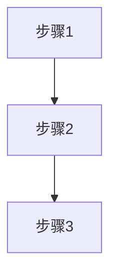
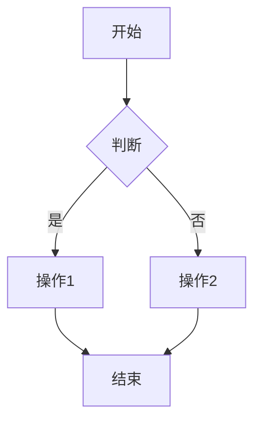
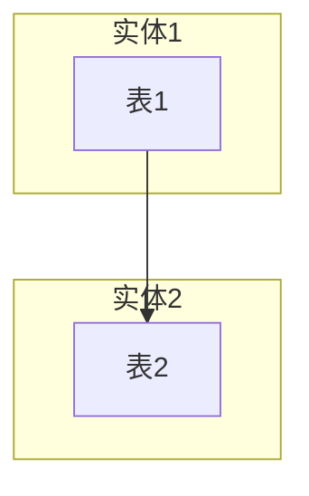

# 模块文档生成技能

基于虚拟仓模块的完整样式规范，一键生成 PRD + 原型 + 测试用例三件套。

## 还原度保障机制

### 必须先阅读的参考文件

**在生成任何内容之前，必须完整阅读以下参考文件**：
1. `虚拟仓/index.html` — 原型结构、CSS 样式、JS 逻辑的完整参考
2. `虚拟仓/prd.md` — PRD 文档格式、章节结构、表格样式参考
3. `虚拟仓/test-cases.md` — 测试用例格式、场景覆盖、编号规则参考

### 还原度检查清单

生成完成后，必须逐项核对以下清单，确保还原度达到 95% 以上：

#### PRD 文档还原度检查
- [ ] 章节结构完全一致（9 个主章节）
- [ ] 表格列名与参考文件一致
- [ ] Mermaid 流程图语法正确（节点用双引号，判断用 `{}`）
- [ ] 功能逻辑描述表格包含 5 列（按钮/操作、触发条件、约束条件、逻辑描述、预期结果）
- [ ] 字段取值逻辑表格包含 4 列（字段、数据来源、取值规则、显示格式）
- [ ] 弹窗属性描述表格包含 4 列（字段、输入方式、必填、取值规则）
- [ ] 每个模块都有"核心业务规则"章节
- [ ] 优先级标注完整（P0/P1）

#### 测试用例还原度检查
- [ ] 用例编号格式正确（TC-{模块缩写}-{序号}）
- [ ] 测试步骤用 `<br>` 分隔
- [ ] 每个功能包含正常流程 + 异常场景
- [ ] 前置条件明确数据状态和登录角色
- [ ] 预期结果具体描述界面变化、数据变化、提示信息
- [ ] 包含集成测试用例
- [ ] 包含测试结果汇总表

#### HTML 原型还原度检查
- [ ] CSS 样式完全复制（prose、toc、mermaid 等所有样式）
- [ ] Tab 切换功能正常（PRD/原型/测试用例）
- [ ] Mermaid 图表渲染正常
- [ ] Mermaid 点击放大功能正常
- [ ] 目录导航生成正确
- [ ] 表格样式与参考一致（渐变背景、圆角、阴影）
- [ ] 模拟数据与业务场景匹配

## When to Use

当用户需要为新业务模块生成完整文档套件（PRD + 原型 + 测试用例）时调用。

## 输出文件结构

```
<模块名>/
├── prd.md           # 产品需求文档
├── test-cases.md    # 测试用例文档
└── index.html       # 交互原型
```

---

## 第一步：生成 prd.md

### PRD 章节结构（必须完整包含，缺一不可）

```markdown
# {{模块名}} PRD

**版本**: V1.0  
**日期**: YYYY-MM-DD  
**状态**: 待评审

---

## 1. Executive Summary 执行摘要

### Problem Statement 问题陈述

面向业务：xxx业务，
现状：xxx
痛点：xxx

### Proposed Solution 解决方案

1、xxx
2、xxx

### Success Criteria 成功指标

| 指标 | 目标值 |
|------|--------|
| xxx | xxx |

---

## 2. User Experience & User Flows 用户体验与用户流程

### 2.1 User Personas 用户画像

| 角色 | 描述 | 目标 | 痛点 |
|------|------|------|------|
| xxx | xxx | xxx | xxx |

### 2.2 User Journey Map 用户旅程图



### 2.3 User Flows 用户流程

#### 2.3.1 xxx流程



**流程说明**：
- 步骤1：xxx
- 步骤2：xxx

---

## 3. Functional Modules 功能模块

### 3.0 功能清单汇总

| 模块名称 | 功能点 | 功能描述 | 优先级 |
|----------|--------|----------|--------|
| xxx | xxx | xxx | P0 |

**优先级说明**：
- **P0（核心功能）**：系统必须实现的基础功能，影响核心业务流程
- **P1（重要功能）**：提升用户体验和系统效率的功能

---

### 3.x 各子模块

**模块概述**：xxx

**功能列表**：
```
模块名
├── 功能1
├── 功能2
└── 功能3
```

**功能逻辑描述**：

| 按钮/操作 | 触发条件 | 约束条件 | 逻辑描述 | 预期结果 |
|-----------|----------|----------|----------|----------|
| xxx | xxx | xxx | 1.步骤1<br>2.步骤2 | xxx |

---

## 4. Functional Logic Details 功能模块详细逻辑

### 4.x.1 初始化页面数据展示逻辑

| 逻辑项 | 说明 | 数据来源 | 展示规则 |
|--------|------|----------|----------|
| xxx | xxx | xxx表 | xxx |

### 4.x.2 模块按钮逻辑

| 按钮 | 位置 | 触发动作 | 前置条件 | 后续操作 |
|------|------|----------|----------|----------|
| xxx | 页面右上角 | 打开弹窗 | 无 | 提交后刷新列表 |

### 4.x.3 字段取值逻辑

| 字段 | 数据来源 | 取值规则 | 显示格式 |
|------|----------|----------|----------|
| xxx | xxx表.xxx字段 | 直接取值 | 文本显示 |

#### 弹窗属性描述

| 字段 | 输入方式 | 必填 | 取值规则 |
|------|----------|------|----------|
| xxx | 下拉单选框 | 是 | 从下拉列表选择 |

**核心业务规则**：
1. xxx
2. xxx

---

## 5. Acceptance Criteria 验收标准

### 5.1 功能验收

| 功能 | 验收条件 | 测试方法 | 优先级 |
|------|----------|----------|--------|
| xxx | xxx | 单元测试 | P0 |

### 5.2 性能验收

| 指标 | 目标值 | 阈值 | 说明 |
|------|--------|------|------|
| 响应时间 | < 500ms | 1s | 列表查询 |

---

## 6. 信息架构

### 实体关系图



### 关系说明

| 关系 | 描述 | 基数 |
|------|------|------|
| 表1-表2 | xxx | 1:N |

---

## 7. 风险与路线图

### 分阶段交付

| 版本 | 时间 | 范围 |
|------|------|------|
| V1.0 | xxx | 核心功能 |

### 技术风险

| 风险 | 影响 | 缓解措施 |
|------|------|----------|
| xxx | 高 | xxx |

---

## 8. 附录

### 术语表

| 术语 | 定义 |
|------|------|
| xxx | xxx |

---

## 9. 变更记录

| 版本 | 日期 | 变更内容 | 变更人 |
|------|------|----------|--------|
| V1.0 | xxx | 初始版本 | xxx |
```

### PRD 写作要求（必须严格遵守）

#### Mermaid 流程图规范
- 每个核心业务流程必须有独立的 `graph TD` 图
- 节点文字用双引号包裹：`A["步骤1"]`
- 判断节点用花括号：`B{"判断条件"}`
- 条件标注用竖线格式：`B -->|"是"| C`
- 流程必须有开始和结束节点
- 流程图后必须有"流程说明"列表

#### 表格规范
- 功能逻辑描述表格：5 列（按钮/操作、触发条件、约束条件、逻辑描述、预期结果）
- 字段取值逻辑表格：4 列（字段、数据来源、取值规则、显示格式）
- 弹窗属性描述表格：4 列（字段、输入方式、必填、取值规则）
- 数据来源必须写到具体表名和字段名（如 `warehouse.type`、`department.name`）

#### 内容规范
- 每个模块必须有"模块概述"、"功能列表"、"功能逻辑描述"三部分
- 每个模块必须有"核心业务规则"章节
- 优先级必须标注（P0/P1）
- 逻辑描述用 `1.步骤1<br>2.步骤2` 格式

---

## 第二步：生成 test-cases.md

### 测试用例结构（必须完整包含）

```markdown
# {{模块名}}测试用例

**版本**: V1.0  
**日期**: YYYY-MM-DD  
**状态**: 待评审

---

## 1. 测试概述

### 1.1 测试范围

本文档涵盖xxx系统的所有功能模块测试，包括：
- 模块1
- 模块2

### 1.2 测试类型

| 测试类型 | 说明 | 覆盖范围 |
|----------|------|----------|
| 功能测试 | 验证各功能模块是否按需求正常工作 | 所有P0/P1功能 |
| 集成测试 | 验证模块间数据流转和业务流程 | 跨模块业务流程 |
| 性能测试 | 验证系统响应时间和并发处理能力 | 关键操作性能指标 |

### 1.3 测试环境

| 环境 | 配置 | 说明 |
|------|------|------|
| 测试环境 | Linux服务器、MySQL 8.0 | 功能测试环境 |

---

## 2. xxx模块测试用例

### 2.1 xxx功能

| 用例编号 | 测试项 | 前置条件 | 测试步骤 | 预期结果 | 优先级 |
|----------|--------|----------|----------|----------|--------|
| TC-XXX-001 | 正常创建 | 以管理员身份登录 | 1.点击"新建"按钮<br>2.填写表单<br>3.点击保存 | 创建成功，列表显示新数据 | P0 |
| TC-XXX-002 | 必填项为空 | 弹窗已打开 | 1.不填写必填项<br>2.点击保存 | 提示"请填写所有必填字段" | P0 |
| TC-XXX-003 | 名称重复 | 同名数据已存在 | 1.填写已存在的名称<br>2.点击保存 | 提示"名称已存在"，创建失败 | P0 |
| TC-XXX-004 | 数据超限 | 数据已达到上限 | 1.输入超限数据<br>2.点击保存 | 提示"数据超出限制" | P0 |
| TC-XXX-005 | 关联约束删除 | 数据有关联记录 | 1.点击删除<br>2.确认删除 | 提示"存在关联数据，无法删除" | P0 |

---

## N. 集成测试用例

| 用例编号 | 测试项 | 前置条件 | 测试步骤 | 预期结果 | 优先级 |
|----------|--------|----------|----------|----------|--------|
| TC-INT-001 | 完整流程 | 无 | 1.步骤1<br>2.步骤2<br>3.验证结果 | 整个流程数据流转正确 | P0 |

---

## N+1. 测试结果汇总

| 测试类型 | 用例数 | 通过数 | 通过率 | 状态 |
|----------|--------|--------|--------|------|
| 功能测试 | xx | xx | xx% | 通过 |

---

## N+2. 变更记录

| 版本 | 日期 | 变更内容 | 变更人 |
|------|------|----------|--------|
| V1.0 | xxx | 初始版本 | xxx |
```

### 测试用例写作要求（必须严格遵守）

#### 用例编号格式
- 格式：`TC-{模块缩写}-{序号}`
- 示例：`TC-VW-001`（虚拟仓模块）、`TC-ORG-101`（组织架构模块）
- 集成测试：`TC-INT-001`

#### 测试步骤格式
- 用 `<br>` 分隔每个步骤
- 步骤必须具体到点击哪个按钮、填写哪个字段
- 格式：`1.点击"新建"按钮<br>2.填写表单<br>3.点击保存`

#### 场景覆盖要求
每个功能必须包含以下场景：
1. **正常流程**：正常创建、编辑、删除、查询
2. **异常场景**：
   - 必填项为空
   - 名称/编码重复
   - 数据超限（数量、长度）
   - 关联约束（有子数据时无法删除）
   - 权限限制（无权限操作）
3. **边界场景**：
   - 最大值/最小值
   - 空数据状态
   - 大数据量

#### 前置条件要求
- 明确说明数据状态（如"部门已存在"、"库存充足"）
- 明确说明登录角色（如"以管理员身份登录"）

#### 预期结果要求
- 具体描述界面变化（如"列表显示新数据"）
- 具体描述数据变化（如"库存扣减"）
- 具体描述提示信息（如"提示'创建成功'"）

---

## 第三步：生成 index.html

### HTML 生成要求（必须严格遵守）

**必须完全复制虚拟仓 `index.html` 的 HTML/CSS/JS 结构**，只替换业务内容。

#### 必须完整复制的 CSS 样式

```css
/* 以下样式必须完整复制，不能简化或省略 */

/* 1. 主内容切换样式 */
.main-content { display: none; }
.main-content.active { display: block; }
.tab-btn { ... }

/* 2. PRD Markdown 渲染样式（prose 类下所有样式） */
.prose { ... }
.prose h1 { ... }
.prose h2 { ... }
.prose h3 { ... }
.prose table { ... }
.prose th { ... }
.prose td { ... }
.prose pre { ... }
.prose code { ... }
.prose blockquote { ... }
.prose strong { ... }
.prose .badge { ... }
.prose .badge-p0 { ... }
.prose .badge-p1 { ... }

/* 3. 目录导航样式 */
.toc { ... }
.toc-title { ... }
.toc a { ... }
.toc-level-2 { ... }
.toc-level-3 { ... }

/* 4. Mermaid 图表放大预览样式 */
.mermaid { ... }
.mermaid-modal { ... }
.mermaid-modal-content { ... }
.mermaid-modal-close { ... }
.mermaid-hint { ... }
.mermaid-container { ... }
```

#### 必须完整复制的 JS 功能

```javascript
/* 以下 JS 功能必须完整复制 */

/* 1. Mermaid 初始化配置 */
mermaid.initialize({
    startOnLoad: true,
    theme: 'default',
    securityLevel: 'loose',
    logLevel: 3
});

/* 2. Marked 渲染器配置 */
const renderer = new marked.Renderer();
renderer.code = function(code, language) {
    if (language === 'mermaid') {
        return `<div class="mermaid-container" onclick="openMermaidModal(this)">
            <div class="mermaid">${code}</div>
            <span class="mermaid-hint"><i class="fa fa-search-plus mr-1"></i>点击放大</span>
        </div>`;
    }
    return `<pre><code class="language-${language}">${code}</code></pre>`;
};

/* 3. Mermaid 放大预览功能 */
function openMermaidModal(container) { ... }
function closeMermaidModal() { ... }

/* 4. Tab 切换功能 */
function switchTab(tabName) { ... }

/* 5. 目录导航生成功能 */
function generateTOC() { ... }
```

#### HTML 结构要求

```html
<!DOCTYPE html>
<html lang="zh-CN">
<head>
    <meta charset="UTF-8">
    <!-- 必须包含所有 CSS 样式 -->
    <style>
        /* 完整复制虚拟仓 index.html 的所有样式 */
    </style>
    
    <meta name="viewport" content="width=device-width, initial-scale=1.0">
    <title>{{模块名}}管理系统</title>
    
    <!-- 必须引用的 CDN -->
    <link rel="preconnect" href="https://cdn.jsdelivr.net">
    <link rel="preconnect" href="https://cdn.tailwindcss.com">
    <link href="https://cdn.jsdelivr.net/npm/font-awesome@4.7.0/css/font-awesome.min.css" rel="stylesheet">
    <script src="https://cdn.tailwindcss.com"></script>
    <script src="https://cdn.jsdelivr.net/npm/marked@4/marked.min.js"></script>
    <script src="https://cdn.jsdelivr.net/npm/mermaid@10/dist/mermaid.min.js"></script>
    
    <!-- 必须包含 Mermaid 和 Marked 初始化脚本 -->
    <script>
        /* Mermaid 初始化 */
        /* Marked 渲染器配置 */
    </script>
    
    <!-- 必须包含 Tailwind 配置 -->
    <script>
        tailwind.config = { ... }
    </script>
</head>
<body>
    <!-- 页面结构 -->
    <div class="min-h-screen bg-gray-50">
        <!-- 顶部导航 -->
        <header>...</header>
        
        <!-- Tab 切换按钮 -->
        <div class="tab-buttons">
            <button class="tab-btn active" onclick="switchTab('prd')">PRD</button>
            <button class="tab-btn" onclick="switchTab('prototype')">原型</button>
            <button class="tab-btn" onclick="switchTab('test')">测试用例</button>
        </div>
        
        <!-- 主内容区域 -->
        <main>
            <!-- PRD 内容 -->
            <div id="prd-content" class="main-content active">
                <div class="flex">
                    <!-- 左侧目录 -->
                    <aside class="toc">...</aside>
                    <!-- 右侧内容 -->
                    <article class="prose">...</article>
                </div>
            </div>
            
            <!-- 原型内容 -->
            <div id="prototype-content" class="main-content">
                <!-- 模拟数据表格 -->
                <!-- 操作按钮 -->
                <!-- 弹窗 -->
            </div>
            
            <!-- 测试用例内容 -->
            <div id="test-content" class="main-content">
                <article class="prose">...</article>
            </div>
        </main>
    </div>
    
    <!-- Mermaid 放大预览模态框 -->
    <div id="mermaidModal" class="mermaid-modal">...</div>
    
    <!-- 必须包含所有 JS 功能 -->
    <script>
        /* Tab 切换功能 */
        /* 目录导航生成功能 */
        /* Mermaid 放大预览功能 */
        /* 弹窗功能 */
    </script>
</body>
</html>
```

#### 模拟数据要求

原型页面必须包含模拟数据，数据内容与业务场景匹配：

```javascript
/* 模拟数据示例 */
const mockData = [
    {
        id: 1,
        name: '示例数据1',
        status: 'active',
        createTime: '2024-01-01 10:00:00'
    },
    {
        id: 2,
        name: '示例数据2',
        status: 'inactive',
        createTime: '2024-01-02 11:00:00'
    }
];
```

---

## 生成流程

### 步骤 1：阅读参考文件

1. 读取 `虚拟仓/index.html`，提取完整的 CSS 样式和 JS 功能
2. 读取 `虚拟仓/prd.md`，提取章节结构和表格格式
3. 读取 `虚拟仓/test-cases.md`，提取用例格式和场景覆盖

### 步骤 2：生成 PRD 文档

1. 按照章节结构填充内容
2. 确保表格列名与参考一致
3. 确保 Mermaid 流程图语法正确
4. 确保每个模块都有完整的逻辑描述

### 步骤 3：生成测试用例

1. 按照格式生成用例
2. 确保覆盖正常流程和异常场景
3. 确保用例编号格式正确
4. 确保测试步骤具体可执行

### 步骤 4：生成 HTML 原型

1. 完整复制 CSS 样式
2. 完整复制 JS 功能
3. 替换业务内容
4. 添加模拟数据

### 步骤 5：还原度检查

1. 逐项核对还原度检查清单
2. 确保所有必填项完整
3. 确保格式与参考一致
4. 确保功能正常运行

---

## 输出要求

1. **文件命名**：`prd.md`、`test-cases.md`、`index.html`
2. **文件位置**：`<模块名>/` 目录下
3. **编码格式**：UTF-8
4. **换行符**：LF（Unix 风格）

---

## 常见问题

### Q1: Mermaid 图表不显示？

检查：
- 节点文字是否用双引号包裹
- 判断节点是否用花括号
- 条件标注是否用竖线格式
- Mermaid 库是否正确加载

### Q2: 表格样式不一致？

检查：
- 是否完整复制了 `.prose table` 相关样式
- 是否包含了渐变背景和圆角样式
- 是否包含了 hover 效果

### Q3: Tab 切换不工作？

检查：
- 是否正确设置了 `main-content` 和 `active` 类
- `switchTab` 函数是否正确实现
- Tab 按钮的 `onclick` 事件是否正确绑定

### Q4: 目录导航不生成？

检查：
- `generateTOC` 函数是否正确实现
- PRD 内容的标题是否有正确的 ID
- 目录容器的 HTML 结构是否正确

---

## 质量标准

生成的文档必须达到以下标准：

1. **完整性**：所有章节、表格、流程图完整
2. **准确性**：内容与业务场景匹配，逻辑正确
3. **一致性**：格式与参考文件完全一致
4. **可用性**：HTML 原型功能正常，交互流畅
5. **可读性**：文档结构清晰，表述准确

还原度目标：**95% 以上**
