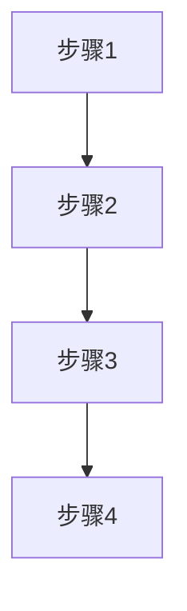

# 原型设计技能

This skill generates standardized prototype designs for system modules based on the standard module template. It creates complete documentation packages including HTML prototypes, PRD documentation, and test cases, ensuring consistency across system components.

## When to Use

Invoke this skill when:
- User needs to create new system modules with standardized documentation
- User wants to generate HTML prototypes with PRD and test cases
- User needs to maintain consistency across multiple system modules
- User wants to accelerate the development of new features
- User needs to ensure proper documentation structure for system components

## Standard Module Structure

### Directory Structure

```
<Module Name>/
├── index.html          # HTML prototype implementation
├── prd.md              # Product Requirements Document
├── test-cases.md       # Test cases documentation
└── prompt.md           # AI prompt (optional)
```

### Prototype Features

| Feature | Description | Implementation |
|---------|-------------|----------------|
| **Tab Switching** | Switch between prototype, PRD, and test cases | JavaScript tab switching |
| **Markdown Rendering** | Render PRD and test cases from Markdown files | Marked.js integration |
| **Mermaid Charts** | Render flowcharts and diagrams | Mermaid.js integration |
| **Responsive Design** | Adapt to different screen sizes | Tailwind CSS responsive classes |
| **Interactive Elements** | Forms, buttons, tables, modals | Tailwind CSS components |
| **Navigation** | Top navigation bar with menu items | Fixed header navigation |

## Prototype Implementation

### HTML Structure

```html
<!DOCTYPE html>
<html lang="zh-CN">
<head>
    <meta charset="UTF-8">
    <style>
        .main-content { display: none; }
        .main-content.active { display: block; }
        .tab-btn { padding: 8px 16px; border: none; border-radius: 6px; cursor: pointer; font-size: 13px; font-weight: 500; transition: all 0.2s; }
        .tab-btn.active { background: #2a3b7d; color: white; }
        .tab-btn:not(.active) { background: #f3f4f6; color: #374151; }
        .tab-btn:hover { opacity: 0.9; }
        
        /* PRD Markdown 渲染样式 */
        .prose { 
            color: #374151; 
            line-height: 1.8; 
            font-size: 0.95rem;
            max-width: 100%;
        }
        .prose h1 { 
            font-size: 2rem; 
            font-weight: 700; 
            color: #1e293b; 
            margin-bottom: 1.5rem; 
            padding-bottom: 1rem; 
            border-bottom: 3px solid #2a3b7d;
            background: linear-gradient(135deg, #667eea 0%, #2a3b7d 100%);
            -webkit-background-clip: text;
            -webkit-text-fill-color: transparent;
            background-clip: text;
        }
        .prose h2 { 
            font-size: 1.4rem; 
            font-weight: 600; 
            color: #2a3b7d; 
            margin: 2.5rem 0 1.2rem; 
            padding: 0.75rem 1rem;
            background: linear-gradient(135deg, #f0f4ff 0%, #e0e7ff 100%);
            border-left: 4px solid #2a3b7d;
            border-radius: 0 8px 8px 0;
        }
        .prose h3 { 
            font-size: 1.15rem; 
            font-weight: 600; 
            color: #475569; 
            margin: 2rem 0 0.75rem;
            padding-bottom: 0.5rem;
            border-bottom: 1px solid #e5e7eb;
        }
        .prose p { margin-bottom: 1rem; color: #4b5563; }
        .prose ul, .prose ol { margin-left: 1.5rem; margin-bottom: 1.2rem; }
        .prose li { margin-bottom: 0.5rem; color: #4b5563; }
        .prose li::marker { color: #2a3b7d; }
        
        /* 增强表格样式 */
        .prose table { 
            width: 100%; 
            border-collapse: separate; 
            border-spacing: 0;
            margin: 1.5rem 0; 
            font-size: 0.85rem; 
            border-radius: 12px;
            overflow: hidden;
            box-shadow: 0 1px 3px rgba(0,0,0,0.1);
        }
        .prose th { 
            padding: 0.875rem 1rem; 
            background: linear-gradient(135deg, #2a3b7d 0%, #4f46e5 100%);
            color: white;
            font-weight: 600;
            text-align: left;
            border: none;
            white-space: nowrap;
        }
        .prose th:first-child { border-top-left-radius: 12px; }
        .prose th:last-child { border-top-right-radius: 12px; }
        .prose td { 
            padding: 0.75rem 1rem; 
            border: none;
            border-bottom: 1px solid #e5e7eb;
            background: white;
        }
        .prose tr:last-child td { border-bottom: none; }
        .prose tr:nth-child(even) td { background: #f9fafb; }
        .prose tr:hover td { background: #f0f4ff; }
        
        /* 代码块样式 */
        .prose pre { 
            background: linear-gradient(135deg, #1e293b 0%, #0f172a 100%); 
            padding: 1.25rem; 
            border-radius: 12px; 
            font-size: 0.8rem; 
            border: 1px solid #334155;
            overflow-x: auto; 
            margin: 1.5rem 0;
            box-shadow: 0 4px 6px -1px rgba(0, 0, 0, 0.1);
        }
        .prose code { 
            background: linear-gradient(135deg, #f1f5f9 0%, #e2e8f0 100%);
            color: #dc2626;
            padding: 0.2rem 0.4rem; 
            border-radius: 4px; 
            font-size: 0.875em;
            font-family: 'Monaco', 'Menlo', monospace;
        }
        .prose pre code { 
            background: none; 
            padding: 0; 
            color: #e2e8f0;
        }
        
        /* 标签样式 */
        .prose .badge { 
            display: inline-block; 
            padding: 0.25rem 0.75rem; 
            border-radius: 9999px; 
            font-size: 0.75rem; 
            font-weight: 600;
            margin: 0.125rem;
        }
        .prose .badge-p0 { 
            background: linear-gradient(135deg, #fee2e2 0%, #fecaca 100%); 
            color: #dc2626;
            border: 1px solid #fca5a5;
        }
        .prose .badge-p1 { 
            background: linear-gradient(135deg, #fef3c7 0%, #fde68a 100%); 
            color: #d97706;
            border: 1px solid #fcd34d;
        }
    </style>

    <meta name="viewport" content="width=device-width, initial-scale=1.0">
    <title>{{Module Name}} Prototype</title>
    <link rel="preconnect" href="https://cdn.jsdelivr.net">
    <link rel="preconnect" href="https://cdn.tailwindcss.com">
    <link href="https://cdn.jsdelivr.net/npm/font-awesome@4.7.0/css/font-awesome.min.css" rel="stylesheet" media="print" onload="this.media='all'">
    <script src="https://cdn.tailwindcss.com"></script>
    <!-- Markdown 解析库 -->
    <script src="https://cdn.jsdelivr.net/npm/marked@4/marked.min.js"></script>
    <!-- Mermaid 图表库 -->
    <script src="https://cdn.jsdelivr.net/npm/mermaid@10/dist/mermaid.min.js"></script>
    <script>
        // 初始化Mermaid
        mermaid.initialize({
            startOnLoad: true,
            theme: 'default',
            securityLevel: 'loose',
            logLevel: 3
        });
        
        // 配置Marked
        const renderer = new marked.Renderer();
        renderer.code = function(code, language) {
            if (language === 'mermaid') {
                return `<div class="mermaid-container" onclick="openMermaidModal(this)">
                    <div class="mermaid">${code}</div>
                    <span class="mermaid-hint"><i class="fa fa-search-plus mr-1"></i>点击放大</span>
                </div>`;
            }
            return `<pre><code class="language-${language}">${code}</code></pre>`;
        };
        
        marked.setOptions({
            renderer: renderer,
            breaks: true,
            gfm: true
        });
    </script>
    <script>
        tailwind.config = {
            theme: {
                extend: {
                    colors: {
                        primary: '#2a3b7d',
                        'primary-light': '#3a4ca7',
                        secondary: '#36CFC9',
                        accent: '#722ED1',
                        success: '#00B42A',
                        warning: '#FF7D00',
                        danger: '#F53F3F',
                        dark: '#1D2129',
                        'light-bg': '#FFFFFF',
                        'card-bg': '#FFFFFF',
                        border: '#E5E7EB'
                    },
                    fontFamily: {
                        inter: ['Inter', 'system-ui', 'sans-serif'],
                    },
                    boxShadow: {
                        'card': '0 2px 8px rgba(0, 0, 0, 0.05)',
                        'card-hover': '0 10px 25px -5px rgba(42, 59, 125, 0.1)',
                        'dropdown': '0 4px 16px rgba(0, 0, 0, 0.1)',
                        'header': '0 2px 4px rgba(0, 0, 0, 0.05)'
                    }
                },
            }
        }
    </script>
    <style type="text/tailwindcss">
        @layer utilities {
            .content-auto {
                content-visibility: auto;
            }
            .text-shadow {
                text-shadow: 0 2px 4px rgba(0, 0, 0, 0.1);
            }
            .btn-primary {
                @apply bg-primary text-white px-4 py-2 rounded-lg transition-all hover:bg-primary-light focus:outline-none focus:ring-2 focus:ring-primary/50 focus:ring-offset-2;
            }
            .btn-secondary {
                @apply bg-white text-primary border border-border px-4 py-2 rounded-lg transition-all hover:bg-gray-50 focus:outline-none focus:ring-2 focus:ring-primary/50 focus:ring-offset-2;
            }
            .btn-danger {
                @apply bg-white text-danger border border-danger/20 px-4 py-2 rounded-lg transition-all hover:bg-danger/5 focus:outline-none focus:ring-2 focus:ring-danger/30 focus:ring-offset-2;
            }
            .input-primary {
                @apply w-full px-4 py-2.5 rounded-lg border border-border bg-white text-dark placeholder-gray-400 focus:outline-none focus:ring-2 focus:ring-primary/30 focus:border-primary transition-all;
            }
            .form-label {
                @apply block text-sm font-medium text-gray-700 mb-1;
            }
            .table-hover-row:hover {
                background-color: #f9fafb;
            }
        }
    </style>
</head>
<body class="font-inter bg-gray-50 min-h-screen">
    <!-- 标签切换按钮 -->
    <div class="fixed bottom-8 right-8 z-40 flex gap-2 shadow-lg rounded-lg overflow-hidden">
        <button id="tab-prototype" class="tab-btn active px-6 py-2" onclick="switchTab('prototype')">
            <i class="fa fa-th-large mr-2"></i>原型
        </button>
        <button id="tab-prd" class="tab-btn px-6 py-2" onclick="switchTab('prd')">
            <i class="fa fa-file-text mr-2"></i>PRD
        </button>
        <button id="tab-testcases" class="tab-btn px-6 py-2" onclick="switchTab('testcases')">
            <i class="fa fa-check-square-o mr-2"></i>测试用例
        </button>
    </div>

    <!-- 顶部导航栏 -->
    <header class="bg-primary text-white shadow-header sticky top-0 z-50">
        <div class="max-w-7xl mx-auto px-4 sm:px-6 lg:px-8">
            <div class="flex items-center justify-between h-14">
                <div class="flex items-center">
                    <div class="flex-shrink-0">
                        <span class="text-xl font-bold">{{System Name}}</span>
                    </div>
                    <nav class="hidden md:ml-6 md:flex space-x-8">
                        {{Navigation Menu}}
                    </nav>
                </div>
                <div class="flex items-center">
                    <div class="flex-shrink-0">
                        <button class="relative p-1 rounded-full text-white hover:bg-primary-light focus:outline-none">
                            <span class="sr-only">查看通知</span>
                            <i class="fa fa-bell"></i>
                            <span class="absolute top-0 right-0 block h-2 w-2 rounded-full bg-secondary"></span>
                        </button>
                    </div>
                    <div class="ml-3 relative">
                        <div>
                            <button class="max-w-xs bg-primary-light rounded-full flex items-center text-sm focus:outline-none" id="user-menu-button">
                                <span class="sr-only">打开用户菜单</span>
                                <span class="text-white mr-2">管理员</span>
                                <i class="fa fa-user-circle-o text-white"></i>
                            </button>
                        </div>
                    </div>
                </div>
            </div>
        </div>
    </header>

    <!-- PRD内容 -->
    <main id="main-prd" class="main-content p-6">
        <div class="max-w-7xl mx-auto">
            <div class="bg-white rounded-xl shadow-card p-6">
                <h1 class="text-2xl font-bold text-primary mb-6">{{Module Name}} PRD</h1>
                <div class="prose" id="prd-content">
                    <div class="text-center py-20">
                        <i class="fa fa-spinner fa-spin text-4xl text-primary mb-4"></i>
                        <p class="text-gray-500">加载PRD文档中...</p>
                    </div>
                </div>
            </div>
        </div>
    </main>

    <!-- 测试用例内容 -->
    <main id="main-testcases" class="main-content p-6">
        <div class="max-w-7xl mx-auto">
            <div class="bg-white rounded-xl shadow-card p-6">
                <h1 class="text-2xl font-bold text-primary mb-6">{{Module Name}} 测试用例</h1>
                <div class="prose" id="testcases-content">
                    <div class="text-center py-20">
                        <i class="fa fa-spinner fa-spin text-4xl text-primary mb-4"></i>
                        <p class="text-gray-500">加载测试用例文档中...</p>
                    </div>
                </div>
            </div>
        </div>
    </main>

    <!-- 原型页面 -->
    <main id="main-prototype" class="main-content active p-6">
        <div class="max-w-7xl mx-auto">
            <div class="bg-white rounded-xl shadow-card p-6">
                <div class="flex items-center justify-between mb-6">
                    <h1 class="text-2xl font-bold text-primary">{{Module Name}}</h1>
                    <button class="btn-primary" onclick="openAddModal()">
                        <i class="fa fa-plus mr-2"></i>新增
                    </button>
                </div>
                
                <!-- 搜索和筛选 -->
                <div class="flex flex-col md:flex-row gap-4 mb-6">
                    <div class="flex-1">
                        <div class="relative">
                            <input type="text" id="search-input" placeholder="搜索..." class="input-primary pl-10">
                            <i class="fa fa-search absolute left-3 top-1/2 -translate-y-1/2 text-gray-400"></i>
                        </div>
                    </div>
                    <div class="flex gap-2">
                        <select id="filter-select" class="input-primary">
                            <option value="all">全部</option>
                            <option value="active">活跃</option>
                            <option value="inactive">非活跃</option>
                        </select>
                        <select id="sort-select" class="input-primary">
                            <option value="id">ID排序</option>
                            <option value="name">名称排序</option>
                            <option value="date">日期排序</option>
                        </select>
                    </div>
                </div>
                
                <!-- 表格 -->
                <div class="overflow-x-auto">
                    <table class="w-full border-collapse">
                        <thead>
                            <tr class="bg-primary text-white">
                                <th class="px-6 py-3 text-left text-sm font-semibold">
                                    <input type="checkbox" id="select-all" class="rounded border-gray-300 text-primary focus:ring-primary">
                                </th>
                                <th class="px-6 py-3 text-left text-sm font-semibold">ID</th>
                                <th class="px-6 py-3 text-left text-sm font-semibold">名称</th>
                                <th class="px-6 py-3 text-left text-sm font-semibold">状态</th>
                                <th class="px-6 py-3 text-left text-sm font-semibold">创建日期</th>
                                <th class="px-6 py-3 text-left text-sm font-semibold">操作</th>
                            </tr>
                        </thead>
                        <tbody id="data-table-body">
                            <!-- 表格数据将通过JavaScript动态生成 -->
                        </tbody>
                    </table>
                </div>
                
                <!-- 分页 -->
                <div class="flex items-center justify-between mt-6">
                    <div class="text-sm text-gray-500">
                        显示 <span id="showing-count">1-10</span> 条，共 <span id="total-count">100</span> 条
                    </div>
                    <div class="flex gap-2">
                        <button class="btn-secondary" onclick="changePage(1)" disabled id="first-page">
                            <i class="fa fa-angle-double-left"></i>
                        </button>
                        <button class="btn-secondary" onclick="changePage(page - 1)" disabled id="prev-page">
                            <i class="fa fa-angle-left"></i>
                        </button>
                        <div id="page-buttons" class="flex gap-1">
                            <!-- 页码按钮将通过JavaScript动态生成 -->
                        </div>
                        <button class="btn-secondary" onclick="changePage(page + 1)" id="next-page">
                            <i class="fa fa-angle-right"></i>
                        </button>
                        <button class="btn-secondary" onclick="changePage(totalPages)" id="last-page">
                            <i class="fa fa-angle-double-right"></i>
                        </button>
                    </div>
                </div>
            </div>
        </div>
    </main>
    
    <!-- 新增/编辑模态框 -->
    <div class="fixed inset-0 bg-black bg-opacity-50 flex items-center justify-center z-50 hidden" id="edit-modal">
        <div class="bg-white rounded-xl shadow-lg w-full max-w-2xl p-6">
            <div class="flex items-center justify-between mb-6">
                <h2 class="text-xl font-bold text-primary" id="modal-title">新增记录</h2>
                <button class="text-gray-400 hover:text-gray-600" onclick="closeEditModal()">
                    <i class="fa fa-times text-xl"></i>
                </button>
            </div>
            <form id="edit-form">
                <input type="hidden" id="record-id">
                <div class="grid grid-cols-1 md:grid-cols-2 gap-4 mb-6">
                    <div>
                        <label class="form-label">名称</label>
                        <input type="text" id="record-name" class="input-primary" required>
                    </div>
                    <div>
                        <label class="form-label">状态</label>
                        <select id="record-status" class="input-primary" required>
                            <option value="active">活跃</option>
                            <option value="inactive">非活跃</option>
                        </select>
                    </div>
                    <div class="md:col-span-2">
                        <label class="form-label">描述</label>
                        <textarea id="record-description" class="input-primary h-24" required></textarea>
                    </div>
                </div>
                <div class="flex gap-3 justify-end">
                    <button type="button" class="btn-secondary" onclick="closeEditModal()">取消</button>
                    <button type="submit" class="btn-primary">保存</button>
                </div>
            </form>
        </div>
    </div>
    
    <!-- 确认删除模态框 -->
    <div class="fixed inset-0 bg-black bg-opacity-50 flex items-center justify-center z-50 hidden" id="delete-modal">
        <div class="bg-white rounded-xl shadow-lg w-full max-w-md p-6">
            <div class="text-center mb-6">
                <div class="inline-flex items-center justify-center w-16 h-16 rounded-full bg-danger/10 text-danger mb-4">
                    <i class="fa fa-trash-o text-2xl"></i>
                </div>
                <h2 class="text-xl font-bold text-gray-800">确认删除</h2>
                <p class="text-gray-500 mt-2">确定要删除选中的记录吗？此操作不可撤销。</p>
            </div>
            <div class="flex gap-3 justify-center">
                <button class="btn-secondary" onclick="closeDeleteModal()">取消</button>
                <button class="btn-danger" onclick="confirmDelete()">删除</button>
            </div>
        </div>
    </div>

    <!-- Mermaid图表放大预览模态框 -->
    <div class="mermaid-modal" id="mermaidModal">
        <div class="mermaid-modal-content">
            <button class="mermaid-modal-close" onclick="closeMermaidModal()">&times;</button>
            <h3 class="mermaid-modal-title">图表预览</h3>
            <div id="mermaidModalContent"></div>
        </div>
    </div>

    <script>
        // 标签切换功能
        function switchTab(tab) {
            document.querySelectorAll('.main-content').forEach(content => {
                content.classList.remove('active');
            });
            document.querySelectorAll('.tab-btn').forEach(btn => {
                btn.classList.remove('active');
            });
            document.getElementById(`main-${tab}`).classList.add('active');
            document.getElementById(`tab-${tab}`).classList.add('active');
            
            if (tab === 'prd') {
                loadPRD();
            } else if (tab === 'testcases') {
                loadTestCases();
            }
        }
        
        // 加载PRD内容
        function loadPRD() {
            const prdContent = document.getElementById('prd-content');
            prdContent.innerHTML = '<div class="text-center py-20"><i class="fa fa-spinner fa-spin text-4xl text-primary mb-4"></i><p class="text-gray-500">加载PRD文档中...</p></div>';
            
            fetch('prd.md')
                .then(response => response.text())
                .then(text => {
                    prdContent.innerHTML = marked.parse(text);
                    setTimeout(() => {
                        mermaid.init(undefined, prdContent.querySelectorAll('.mermaid'));
                    }, 100);
                })
                .catch(error => {
                    prdContent.innerHTML = '<div class="text-center py-20"><i class="fa fa-exclamation-triangle text-4xl text-danger mb-4"></i><p class="text-gray-500">加载PRD文档失败</p></div>';
                });
        }
        
        // 加载测试用例内容
        function loadTestCases() {
            const testcasesContent = document.getElementById('testcases-content');
            testcasesContent.innerHTML = '<div class="text-center py-20"><i class="fa fa-spinner fa-spin text-4xl text-primary mb-4"></i><p class="text-gray-500">加载测试用例文档中...</p></div>';
            
            fetch('test-cases.md')
                .then(response => response.text())
                .then(text => {
                    testcasesContent.innerHTML = marked.parse(text);
                    setTimeout(() => {
                        mermaid.init(undefined, testcasesContent.querySelectorAll('.mermaid'));
                    }, 100);
                })
                .catch(error => {
                    testcasesContent.innerHTML = '<div class="text-center py-20"><i class="fa fa-exclamation-triangle text-4xl text-danger mb-4"></i><p class="text-gray-500">加载测试用例文档失败</p></div>';
                });
        }
        
        // 打开Mermaid图表放大预览
        function openMermaidModal(element) {
            const mermaidCode = element.querySelector('.mermaid').innerHTML;
            const modal = document.getElementById('mermaidModal');
            const modalContent = document.getElementById('mermaidModalContent');
            
            modalContent.innerHTML = `<div class="mermaid">${mermaidCode}</div>`;
            modal.classList.add('active');
            
            setTimeout(() => {
                mermaid.init(undefined, modalContent.querySelectorAll('.mermaid'));
            }, 100);
        }
        
        // 关闭Mermaid图表放大预览
        function closeMermaidModal() {
            const modal = document.getElementById('mermaidModal');
            modal.classList.remove('active');
        }
        
        // 全局变量
        let data = [];
        let filteredData = [];
        let page = 1;
        let pageSize = 10;
        let totalPages = 1;
        let selectedIds = [];
        
        // 模拟数据
        function generateMockData() {
            const mockData = [];
            for (let i = 1; i <= 50; i++) {
                mockData.push({
                    id: i,
                    name: `项目 ${i}`,
                    status: i % 2 === 0 ? 'active' : 'inactive',
                    description: `这是项目 ${i} 的描述信息，包含详细的项目内容和要求。`,
                    createdAt: new Date(Date.now() - Math.random() * 30 * 24 * 60 * 60 * 1000).toLocaleDateString('zh-CN')
                });
            }
            return mockData;
        }
        
        // 初始化数据
        function initData() {
            data = generateMockData();
            filteredData = [...data];
            renderTable();
            renderPagination();
        }
        
        // 渲染表格
        function renderTable() {
            const tbody = document.getElementById('data-table-body');
            const startIndex = (page - 1) * pageSize;
            const endIndex = startIndex + pageSize;
            const pageData = filteredData.slice(startIndex, endIndex);
            
            tbody.innerHTML = '';
            
            if (pageData.length === 0) {
                const emptyRow = document.createElement('tr');
                emptyRow.innerHTML = `<td colspan="6" class="px-6 py-10 text-center text-gray-500">暂无数据</td>`;
                tbody.appendChild(emptyRow);
                return;
            }
            
            pageData.forEach(item => {
                const row = document.createElement('tr');
                row.className = 'border-b border-gray-200 hover:bg-gray-50';
                
                const statusBadge = item.status === 'active' 
                    ? '<span class="px-2 py-1 rounded-full text-xs font-medium bg-green-100 text-green-800">活跃</span>'
                    : '<span class="px-2 py-1 rounded-full text-xs font-medium bg-gray-100 text-gray-800">非活跃</span>';
                
                row.innerHTML = `
                    <td class="px-6 py-4">
                        <input type="checkbox" class="record-checkbox rounded border-gray-300 text-primary focus:ring-primary" data-id="${item.id}">
                    </td>
                    <td class="px-6 py-4">${item.id}</td>
                    <td class="px-6 py-4 font-medium">${item.name}</td>
                    <td class="px-6 py-4">${statusBadge}</td>
                    <td class="px-6 py-4">${item.createdAt}</td>
                    <td class="px-6 py-4">
                        <div class="flex gap-2">
                            <button class="text-primary hover:text-primary-light" onclick="editRecord(${item.id})"><i class="fa fa-edit"></i></button>
                            <button class="text-danger hover:text-danger/80" onclick="deleteRecord(${item.id})"><i class="fa fa-trash"></i></button>
                            <button class="text-gray-600 hover:text-gray-800" onclick="viewRecord(${item.id})"><i class="fa fa-eye"></i></button>
                        </div>
                    </td>
                `;
                
                tbody.appendChild(row);
            });
            
            // 绑定复选框事件
            bindCheckboxEvents();
        }
        
        // 绑定复选框事件
        function bindCheckboxEvents() {
            // 全选复选框
            const selectAllCheckbox = document.getElementById('select-all');
            selectAllCheckbox.addEventListener('change', function() {
                const checkboxes = document.querySelectorAll('.record-checkbox');
                checkboxes.forEach(checkbox => {
                    checkbox.checked = this.checked;
                });
                updateSelectedIds();
            });
            
            // 单个复选框
            const checkboxes = document.querySelectorAll('.record-checkbox');
            checkboxes.forEach(checkbox => {
                checkbox.addEventListener('change', function() {
                    updateSelectedIds();
                    // 更新全选状态
                    const allChecked = Array.from(checkboxes).every(cb => cb.checked);
                    selectAllCheckbox.checked = allChecked;
                });
            });
        }
        
        // 更新选中的ID
        function updateSelectedIds() {
            const checkboxes = document.querySelectorAll('.record-checkbox:checked');
            selectedIds = Array.from(checkboxes).map(cb => parseInt(cb.dataset.id));
        }
        
        // 渲染分页
        function renderPagination() {
            totalPages = Math.ceil(filteredData.length / pageSize);
            const pageButtons = document.getElementById('page-buttons');
            const showingCount = document.getElementById('showing-count');
            const totalCount = document.getElementById('total-count');
            
            // 更新显示信息
            const start = (page - 1) * pageSize + 1;
            const end = Math.min(page * pageSize, filteredData.length);
            showingCount.textContent = `${start}-${end}`;
            totalCount.textContent = filteredData.length;
            
            // 渲染页码按钮
            pageButtons.innerHTML = '';
            
            // 显示最多5个页码按钮
            let startPage = Math.max(1, page - 2);
            let endPage = Math.min(totalPages, startPage + 4);
            if (endPage - startPage < 4) {
                startPage = Math.max(1, endPage - 4);
            }
            
            for (let i = startPage; i <= endPage; i++) {
                const button = document.createElement('button');
                button.className = `px-3 py-1 rounded ${i === page ? 'bg-primary text-white' : 'bg-white text-gray-600 hover:bg-gray-100'}`;
                button.textContent = i;
                button.addEventListener('click', () => changePage(i));
                pageButtons.appendChild(button);
            }
            
            // 更新分页按钮状态
            document.getElementById('first-page').disabled = page === 1;
            document.getElementById('prev-page').disabled = page === 1;
            document.getElementById('next-page').disabled = page === totalPages;
            document.getElementById('last-page').disabled = page === totalPages;
        }
        
        // 切换页码
        function changePage(newPage) {
            if (newPage < 1 || newPage > totalPages) return;
            page = newPage;
            renderTable();
            renderPagination();
        }
        
        // 搜索和筛选
        function initSearchAndFilter() {
            const searchInput = document.getElementById('search-input');
            const filterSelect = document.getElementById('filter-select');
            const sortSelect = document.getElementById('sort-select');
            
            searchInput.addEventListener('input', applyFilters);
            filterSelect.addEventListener('change', applyFilters);
            sortSelect.addEventListener('change', applyFilters);
        }
        
        // 应用筛选
        function applyFilters() {
            const searchInput = document.getElementById('search-input').value.toLowerCase();
            const filterValue = document.getElementById('filter-select').value;
            const sortValue = document.getElementById('sort-select').value;
            
            // 筛选
            filteredData = data.filter(item => {
                const matchesSearch = item.name.toLowerCase().includes(searchInput) || 
                                     item.description.toLowerCase().includes(searchInput);
                const matchesFilter = filterValue === 'all' || item.status === filterValue;
                return matchesSearch && matchesFilter;
            });
            
            // 排序
            filteredData.sort((a, b) => {
                switch (sortValue) {
                    case 'id':
                        return a.id - b.id;
                    case 'name':
                        return a.name.localeCompare(b.name);
                    case 'date':
                        return new Date(b.createdAt) - new Date(a.createdAt);
                    default:
                        return 0;
                }
            });
            
            page = 1;
            renderTable();
            renderPagination();
        }
        
        // 打开新增模态框
        function openAddModal() {
            document.getElementById('modal-title').textContent = '新增记录';
            document.getElementById('record-id').value = '';
            document.getElementById('record-name').value = '';
            document.getElementById('record-status').value = 'active';
            document.getElementById('record-description').value = '';
            document.getElementById('edit-modal').classList.remove('hidden');
        }
        
        // 编辑记录
        function editRecord(id) {
            const record = data.find(item => item.id === id);
            if (record) {
                document.getElementById('modal-title').textContent = '编辑记录';
                document.getElementById('record-id').value = record.id;
                document.getElementById('record-name').value = record.name;
                document.getElementById('record-status').value = record.status;
                document.getElementById('record-description').value = record.description;
                document.getElementById('edit-modal').classList.remove('hidden');
            }
        }
        
        // 查看记录
        function viewRecord(id) {
            const record = data.find(item => item.id === id);
            if (record) {
                alert(`查看记录：\nID: ${record.id}\n名称: ${record.name}\n状态: ${record.status === 'active' ? '活跃' : '非活跃'}\n描述: ${record.description}\n创建日期: ${record.createdAt}`);
            }
        }
        
        // 删除记录
        function deleteRecord(id) {
            selectedIds = [id];
            document.getElementById('delete-modal').classList.remove('hidden');
        }
        
        // 关闭编辑模态框
        function closeEditModal() {
            document.getElementById('edit-modal').classList.add('hidden');
        }
        
        // 关闭删除模态框
        function closeDeleteModal() {
            document.getElementById('delete-modal').classList.add('hidden');
        }
        
        // 确认删除
        function confirmDelete() {
            data = data.filter(item => !selectedIds.includes(item.id));
            applyFilters();
            closeDeleteModal();
            showToast('删除成功');
        }
        
        // 保存记录
        function saveRecord() {
            const id = document.getElementById('record-id').value;
            const name = document.getElementById('record-name').value;
            const status = document.getElementById('record-status').value;
            const description = document.getElementById('record-description').value;
            
            if (!name || !description) {
                showToast('请填写完整信息', 'error');
                return;
            }
            
            if (id) {
                // 编辑
                const index = data.findIndex(item => item.id === parseInt(id));
                if (index !== -1) {
                    data[index] = {
                        ...data[index],
                        name,
                        status,
                        description
                    };
                    showToast('更新成功');
                }
            } else {
                // 新增
                const newId = Math.max(...data.map(item => item.id), 0) + 1;
                data.push({
                    id: newId,
                    name,
                    status,
                    description,
                    createdAt: new Date().toLocaleDateString('zh-CN')
                });
                showToast('创建成功');
            }
            
            applyFilters();
            closeEditModal();
        }
        
        // 显示提示
        function showToast(message, type = 'success') {
            // 创建提示元素
            const toast = document.createElement('div');
            toast.className = `fixed top-4 right-4 px-4 py-2 rounded-lg shadow-lg z-50 ${type === 'success' ? 'bg-green-500 text-white' : 'bg-red-500 text-white'}`;
            toast.textContent = message;
            
            // 添加到页面
            document.body.appendChild(toast);
            
            // 3秒后移除
            setTimeout(() => {
                toast.classList.add('opacity-0', 'transition-opacity', 'duration-300');
                setTimeout(() => {
                    document.body.removeChild(toast);
                }, 300);
            }, 3000);
        }
        
        // 初始化表单提交
        function initForm() {
            const form = document.getElementById('edit-form');
            form.addEventListener('submit', function(e) {
                e.preventDefault();
                saveRecord();
            });
        }
        
        // 页面加载完成后初始化
        document.addEventListener('DOMContentLoaded', function() {
            switchTab('prototype');
            initData();
            initSearchAndFilter();
            initForm();
        });
    </script>
</body>
</html>
```

### PRD Template

```markdown
# {{Module Name}} PRD

**版本**: V1.0  
**日期**: YYYY-MM-DD  
**状态**: 待评审

---

## 1. Executive Summary 执行摘要

### 1.1 Problem Statement 问题陈述
- **面向业务**：
- **现状**：
- **痛点**：

### 1.2 Proposed Solution 解决方案
- 1、
- 2、

### 1.3 Success Criteria 成功指标
| 指标 | 目标值 |
|------|--------|
| 响应时间 | < 500ms |
| 数据准确率 | 100% |
| 系统可用性 | >= 99.9% |

## 2. User Experience & User Flows 用户体验与用户流程

### 2.1 User Personas 用户画像
| 角色 | 描述 | 目标 | 痛点 |
|------|------|------|------|
| 管理员 | | | |
| 运营人员 | | | |
| 财务人员 | | | |

### 2.2 User Journey Map 用户旅程图


### 2.3 User Flows 用户流程

## 3. Functional Modules 功能模块

### 3.0 功能清单汇总
| 模块名称 | 功能点 | 功能描述 | 优先级 |
|----------|--------|----------|--------|
| | | | P0 |

### 3.1 模块1
**模块概述**：
**功能列表**：
**功能逻辑描述**：

## 4. Functional Logic Details 功能模块详细逻辑

## 5. Data Model 数据模型

## 6. API Specifications API规范

## 7. Non-functional Requirements 非功能需求

## 8. 验收标准

## 9. 风险评估

## 10. 项目计划

## 11. 变更记录

| 版本 | 日期 | 变更内容 | 变更人 |
|------|------|----------|--------|
| V1.0 | YYYY-MM-DD | 初始版本 | 系统管理员 |
```

### Test Case Template

```markdown
# {{Module Name}} 测试用例

**版本**: V1.0  
**日期**: YYYY-MM-DD  
**状态**: 待评审

---

## 1. 测试概述

### 1.1 测试范围
本文档涵盖{{Module Name}}的所有功能模块测试，包括：
- 功能1
- 功能2
- 功能3

### 1.2 测试类型
| 测试类型 | 说明 | 覆盖范围 |
|----------|------|----------|
| 功能测试 | 验证各功能模块是否按需求正常工作 | 所有P0/P1功能 |
| 集成测试 | 验证模块间数据流转和业务流程 | 跨模块业务流程 |
| 性能测试 | 验证系统响应时间和并发处理能力 | 关键操作性能指标 |
| 界面测试 | 验证界面布局和用户交互 | UI/UX体验 |
| 数据准确性测试 | 验证数据计算和处理的准确性 | 数据逻辑 |

## 2. 功能测试用例

| 用例编号 | 测试项 | 前置条件 | 测试步骤 | 预期结果 | 优先级 |
|----------|--------|----------|----------|----------|--------|
| TC-{{MOD}}-001 | 创建功能 | 系统已登录 | 1.点击"新建"按钮<br>2.填写表单信息<br>3.点击"保存" | 创建成功，列表显示新记录 | P0 |
| TC-{{MOD}}-002 | 编辑功能 | 记录已存在 | 1.选择记录并点击"编辑"<br>2.修改信息<br>3.点击"保存" | 更新成功，列表显示更新后信息 | P0 |
| TC-{{MOD}}-003 | 删除功能 | 记录已存在 | 1.选择记录并点击"删除"<br>2.确认删除 | 删除成功，列表不再显示该记录 | P0 |
| TC-{{MOD}}-004 | 搜索功能 | 多条记录已存在 | 1.在搜索框输入关键词<br>2.点击搜索 | 显示匹配的记录 | P1 |

## 3. 集成测试用例

## 4. 性能测试用例

## 5. 界面测试用例

## 6. 数据准确性测试

## 7. 安全性测试

## 8. 测试结果汇总

| 测试类型 | 测试用例数 | 预期通过数 | 实际通过数 | 通过率 | 状态 |
|----------|------------|------------|------------|--------|------|
| 功能测试 | | | | | |
| 集成测试 | | | | | |
| 性能测试 | | | | | |
| 界面测试 | | | | | |
| **总计** | | | | | |

## 9. 变更记录

| 版本 | 日期 | 变更内容 | 变更人 |
|------|------|----------|--------|
| V1.0 | YYYY-MM-DD | 初始版本 | 测试团队 |
```

## Technical Implementation

### Technology Stack

| Technology | Purpose | Version |
|------------|---------|---------|
| HTML5 | Page structure | Latest |
| Tailwind CSS | Styling | 3.0+ |
| JavaScript | Interactivity | ES6+ |
| Font Awesome | Icons | 4.7.0 |
| Marked.js | Markdown parsing | 4.0+ |
| Mermaid.js | Chart rendering | 10.0+ |

### Core Features

1. **Tab Switching System**
   - Prototype tab for interactive UI
   - PRD tab for documentation
   - Test cases tab for testing plans

2. **Markdown Rendering**
   - Load and render PRD from prd.md
   - Load and render test cases from test-cases.md
   - Support for Mermaid diagrams

3. **Interactive Elements**
   - Forms with validation
   - Tables with hover effects
   - Modals for actions
   - Buttons with states

4. **Responsive Design**
   - Desktop-first approach
   - Tablet compatibility
   - Mobile-friendly layout

5. **Visual Consistency**
   - Follow design system guidelines
   - Consistent color scheme
   - Uniform typography
   - Standard spacing

## Usage Examples

### Example 1: Creating a New Module

**Input:**
```
Create a new module called "Inventory Management" with the following features:
- Inventory tracking
- Stock management
- Supplier management
- Reports generation
```

**Output:**
```
Inventory Management/
├── index.html          # Interactive prototype
├── prd.md              # Complete PRD documentation
├── test-cases.md       # Test cases for all features
└── prompt.md           # Original prompt
```

### Example 2: Generating Prototype for Existing PRD

**Input:**
```
Generate a prototype for the existing PRD in the "Order Management" module.
```

**Output:**
```
Order Management/
├── index.html          # Updated prototype with PRD integration
├── prd.md              # Existing PRD (unchanged)
├── test-cases.md       # Test cases (updated)
└── prompt.md           # Original prompt
```

### Example 3: Standardizing Multiple Modules

**Input:**
```
Standardize the following modules to use the prototype design skill:
- Customer Management
- Order Processing
- Payment System
```

**Output:**
```
Customer Management/
├── index.html
├── prd.md
├── test-cases.md
└── prompt.md

Order Processing/
├── index.html
├── prd.md
├── test-cases.md
└── prompt.md

Payment System/
├── index.html
├── prd.md
├── test-cases.md
└── prompt.md
```

## Best Practices

1. **Consistency First**
   - Use the same structure for all modules
   - Follow design system guidelines
   - Maintain consistent naming conventions

2. **Modular Design**
   - Break down complex features into smaller components
   - Reuse common UI elements
   - Keep code organized and maintainable

3. **Documentation Quality**
   - Write clear and comprehensive PRD
   - Create detailed test cases
   - Keep documentation up to date

4. **User Experience**
   - Focus on intuitive navigation
   - Ensure responsive design
   - Test across different devices

5. **Performance Optimization**
   - Minimize unnecessary JavaScript
   - Optimize image loading
   - Use CDN for external libraries

## Conclusion

This prototype design skill provides a standardized approach to creating system modules with complete documentation. By following the templates and best practices, teams can ensure consistency across modules, accelerate development, and maintain high-quality documentation.

The skill supports rapid prototyping, comprehensive documentation, and thorough testing, making it an essential tool for system design and development projects.

By using this skill, teams can:
- Create consistent, professional-looking prototypes
- Generate complete PRD documentation
- Develop comprehensive test cases
- Maintain standardization across multiple modules
- Accelerate the development process
- Ensure quality and consistency in system design
