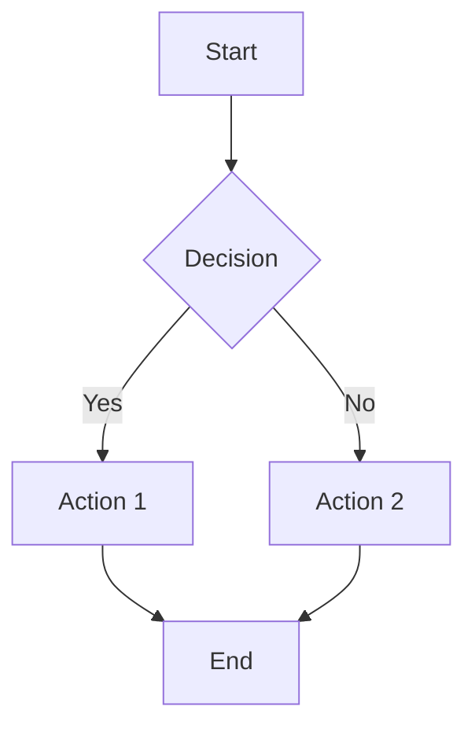

# Virtual Warehouse Generator

This skill generates virtual warehouse system prototype HTML files and PRD (Product Requirements Document) markdown files with consistent styling, structure, and formatting rules.

## When to Use

Invoke this skill when:
- User needs to create a new virtual warehouse module
- User wants to generate PRD documentation
- User needs to update prototype HTML pages
- User asks for consistent styling across virtual warehouse files
- User needs to add new features to existing virtual warehouse system

## File Structure

```
虚拟仓/
├── index.html          # Prototype HTML file
└── prd.md            # PRD documentation file
```

## Prototype HTML Styling Rules

### CSS Framework & Theme

**Framework**: Tailwind CSS
**Primary Color**: `#2a3b7d` (Deep Blue)
**Secondary Colors**:
- `#36CFC9` (Teal)
- `#722ED1` (Purple)
- `#00B42A` (Success Green)
- `#FF7D00` (Warning Orange)
- `#F53F3F` (Danger Red)

### Key CSS Classes

**Page Structure**:
```css
.main-content { display: none; }
.main-content.active { display: block; }
.page { display: none; }
.page.active { display: block; }
```

**PRD Content Styling**:
```css
.prose { 
    color: #374151; 
    line-height: 1.8; 
    font-size: 0.95rem;
}
.prose h1 { 
    font-size: 2rem; 
    font-weight: 700; 
    color: #1e293b;
    background: linear-gradient(135deg, #667eea 0%, #2a3b7d 100%);
}
.prose h2 { 
    font-size: 1.4rem; 
    font-weight: 600; 
    color: #2a3b7d;
    background: linear-gradient(135deg, #f0f4ff 0%, #e0e7ff 100%);
    border-left: 4px solid #2a3b7d;
}
```

**Table Styling**:
```css
.prose table { 
    width: 100%; 
    border-collapse: separate;
    border-radius: 12px;
    box-shadow: 0 1px 3px rgba(0,0,0,0.1);
}
.prose th { 
    background: linear-gradient(135deg, #2a3b7d 0%, #4f46e5 100%);
    color: white;
    font-weight: 600;
}
.prose tr:nth-child(even) td { background: #f9fafb; }
.prose tr:hover td { background: #f0f4ff; }
```

**Code Block Styling**:
```css
.prose pre { 
    background: linear-gradient(135deg, #1e293b 0%, #0f172a 100%);
    padding: 1.25rem;
    border-radius: 12px;
    border: 1px solid #334155;
}
.prose code { 
    background: linear-gradient(135deg, #f1f5f9 0%, #e2e8f0 100%);
    color: #dc2626;
    padding: 0.2rem 0.4rem;
    border-radius: 4px;
}
```

**TOC (Table of Contents) Styling**:
```css
.toc {
    position: sticky;
    top: 100px;
    background: white;
    border-radius: 12px;
    box-shadow: 0 4px 6px -1px rgba(0, 0, 0, 0.1);
}
.toc-level-2 {
    font-weight: 500;
    position: relative;
}
.toc-level-3 {
    padding-left: 1.5rem;
    font-size: 0.8rem;
}
```

**Mermaid Chart Styling**:
```css
.mermaid {
    cursor: zoom-in;
    transition: transform 0.3s ease;
}
.mermaid:hover {
    transform: scale(1.02);
}
.mermaid-modal {
    display: none;
    position: fixed;
    background: rgba(0, 0, 0, 0.85);
    z-index: 9999;
}
```

### JavaScript Libraries Required

```html
<!-- Tailwind CSS -->
<script src="https://cdn.tailwindcss.com"></script>

<!-- Markdown Parser -->
<script src="https://cdn.jsdelivr.net/npm/marked@4/marked.min.js"></script>

<!-- Mermaid Diagram -->
<script src="https://cdn.jsdelivr.net/npm/mermaid@10/dist/mermaid.min.js"></script>

<!-- Font Awesome -->
<link href="https://cdn.jsdelivr.net/npm/font-awesome@4.7.0/css/font-awesome.min.css" rel="stylesheet">
```

### JavaScript Initialization

```javascript
// Mermaid Initialization
mermaid.initialize({
    startOnLoad: true,
    theme: 'default',
    securityLevel: 'loose',
    logLevel: 3
});

// Marked Renderer for Mermaid
const renderer = new marked.Renderer();
renderer.code = function(code, language) {
    if (language === 'mermaid') {
        return `<div class="mermaid-container" onclick="openMermaidModal(this)">
            <div class="mermaid">${code}</div>
            <span class="mermaid-hint"><i class="fa fa-search-plus mr-1"></i>点击放大</span>
        </div>`;
    }
    return `<pre><code class="language-${language}">${code}</code></pre>`;
};
```

## PRD Markdown Generation Rules

### Document Structure

```markdown
# <Module Name> PRD

**版本**: V<version>  
**日期**: YYYY-MM-DD  
**状态**: <status>

---

## 1. Executive Summary 执行摘要

### Problem Statement 问题陈述
### Proposed Solution 解决方案
### Success Criteria 成功指标

## 2. User Experience & User Flows 用户体验与用户流程

### 2.1 User Personas 用户画像
### 2.2 User Journey Map 用户旅程图
### 2.3 User Flows 用户流程

## 3. Functional Modules 功能模块

### 3.1 <Module Name>
### 3.2 <Module Name>
...

## 4. Technical Specifications 技术规范

## 5. Data Model 数据模型

## 6. API Specifications API规范
```

### Table Format

```markdown
| 列1 | 列2 | 列3 |
|------|------|------|
| 数据1 | 数据2 | 数据3 |
| 数据4 | 数据5 | 数据6 |
```

### Mermaid Flowchart Format



### Function List Format

```markdown
**功能列表**：
```
<Module Name>
├── Feature 1（description）
├── Feature 2（description）
└── Feature 3（description）
```
```

### Logic Table Format

```markdown
**功能逻辑描述**：

| 按钮/操作 | 触发条件 | 约束条件 | 逻辑描述 | 预期结果 |
|-----------|----------|----------|----------|----------|
| Action 1 | Condition 1 | Constraint 1 | Description 1 | Result 1 |
| Action 2 | Condition 2 | Constraint 2 | Description 2 | Result 2 |
```

### Property Value Logic Format

```markdown
#### 4.4.3 字段取值逻辑

| 字段 | 数据来源 | 取值规则 | 显示格式 |
|------|----------|----------|----------|
| Field 1 | Source 1 | Rule 1 | Format 1 |
| Field 2 | Source 2 | Rule 2 | Format 2 |
```

### Modal Property Description Format

```markdown
#### 弹窗属性描述

| 字段 | 输入方式 | 必填 | 取值规则 |
|------|----------|------|----------|
| Field 1 | Input Type 1 | Yes/No | Rule 1 |
| Field 2 | Input Type 2 | Yes/No | Rule 2 |
```

## Data Source Rules

### Data Source Types

When describing data sources, use these standardized descriptions:

- **系统生成**: Auto-generated by system (e.g., IDs, timestamps)
- **键盘输入**: User keyboard input
- **手工选择**: Manual selection from dropdown
- **系统菜单**: System menu navigation
- **关联查询**: Related data query

### Data Source Examples

```markdown
| 字段 | 数据来源 | 取值规则 |
|------|----------|----------|
| 虚拟仓名称 | 键盘输入 | 新增弹窗取值 |
| 仓库类型 | 手工选择 | 新增弹窗取值 |
| 仓库编码 | 系统生成 | 系统定义，默认由客户代码+仓库类型+序号组成 |
| 创建时间 | 系统生成 | 记录提交的时间 |
```

## Prototype Page Structure

### Basic Page Template

```html
<div id="page-<module-name>" class="page">
    <!-- Search/Filter Section -->
    <div class="bg-white rounded shadow-card p-4 mb-4">
        <div class="flex flex-col sm:flex-row items-start sm:items-center gap-3">
            <!-- Search inputs -->
        </div>
    </div>

    <!-- Action Buttons -->
    <div class="bg-white rounded shadow-card p-4 mb-4">
        <div class="flex justify-start gap-3">
            <button class="erp-btn erp-btn-primary">
                <i class="fa fa-plus mr-1.5"></i> 新增
            </button>
            <button class="erp-btn erp-btn-secondary">
                <i class="fa fa-upload mr-1.5"></i> 导出
            </button>
        </div>
    </div>

    <!-- Data Table -->
    <div class="bg-white rounded shadow-card overflow-hidden">
        <div class="overflow-x-auto">
            <table class="min-w-full divide-y divide-neutral-200 text-sm table-auto">
                <thead class="bg-primary/10">
                    <tr>
                        <th class="px-4 py-3 text-left text-sm font-semibold text-primary whitespace-nowrap">Column 1</th>
                        <th class="px-4 py-3 text-left text-sm font-semibold text-primary whitespace-nowrap">Column 2</th>
                    </tr>
                </thead>
                <tbody class="bg-white divide-y divide-neutral-200">
                    <!-- Data rows -->
                </tbody>
            </table>
        </div>
    </div>

    <!-- PRD Documentation Section -->
    <div class="bg-white rounded shadow-card mt-4 overflow-hidden">
        <!-- Flow Diagram -->
        <div class="bg-white rounded shadow-card mt-4 overflow-hidden">
            <div class="px-4 py-3 bg-gradient-to-r from-primary/5 to-primary/10 border-b border-primary/20 flex justify-between items-center cursor-pointer" onclick="togglePrdFlow('<module-name>')">
                <div class="flex items-center">
                    <i class="fa fa-sitemap text-primary mr-2"></i>
                    <span class="font-semibold text-primary">流程图</span>
                    <span class="ml-2 text-xs text-gray-500">(点击展开/收起)</span>
                </div>
                <i class="fa fa-chevron-down text-primary transition-transform" id="<module-name>-flow-icon"></i>
            </div>
            <div id="<module-name>-flow-content" class="hidden">
                <div class="p-4">
                    <div class="mermaid">
                        <!-- Mermaid diagram code -->
                    </div>
                </div>
            </div>
        </div>

        <!-- Logic Description -->
        <div class="bg-white rounded shadow-card mt-4 overflow-hidden">
            <div class="px-4 py-3 bg-gradient-to-r from-primary/5 to-primary/10 border-b border-primary/20 flex justify-between items-center cursor-pointer" onclick="togglePrdLogic('<module-name>')">
                <div class="flex items-center">
                    <i class="fa fa-book text-primary mr-2"></i>
                    <span class="font-semibold text-primary">逻辑说明</span>
                    <span class="ml-2 text-xs text-gray-500">(点击展开/收起)</span>
                </div>
                <i class="fa fa-chevron-down text-primary transition-transform" id="<module-name>-logic-icon"></i>
            </div>
            <div id="<module-name>-logic-content">
                <!-- Logic tables -->
            </div>
        </div>
    </div>
</div>
```

### Modal Template

```html
<div id="<modal-name>-modal" class="modal-overlay">
    <div class="modal-content">
        <div class="modal-header">
            <h3 class="modal-title"><Modal Title></h3>
            <button class="close-btn" onclick="closeModal('<modal-name>-modal')">
                <i class="fa fa-times"></i>
            </button>
        </div>
        <div class="modal-body">
            <div class="form-group">
                <label for="<field-id>"><span class="required">*</span> Field Label</label>
                <input type="text" id="<field-id>" class="form-input" placeholder="Placeholder">
            </div>
        </div>
        <div class="modal-footer">
            <button class="close-btn" onclick="closeModal('<modal-name>-modal')">取消</button>
            <button class="erp-btn erp-btn-primary" onclick="save<Function>()">保存</button>
        </div>
    </div>
</div>
```

### JavaScript Functions Required

```javascript
// Page Navigation
document.querySelectorAll('[data-page]').forEach(function(link) {
    link.addEventListener('click', function(e) {
        e.preventDefault();
        const page = this.getAttribute('data-page');
        
        // Hide all pages
        document.querySelectorAll('.page').forEach(function(pageEl) {
            pageEl.classList.remove('active');
        });
        
        // Show target page
        const targetPage = document.getElementById('page-' + page);
        if (targetPage) {
            targetPage.classList.add('active');
            
            // Re-render Mermaid charts
            setTimeout(function() {
                const mermaidElements = targetPage.querySelectorAll('.mermaid');
                if (mermaidElements.length > 0) {
                    mermaid.init(undefined, mermaidElements);
                }
            }, 50);
        }
    });
});

// Toggle PRD Flow
function togglePrdFlow(module) {
    const content = document.getElementById(module + '-flow-content');
    const icon = document.getElementById(module + '-flow-icon');
    
    if (content) {
        if (content.classList.contains('hidden')) {
            content.classList.remove('hidden');
            if (icon) icon.style.transform = 'rotate(180deg)';
            
            // Re-render Mermaid charts
            setTimeout(function() {
                const mermaidElements = content.querySelectorAll('.mermaid');
                if (mermaidElements.length > 0) {
                    mermaid.init(undefined, mermaidElements);
                }
            }, 50);
        } else {
            content.classList.add('hidden');
            if (icon) icon.style.transform = 'rotate(0deg)';
        }
    }
}

// Toggle PRD Logic
function togglePrdLogic(module) {
    const content = document.getElementById(module + '-logic-content');
    const icon = document.getElementById(module + '-logic-icon');
    
    if (content.classList.contains('hidden')) {
        content.classList.remove('hidden');
        if (icon) icon.style.transform = 'rotate(180deg)';
    } else {
        content.classList.add('hidden');
        if (icon) icon.style.transform = 'rotate(0deg)';
    }
}

// Modal Operations
function openModal(modalId) {
    const modal = document.getElementById(modalId);
    if (modal) {
        modal.classList.add('show');
        document.body.style.overflow = 'hidden';
    }
}

function closeModal(modalId) {
    const modal = document.getElementById(modalId);
    if (modal) {
        modal.classList.remove('show');
        document.body.style.overflow = '';
    }
}
```

## Common Components

### Status Badge Colors

```html
<span class="status-badge bg-green-100 text-green-800">已完成</span>
<span class="status-badge bg-yellow-100 text-yellow-800">待处理</span>
<span class="status-badge bg-red-100 text-red-800">已拒绝</span>
<span class="status-badge bg-gray-100 text-gray-800">已取消</span>
```

### Button Styles

```html
<button class="erp-btn erp-btn-primary">
    <i class="fa fa-plus mr-1.5"></i> Primary Action
</button>
<button class="erp-btn erp-btn-secondary">
    <i class="fa fa-refresh mr-1.5"></i> Secondary Action
</button>
```

### Form Input Styles

```html
<div class="form-group">
    <label for="<field-id>"><span class="required">*</span> Field Label</label>
    <input type="text" id="<field-id>" class="form-input" placeholder="Placeholder">
</div>

<div class="form-group">
    <label for="<field-id>">Select Field</label>
    <select id="<field-id>" class="form-select">
        <option value="">请选择</option>
        <option value="option1">Option 1</option>
    </select>
</div>
```

## Usage Examples

### Example 1: Generate New Module PRD

When user asks: "Create a PRD for inventory management module"

1. Generate `prd.md` with:
   - Executive Summary section
   - User Experience section with personas and flows
   - Functional Modules section
   - Technical Specifications section
   - Use Mermaid flowcharts for processes
   - Use tables for data models and logic

2. Generate `index.html` with:
   - Page structure following template
   - Search/filter section
   - Data table with proper styling
   - PRD documentation section with flow diagram and logic tables
   - Modal for new/edit operations
   - JavaScript functions for navigation and interactions

### Example 2: Update Existing Module

When user asks: "Add storage fee migration to transfer module"

1. Update `prd.md`:
   - Add storage fee migration to transfer flow diagram
   - Update property value logic table
   - Add modal property description

2. Update `index.html`:
   - Add checkbox to transfer modal
   - Update transfer list table columns
   - Add logic to save function
   - Update PRD documentation section

## Best Practices

1. **Consistency**: Always use the same color scheme and styling patterns
2. **Accessibility**: Include proper labels and ARIA attributes
3. **Responsiveness**: Use Tailwind's responsive classes (sm:, md:, lg:)
4. **Documentation**: Always include PRD documentation sections in prototype pages
5. **Mermaid Charts**: Use consistent flowchart notation and styling
6. **Data Sources**: Use standardized data source descriptions
7. **Language**: Keep all UI text in Chinese, code comments in English
8. **Validation**: Always include form validation in JavaScript functions
9. **Error Handling**: Provide user-friendly error messages
10. **Performance**: Optimize Mermaid rendering with proper initialization timing

## File Generation Checklist

When generating files, ensure:

- [ ] HTML file includes all required CSS classes
- [ ] HTML file includes all required JavaScript libraries
- [ ] HTML file has proper page navigation
- [ ] HTML file includes modal templates
- [ ] HTML file has PRD documentation sections
- [ ] PRD markdown follows structure template
- [ ] PRD includes Mermaid flowcharts
- [ ] PRD includes proper tables
- [ ] Data sources use standardized descriptions
- [ ] All text is in Chinese (except code)
- [ ] All styling follows the color scheme
- [ ] JavaScript functions are properly implemented
- [ ] Mermaid charts render correctly
- [ ] TOC navigation works properly
- [ ] Modals open and close correctly
