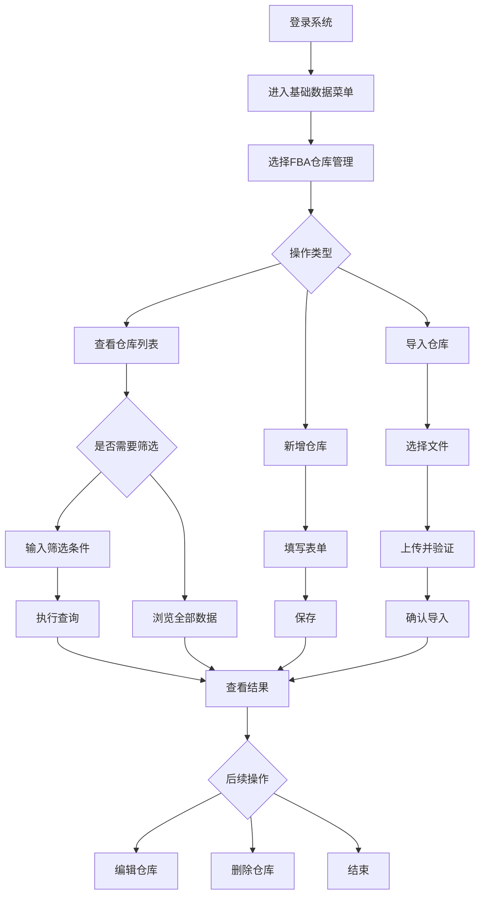
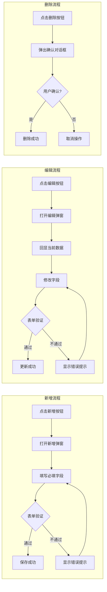

# FBA仓库管理 PRD

| 版本 | 日期 | 变更内容 | 变更人 | 审核人 | 备注 |
|------|------|----------|--------|--------|------|
| V1.0 | 2026-01-18 | 初始版本 | 产品经理 | 产品总监 | 基于高保真原型编写 |

---

## 1. Executive Summary 执行摘要

### 1.1 Problem Statement 问题陈述

面向业务：**跨境物流仓储管理**，
现状：**企业需要管理多个亚马逊FBA仓库的配置信息，包括仓库代码、地址、联系方式等基础数据，目前依赖Excel表格或分散的系统进行管理**。
痛点：
- **数据维护效率低**：仓库信息变更后无法及时同步到各业务系统
- **查询检索困难**：无法按多条件快速筛选和定位目标仓库
- **批量操作缺失**：新增大量仓库时需逐条录入，耗时耗力
- **数据一致性差**：不同部门维护的仓库信息存在冲突和不一致

### 1.2 Proposed Solution 解决方案

1、**构建统一的FBA仓库管理模块**，集中维护所有FBA仓库的基础信息（代码、名称、地址、联系方式等），作为系统的唯一数据源。
2、**提供灵活的筛选查询功能**，支持按仓库代码精确匹配和仓库名称模糊搜索，快速定位目标仓库。
3、**支持批量导入功能**，允许通过Excel模板批量导入仓库数据，提升数据初始化和维护效率。
4、**实现完整的CRUD操作**，支持新增、编辑、删除仓库信息，并保留完整的操作审计日志。

### 1.3 Success Criteria 成功指标

| 指标 | 目标值 |
|------|--------|
| 仓库列表加载时间 | < 500ms（1000条以内） |
| 查询响应时间 | < 300ms |
| 数据导入成功率 | >= 99%（格式正确的情况下） |
| 操作响应时间 | < 200ms（增删改） |
| 数据一致性 | 100%（无脏读/重复数据） |

---

## 2. User Experience & User Flows 用户体验与用户流程

### 2.1 User Personas 用户画像

| 角色 | 描述 | 目标 | 痛点 |
|------|------|------|------|
| **系统管理员** | 负责基础数据维护的全局管理员 | 维护完整的FBA仓库列表、确保数据准确性 | 手工维护效率低、容易出错 |
| **运营人员** | 使用仓库数据进行日常业务操作的员工 | 快速查找目标仓库信息、获取准确地址 | 查询不便、信息可能过时 |
| **财务人员** | 需要仓库地址用于对账和结算的财务人员 | 获取准确的仓库地址和联系信息 | 信息不一致导致账单错误 |

### 2.2 User Journey Map 用户旅程图



### 2.3 User Flows 用户流程

#### 核心业务流程：FBA仓库全生命周期管理



---

## 3. Functional Modules 功能模块

### 3.0 功能清单汇总

| 功能模块 | 功能点 | 优先级 | 说明 |
|----------|--------|:------:|------|
| **FBA仓库列表展示** | 列表加载与展示 | P0 | 页面初始化时展示所有FBA仓库 |
| **筛选查询** | 按条件筛选 | P0 | 支持仓库代码、名称筛选 |
| **新增仓库** | 单条新增 | P0 | 通过弹窗表单新增单个仓库 |
| **编辑仓库** | 修改仓库信息 | P0 | 通过弹窗表单修改已有仓库 |
| **删除仓库** | 删除仓库记录 | P0 | 支持单条删除，带确认提示 |
| **批量导入** | Excel导入 | P1 | 通过Excel模板批量导入仓库数据 |
| **重置筛选** | 清空条件 | P1 | 一键清空所有筛选条件 |
| **分页展示** | 数据分页 | P0 | 支持大数据量分页浏览 |

### 3.1 FBA仓库列表展示

#### 功能描述
系统在页面加载时自动获取并展示所有FBA仓库的完整列表，按创建时间倒序排列。

#### 页面元素
- **位置**：页面主体区域
- **组件**：数据表格（Data Table）
- **展示字段**：13个字段（详见4.1节）

#### 展示规则
- 默认按**创建时间倒序**排列
- 每页默认显示 **20条** 数据（可配置）
- 显示总数统计："共 X 条"
- 空状态提示："暂无FBA仓库数据"

### 3.2 筛选查询

#### 功能描述
提供两个维度的筛选条件，帮助用户快速定位目标仓库。

#### 筛选条件

| 筛选项 | 输入控件 | 类型 | 逻辑说明 | 必填 |
|--------|----------|:----:|----------|:----:|
| FBA仓库代码 | 下拉选择框 | 精确匹配 | 从现有仓库代码列表中选择 | 否 |
| FBA仓库名称 | 文本输入框 | 模糊搜索 | 支持前后模糊匹配 | 否 |

#### 操作按钮
- **查询按钮**：根据已填写的条件执行筛选，未填写的条件不参与过滤
- **重置按钮**：清空所有筛选条件，恢复显示全部数据

#### 交互逻辑
- 点击"查询"后，表格刷新显示符合条件的数据
- 点击"重置"后，所有输入框清空，表格恢复初始状态
- 支持空条件查询（直接点击查询显示全部数据）

### 3.3 新增仓库

#### 功能描述
通过弹窗表单的方式新增单个FBA仓库记录。

#### 触发方式
- 点击操作区域的 **"新增"** 按钮

#### 表单字段（详见4.1节属性定义）

#### 业务规则
1. **FBA仓库代码**为必填项且全局唯一
2. **FBA仓库名称**为必填项
3. 所有字段均需通过前端校验
4. 保存成功后关闭弹窗并刷新列表
5. 新增的记录显示在列表第一条（按创建时间倒序）

### 3.4 编辑仓库

#### 功能描述
修改已有的FBA仓库信息。

#### 触发方式
- 点击数据行操作列的 **"编辑"** 图标按钮

#### 业务规则
1. 弹窗打开时自动回显当前行的所有数据
2. **FBA仓库代码**不可修改（主键标识）
3. 其他字段均可编辑
4. 保存成功后关闭弹窗并刷新列表
5. 更新人和更新时间自动更新为当前用户和时间

### 3.5 删除仓库

#### 功能描述
删除指定的FBA仓库记录。

#### 触发方式
- 点击数据行操作列的 **"删除"** 图标按钮

#### 业务规则
1. 点击删除后弹出**二次确认对话框**
2. 对话框内容："确定要删除 [仓库名称] 吗？此操作不可恢复。"
3. 提供 **"确定"** 和 **"取消"** 两个按钮
4. 确认删除后从数据库移除该记录
5. 删除成功后刷新列表
6. **待确认**：如果仓库有关联数据（如库存、订单等），是否允许删除？

### 3.6 批量导入

#### 功能描述
通过上传Excel文件的方式批量导入FBA仓库数据。

#### 触发方式
- 点击操作区域的 **"导入"** 按钮

#### 导入流程
1. 点击"导入"按钮 → 打开文件选择弹窗
2. 选择Excel文件（.xlsx, .xls格式）
3. 上传文件 → 系统解析并验证数据格式
4. 显示预览数据（可选）→ 确认导入
5. 导入成功 → 刷新列表

#### 文件要求
- 格式：Excel 2007+ (.xlsx) 或 Excel 97-2003 (.xls)
- 大小：不超过 10MB
- 编码：UTF-8
- 模板：提供标准导入模板下载

#### 验证规则
1. 必填字段不能为空
2. FBA仓库代码不能重复（与已有数据比对）
3. 字段长度符合定义要求
4. 数据格式正确（如邮编、电话号码格式）

#### 错误处理
- 格式错误：返回具体错误行号和原因
- 重复数据：跳过重复记录并提示
- 部分失败：显示成功/失败数量明细

---

## 4. Functional Logic Details 功能模块详细逻辑

### 4.1 数据模型定义

#### 主表：fba_warehouse（FBA仓库信息表）

| 序号 | 字段名 | 中文名称 | 数据类型 | 存储长度 | 是否必填 | 默认值 | 说明 |
|:----:|--------|----------|:--------:|:--------:|:--------:|--------|------|
| 1 | warehouse_code | FBA仓库代码 | VARCHAR | 64 | ✅ 是 | - | 全局唯一标识 |
| 2 | warehouse_name | FBA仓库名称 | VARCHAR | 128 | ✅ 是 | - | 仓库显示名称 |
| 3 | address | 详细地址 | VARCHAR | 256 | ❌ 否 | - | 完整街道地址 |
| 4 | country | 国家 | VARCHAR | 32 | ❌ 否 | - | ISO国家代码或名称 |
| 5 | province | 省/州 | VARCHAR | 64 | ❌ 否 | - | 州/省名称 |
| 6 | city | 城市 | VARCHAR | 64 | ❌ 否 | - | 城市名称 |
| 7 | postal_code | 邮编 | VARCHAR | 16 | ❌ 否 | - | 邮政编码 |
| 8 | contact_phone | 联系电话 | VARCHAR | 32 | ❌ 否 | - | 仓库联系电话 |
| 9 | created_by | 创建人 | VARCHAR | 64 | ✅ 是 | 当前用户 | 创建操作人 |
| 10 | created_time | 创建时间 | DATETIME | - | ✅ 是 | 系统时间 | 记录创建时间 |
| 11 | updated_by | 更新人 | VARCHAR | 64 | ✅ 是 | 当前用户 | 最后更新人 |
| 12 | updated_time | 更新时间 | DATETIME | - | ✅ 是 | 系统时间 | 最后更新时间 |

#### 主键
- `warehouse_code` (FBA仓库代码)

#### 索引建议
- **PRIMARY KEY**: warehouse_code
- **INDEX**: warehouse_name (支持模糊搜索)
- **INDEX**: created_time (支持排序)

### 4.2 接口定义

#### 4.2.1 获取仓库列表

**接口路径**：`GET /api/fba/warehouse/list`

**请求参数**：

| 参数名 | 类型 | 必填 | 说明 |
|--------|------|:----:|------|
| warehouse_code | String | 否 | FBA仓库代码（精确匹配） |
| warehouse_name | String | 否 | FBA仓库名称（模糊搜索） |
| page | Integer | 否 | 页码，默认1 |
| page_size | Integer | 否 | 每页条数，默认20 |

**响应示例**：

```json
{
    "code": 200,
    "message": "success",
    "data": {
        "total": 100,
        "list": [
            {
                "warehouse_code": "DEMO",
                "warehouse_name": "DEMO",
                "address": "1568 N Linden Ave",
                "country": "US",
                "province": "CA",
                "city": "North Dallas",
                "postal_code": "95286",
                "contact_phone": "1234567890",
                "created_by": "Admin",
                "created_time": "2025-01-01 12:00:00",
                "updated_by": "Admin",
                "updated_time": "2025-01-01 12:00:00"
            }
        ]
    }
}
```

#### 4.2.2 新增仓库

**接口路径**：`POST /api/fba/warehouse/add`

**请求体**：

```json
{
    "warehouse_code": "WH001",
    "warehouse_name": "美国西部仓库",
    "address": "123 Main Street",
    "country": "US",
    "province": "CA",
    "city": "Los Angeles",
    "postal_code": "90001",
    "contact_phone": "1234567890"
}
```

**响应**：

```json
{
    "code": 200,
    "message": "新增成功"
}
```

**异常响应**：

```json
{
    "code": 400,
    "message": "FBA仓库代码已存在"
}
```

#### 4.2.3 编辑仓库

**接口路径**：`PUT /api/fba/warehouse/update`

**请求体**：

```json
{
    "warehouse_code": "DEMO",  // 不可修改，用作标识
    "warehouse_name": "DEMO Updated",
    "address": "New Address",
    // ...其他可编辑字段
}
```

#### 4.2.4 删除仓库

**接口路径**：`DELETE /api/fba/warehouse/delete`

**请求参数**：

| 参数名 | 类型 | 必填 | 说明 |
|--------|------|:----:|------|
| warehouse_code | String | ✅ 是 | 要删除的仓库代码 |

#### 4.2.5 批量导入

**接口路径**：`POST /api/fba/warehouse/import`

**请求格式**：`multipart/form-data`

**请求参数**：

| 参数名 | 类型 | 必填 | 说明 |
|--------|------|:----:|------|
| file | File | ✅ 是 | Excel文件（.xlsx/.xls） |

**响应**：

```json
{
    "code": 200,
    "message": "导入完成",
    "data": {
        "total": 100,
        "success_count": 98,
        "fail_count": 2,
        "error_details": [
            {
                "row": 15,
                "reason": "FBA仓库代码已存在"
            },
            {
                "row": 23,
                "reason": "仓库名称为空"
            }
        ]
    }
}
```

### 4.3 前端校验规则

#### 4.3.1 新增/编辑表单校验

| 字段 | 校验规则 | 错误提示 |
|------|----------|----------|
| FBA仓库代码 | 必填，1-64字符，仅允许字母数字下划线 | "请输入FBA仓库代码" / "格式不正确" |
| FBA仓库名称 | 必填，1-128字符 | "请输入FBA仓库名称" |
| 详细地址 | 选填，最大256字符 | "地址长度不能超过256字符" |
| 国家 | 选填，最大32字符 | "国家名称过长" |
| 省/州 | 选填，最大64字符 | - |
| 城市 | 选填，最大64字符 | - |
| 邮编 | 选填，符合邮编格式 | "邮编格式不正确" |
| 联系电话 | 选填，符合电话号码格式 | "电话号码格式不正确" |

#### 4.3.2 筛选条件校验

| 校验场景 | 规则 | 处理方式 |
|----------|------|----------|
| 仓库代码下拉 | 只能选择已有值 | 无需额外校验 |
| 仓库名称输入 | 自动去除首尾空格 | 前端trim处理 |
| 空条件查询 | 允许不填任何条件 | 返回全部数据 |

### 4.4 异常处理机制

| 异常场景 | 处理方式 | 用户提示 |
|----------|----------|----------|
| 网络超时 | 显示Toast错误提示 | "网络连接超时，请稍后重试" |
| 服务器错误(500) | 记录日志，显示友好提示 | "服务器繁忙，请稍后再试" |
| 权限不足 | 阻止操作，提示权限问题 | "您没有权限执行此操作" |
| 并发编辑冲突 | 采用乐观锁，提示重新加载 | "数据已被其他人修改，请刷新后重试" |
| 导入文件格式错误 | 返回具体错误信息 | "文件格式不支持，请使用.xlsx或.xls格式" |
| 导入数据量过大 | 限制单次导入上限 | "单次导入不能超过1000条" |

---

## 5. 非功能性需求

### 5.1 性能需求

| 场景 | 性能指标 | 测试方法 |
|------|----------|----------|
| 列表加载（<1000条） | < 500ms | JMeter压测 |
| 筛选查询响应 | < 300ms | 接口性能测试 |
| 新增/编辑提交 | < 200ms | 接口响应时间测试 |
| 批量导入（500条） | < 5s | 实际导入测试 |

### 5.2 安全需求

| 安全项 | 要求 | 实现方式 |
|--------|------|----------|
| 身份认证 | 登录后才能访问 | Session/Cookie验证 |
| 操作权限 | 仅管理员可增删改 | RBAC权限控制 |
| 数据安全 | 敏感操作留痕 | 操作日志记录 |
| XSS防护 | 防止脚本注入 | 输入转义、CSP策略 |
| CSRF防护 | 防止跨站请求伪造 | Token验证 |

### 5.3 兼容性需求

| 类别 | 支持范围 |
|------|----------|
| 浏览器 | Chrome 90+, Firefox 88+, Safari 14+, Edge 90+ |
| 分辨率 | 最低1366x768，推荐1920x1080及以上 |
| 移动端 | 响应式布局，支持平板设备 |

---

## 6. 附录

### 6.1 术语表

| 术语 | 英文 | 说明 |
|------|------|------|
| FBA | Fulfillment by Amazon | 亚马逊物流服务，卖家将商品发送至亚马逊仓库，由亚马逊负责配送 |
| FBA仓库 | FBA Warehouse | 亚马逊在全球各地的物流中心/仓库 |
| CRUD | Create, Read, Update, Delete | 增删改查操作 |

### 6.2 参考文档

- [原型页面](./index.html)
- [测试用例](./test-cases.md)
- [设计令牌规范](../.trae/skills/Template/00-design-tokens.md)

### 6.3 变更历史

| 版本 | 日期 | 变更内容 | 变更人 |
|:----:|:----:|----------|--------|
| V1.0 | 2026-01-18 | 初始版本，基于高保真原型编写 | 产品经理 |
