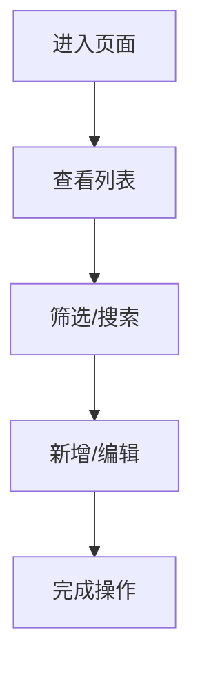
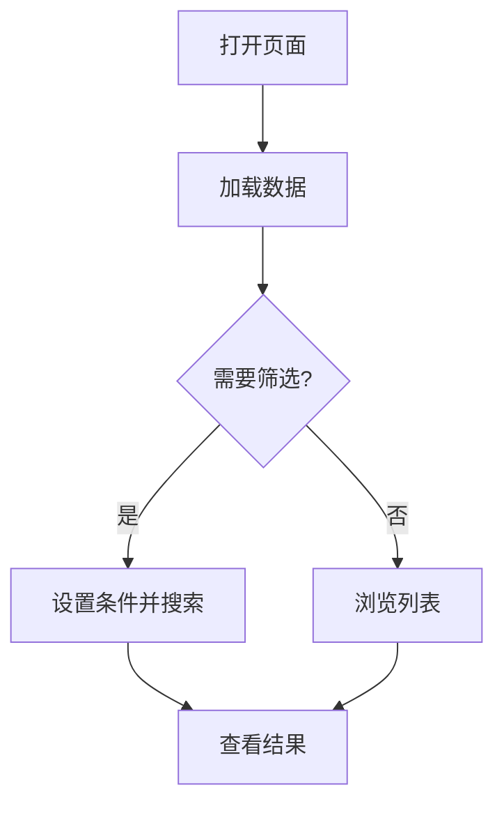

# [模块名称] PRD

| 版本 | 日期 | 变更内容 | 变更人 | 审核人 | 备注 |
|------|------|----------|--------|--------|------|
| V1.0 | YYYY-MM-DD | 初始版本 | - | - | - |

---

## 1. Executive Summary 执行摘要

### 1.1 Problem Statement 问题陈述

面向业务：[业务领域]，

现状：[当前情况描述]

痛点：
- [痛点 1]
- [痛点 2]

### 1.2 Proposed Solution 解决方案

1、[解决方案要点 1]

2、[解决方案要点 2]

### 1.3 Success Criteria 成功指标

| 指标 | 目标值 |
|------|--------|
| 查询响应时间 | < 500ms |
| 数据准确率 | 100% |

---

## 2. User Experience & User Flows

### 2.1 User Personas 用户画像

| 角色 | 描述 | 目标 | 痛点 |
|------|------|------|------|
| [角色] | [描述] | [目标] | [痛点] |

### 2.2 User Journey Map 用户旅程图

### 2.3 User Flows 用户流程

#### 2.3.1 [核心流程名称]

---

## 3. Functional Modules 功能模块

### 3.0 功能清单汇总

| 模块名称 | 功能点 | 功能描述 | 优先级 |
|----------|--------|----------|--------|
| [模块名] | 列表查询 | 展示数据列表，支持筛选 | P0 |
| [模块名] | 新增 | 通过弹窗新增记录 | P0 |
| [模块名] | 编辑 | 编辑已有记录 | P0 |
| [模块名] | 删除 | 删除记录（需确认） | P0 |

### 3.1 [模块名称]

**模块概述**：[简要描述]

**功能逻辑描述**：

| 按钮/操作 | 触发条件 | 约束条件 | 逻辑描述 | 预期结果 |
|-----------|----------|----------|----------|----------|
| 新增 | 点击「新增」 | 无 | 1.打开弹窗 2.填写 3.校验 4.保存 | 列表刷新 |
| 编辑 | 点击行内「编辑」 | 记录存在 | 1.预填 2.修改 3.保存 | 更新成功 |
| 删除 | 点击行内「删除」 | 二次确认 | 1.确认 2.删除 | 列表刷新 |

---

## 4. Functional Logic Details 功能模块详细逻辑

### 4.1 初始化页面数据展示逻辑

| 逻辑项 | 说明 | 数据来源 | 展示规则 |
|--------|------|----------|----------|
| 列表加载 | 页面加载时展示数据 | data/[page_id]-data.json | 按创建时间倒序 |

### 4.2 模块按钮逻辑

| 按钮 | 位置 | 触发动作 | 前置条件 | 后续操作 |
|------|------|----------|----------|----------|
| 新增 | 列表上方 | 打开弹窗 | 无 | 保存后刷新列表 |

### 4.3 字段取值逻辑

| 字段 | 数据来源 | 取值规则 | 显示格式 |
|------|----------|----------|----------|
| 名称 | record.name | 直接取值 | 文本 |
| 状态 | record.status | active→启用，inactive→禁用 | 标签 |
| 创建时间 | record.createdAt | ISO 转本地日期 | YYYY-MM-DD |

### 4.4 弹窗属性描述

| 字段 | 输入方式 | 必填 | 取值规则 |
|------|----------|------|----------|
| 名称 | 文本输入 | 是 | 1-50 字符，不可为空 |
| 状态 | 下拉选择 | 是 | 启用 / 禁用 |
