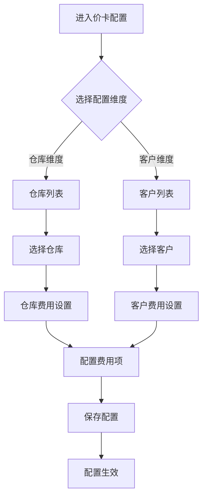
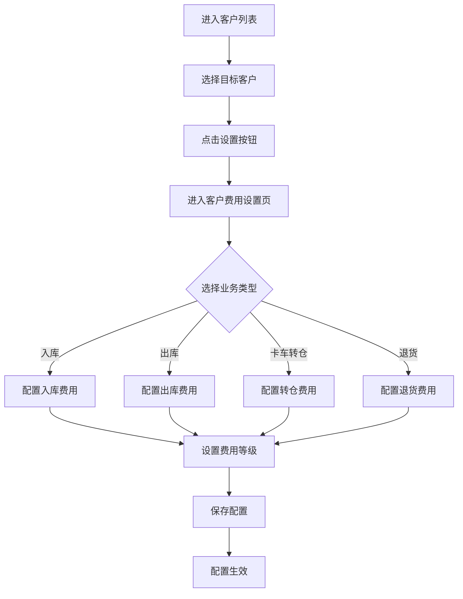
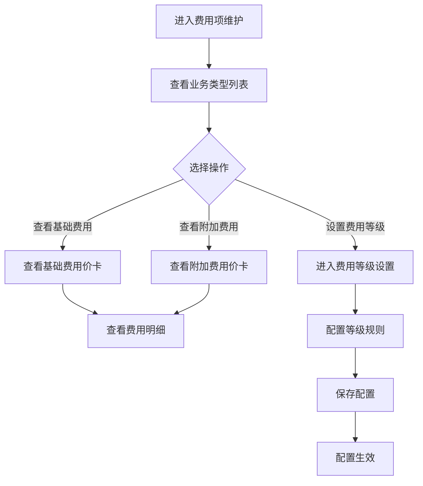
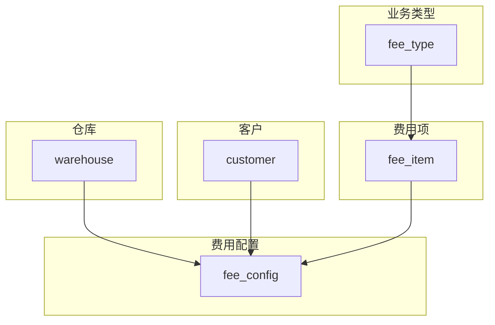

# 价卡配置模块 PRD

**版本**: V1.0  
**日期**: 2026-03-25  
**状态**: 待评审

---

## 1. Executive Summary 执行摘要

### Problem Statement 问题陈述

面向业务：海外仓业务，
现状：仓库和客户的费用配置分散在多个系统，缺乏统一的价卡管理平台，费用项配置不透明、难以追溯。
痛点：费用配置混乱、无法快速查询某仓库/客户的收费项、费用调整缺乏审批流程、账单计算易出错。

### Proposed Solution 解决方案

1、构建统一的价卡配置管理系统，支持按仓库、按客户两个维度进行费用配置管理。
2、系统提供费用项维护功能，支持基础费用和附加费用的分级管理，实现费用配置的可追溯和可审计。

### Success Criteria 成功指标

| 指标 | 目标值 |
|------|--------|
| 费用配置查询响应时间 | < 300ms |
| 费用项配置准确率 | 100% |
| 配置变更可追溯率 | 100% |
| 系统可用性 | >= 99.9% |
| 用户操作满意度 | >= 90% |

---

## 2. User Experience & User Flows 用户体验与用户流程

### 2.1 User Personas 用户画像

| 角色 | 描述 | 目标 | 痛点 |
|------|------|------|------|
| 财务管理员 | 负责费用配置和账单管理 | 快速配置仓库/客户费用、查看费用明细 | 费用配置分散、难以统一管理 |
| 运营人员 | 负责日常业务运营 | 查询某仓库/客户的收费项、确认费用标准 | 费用信息不透明、查询困难 |
| 系统管理员 | 负责系统维护和配置 | 管理费用项模板、维护业务类型 | 费用项变更无记录、难以追溯 |
| 客户经理 | 负责客户关系维护 | 为客户配置专属费用标准、响应客户需求 | 客户费用配置复杂、易出错 |

### 2.2 User Journey Map 用户旅程图



### 2.3 User Flows 用户流程

#### 2.3.1 仓库费用配置流程


**流程说明**：
- 用户从仓库列表选择目标仓库
- 点击设置按钮进入仓库费用设置页面
- 选择业务类型（入库/出库/卡车转仓/退货）
- 配置该业务类型下的费用等级和金额
- 保存后配置立即生效

#### 2.3.2 客户费用配置流程



**流程说明**：
- 用户从客户列表选择目标客户
- 点击设置按钮进入客户费用设置页面
- 选择业务类型进行费用配置
- 配置完成后保存生效

#### 2.3.3 费用项维护流程



---

## 3. Functional Modules 功能模块

### 3.0 功能清单汇总

| 模块名称 | 功能点 | 功能描述 | 优先级 |
|----------|--------|----------|--------|
| 仓库列表 | 仓库查询 | 按仓库代码筛选查询仓库列表 | P0 |
| 仓库列表 | 仓库费用设置入口 | 点击设置按钮进入仓库费用配置页面 | P0 |
| 仓库列表 | 关联收费项统计 | 显示每个仓库关联的收费项数量 | P1 |
| 客户列表 | 客户查询 | 按客户代码筛选查询客户列表 | P0 |
| 客户列表 | 客户费用设置入口 | 点击设置按钮进入客户费用配置页面 | P0 |
| 客户列表 | 关联收费项统计 | 显示每个客户关联的收费项数量 | P1 |
| 费用项维护 | 业务类型查询 | 搜索查询业务类型列表 | P0 |
| 费用项维护 | 费用项统计 | 显示基础费用和附加费用价卡数量 | P0 |
| 费用项维护 | 费用等级设置 | 配置费用等级规则和金额 | P0 |
| 仓库费用设置 | 业务类型切换 | 切换不同业务类型查看费用配置 | P0 |
| 仓库费用设置 | 基础费用配置 | 配置基础费用项目和金额 | P0 |
| 仓库费用设置 | 附加费用配置 | 配置附加费用项目和金额 | P0 |
| 客户费用设置 | 业务类型切换 | 切换不同业务类型查看费用配置 | P0 |
| 客户费用设置 | 基础费用配置 | 配置基础费用项目和金额 | P0 |
| 客户费用设置 | 附加费用配置 | 配置附加费用项目和金额 | P0 |

**优先级说明**：
- **P0（核心功能）**：系统必须实现的基础功能，影响核心业务流程
- **P1（重要功能）**：提升用户体验和系统效率的功能

---

### 3.1 仓库列表

**模块概述**：展示所有仓库的价卡配置入口，支持按仓库筛选查询，显示关联收费项数量

**功能列表**：
```
仓库列表
├── 仓库筛选查询
├── 仓库列表展示
├── 关联收费项统计
└── 费用设置入口
```

**功能逻辑描述**：

| 按钮/操作 | 触发条件 | 约束条件 | 逻辑描述 | 预期结果 |
|-----------|----------|----------|----------|----------|
| 筛选仓库 | 选择仓库下拉框 | 无 | 1.选择仓库 2.筛选列表 3.显示匹配结果 | 列表显示筛选后的仓库 |
| 设置费用 | 点击"设置"按钮 | 无 | 1.获取仓库代码 2.跳转设置页面 3.传递参数 | 进入仓库费用设置页面 |

---

### 3.2 客户列表

**模块概述**：展示所有客户的价卡配置入口，支持按客户筛选查询，显示关联收费项数量

**功能列表**：
```
客户列表
├── 客户筛选查询
├── 客户列表展示
├── 关联收费项统计
└── 费用设置入口
```

**功能逻辑描述**：

| 按钮/操作 | 触发条件 | 约束条件 | 逻辑描述 | 预期结果 |
|-----------|----------|----------|----------|----------|
| 筛选客户 | 选择客户下拉框 | 无 | 1.选择客户 2.筛选列表 3.显示匹配结果 | 列表显示筛选后的客户 |
| 设置费用 | 点击"设置"按钮 | 无 | 1.获取客户代码 2.跳转设置页面 3.传递参数 | 进入客户费用设置页面 |

---

### 3.3 费用项维护

**模块概述**：管理各业务类型的费用项模板，显示基础费用和附加费用价卡数量

**功能列表**：
```
费用项维护
├── 业务类型搜索
├── 业务类型列表
├── 费用价卡统计
└── 费用等级设置入口
```

**功能逻辑描述**：

| 按钮/操作 | 触发条件 | 约束条件 | 逻辑描述 | 预期结果 |
|-----------|----------|----------|----------|----------|
| 搜索业务类型 | 输入关键词点击搜索 | 无 | 1.输入关键词 2.模糊匹配 3.显示结果 | 列表显示匹配的业务类型 |
| 重置搜索 | 点击"重置"按钮 | 无 | 1.清空搜索框 2.显示全部数据 | 列表显示全部业务类型 |
| 设置费用等级 | 点击设置图标 | 无 | 1.获取业务类型 2.跳转等级设置页面 | 进入费用等级设置页面 |

---

### 3.4 仓库费用设置

**模块概述**：配置指定仓库的各项费用标准，支持按业务类型分类配置

**功能列表**：
```
仓库费用设置
├── 业务类型切换
├── 基础费用配置
├── 附加费用配置
└── 费用保存
```

**功能逻辑描述**：

| 按钮/操作 | 触发条件 | 约束条件 | 逻辑描述 | 预期结果 |
|-----------|----------|----------|----------|----------|
| 切换业务类型 | 点击业务类型Tab | 无 | 1.切换Tab 2.加载对应费用配置 | 显示该业务类型的费用配置 |
| 保存配置 | 点击"保存"按钮 | 必填项已填写 | 1.校验数据 2.保存配置 3.提示成功 | 配置保存成功 |

**核心业务规则**：
- 仓库费用配置优先级高于客户费用配置
- 费用金额必须大于等于0
- 同一仓库同一业务类型同一费用项不能重复配置

---

### 3.5 客户费用设置

**模块概述**：配置指定客户的各项费用标准，支持按业务类型分类配置

**功能列表**：
```
客户费用设置
├── 业务类型切换
├── 基础费用配置
├── 附加费用配置
└── 费用保存
```

**功能逻辑描述**：

| 按钮/操作 | 触发条件 | 约束条件 | 逻辑描述 | 预期结果 |
|-----------|----------|----------|----------|----------|
| 切换业务类型 | 点击业务类型Tab | 无 | 1.切换Tab 2.加载对应费用配置 | 显示该业务类型的费用配置 |
| 保存配置 | 点击"保存"按钮 | 必填项已填写 | 1.校验数据 2.保存配置 3.提示成功 | 配置保存成功 |

**核心业务规则**：
- 客户费用配置为该客户的专属费用标准
- 若客户无专属配置，则使用默认费用标准
- 费用金额必须大于等于0

---

## 4. Functional Logic Details 功能模块详细逻辑

### 4.1 仓库列表

#### 4.1.1 初始化页面数据展示逻辑

| 逻辑项 | 说明 | 数据来源 | 展示规则 |
|--------|------|----------|----------|
| 仓库列表加载 | 页面加载时展示所有仓库 | warehouse表 | 按仓库代码排序 |
| 仓库下拉选项 | 顶部仓库筛选下拉框 | warehouse表 | 全部/各仓库代码 |
| 关联收费项数量 | 统计该仓库关联的收费项数量 | fee_config表count | 数字显示 |

#### 4.1.2 模块按钮逻辑

| 按钮 | 位置 | 触发动作 | 前置条件 | 后续操作 |
|------|------|----------|----------|----------|
| 设置 | 每行操作列 | 跳转到仓库费用设置页面 | 无 | 跳转并传递仓库代码参数 |

#### 4.1.3 字段取值逻辑

| 字段 | 数据来源 | 取值规则 | 显示格式 |
|------|----------|----------|----------|
| 仓库代码 | warehouse.code | 直接取值 | 文本显示 |
| 仓库名称 | warehouse.name | 直接取值 | 文本显示 |
| 关联收费项 | fee_config表count | 统计该仓库的费用配置数量 | 数字 |

---

### 4.2 客户列表

#### 4.2.1 初始化页面数据展示逻辑

| 逻辑项 | 说明 | 数据来源 | 展示规则 |
|--------|------|----------|----------|
| 客户列表加载 | 页面加载时展示所有客户 | customer表 | 按客户代码排序 |
| 客户下拉选项 | 顶部客户筛选下拉框 | customer表 | 全部/各客户代码 |
| 关联收费项数量 | 统计该客户关联的收费项数量 | fee_config表count | 数字显示 |

#### 4.2.2 模块按钮逻辑

| 按钮 | 位置 | 触发动作 | 前置条件 | 后续操作 |
|------|------|----------|----------|----------|
| 设置 | 每行操作列 | 跳转到客户费用设置页面 | 无 | 跳转并传递客户代码参数 |

#### 4.2.3 字段取值逻辑

| 字段 | 数据来源 | 取值规则 | 显示格式 |
|------|----------|----------|----------|
| 客户代码 | customer.code | 直接取值 | 文本显示 |
| 客户名称 | customer.name | 直接取值 | 文本显示 |
| 关联收费项 | fee_config表count | 统计该客户的费用配置数量 | 数字 |

---

### 4.3 费用项维护

#### 4.3.1 初始化页面数据展示逻辑

| 逻辑项 | 说明 | 数据来源 | 展示规则 |
|--------|------|----------|----------|
| 业务类型列表 | 页面加载时展示所有业务类型 | fee_type表 | 按更新时间倒序 |
| 基础费用价卡数量 | 统计该业务类型的基础费用项数量 | fee_item表count(type='base') | 数字显示 |
| 附加费用价卡数量 | 统计该业务类型的附加费用项数量 | fee_item表count(type='additional') | 数字显示 |
| 更新时间 | 该业务类型最后更新时间 | fee_type.update_time | YYYY-MM-DD HH:mm |

#### 4.3.2 模块按钮逻辑

| 按钮 | 位置 | 触发动作 | 前置条件 | 后续操作 |
|------|------|----------|----------|----------|
| 搜索 | 搜索区域 | 按关键词筛选业务类型 | 无 | 显示匹配的业务类型 |
| 重置 | 搜索区域 | 清空搜索条件 | 无 | 显示全部业务类型 |
| 设置 | 每行操作列 | 跳转到费用等级设置页面 | 无 | 跳转并传递业务类型参数 |

#### 4.3.3 字段取值逻辑

| 字段 | 数据来源 | 取值规则 | 显示格式 |
|------|----------|----------|----------|
| 业务类型 | fee_type.name | 直接取值 | 文本显示 |
| 基础费用价卡数量 | fee_item表count | 统计type='base'的数量 | 数字 |
| 附加费用价卡数量 | fee_item表count | 统计type='additional'的数量 | 数字 |
| 更新时间 | fee_type.update_time | 时间戳转日期时间 | YYYY-MM-DD HH:mm |

---

### 4.4 仓库费用设置

#### 4.4.1 初始化页面数据展示逻辑

| 逻辑项 | 说明 | 数据来源 | 展示规则 |
|--------|------|----------|----------|
| 仓库信息 | 从URL参数获取仓库代码 | URL参数 | 页面标题显示仓库名称 |
| 业务类型Tab | 显示所有业务类型选项 | fee_type表 | Tab形式展示 |
| 费用配置列表 | 加载该仓库该业务类型的费用配置 | fee_config表 | 表格形式展示 |

#### 4.4.2 模块按钮逻辑

| 按钮 | 位置 | 触发动作 | 前置条件 | 后续操作 |
|------|------|----------|----------|----------|
| 切换业务类型 | 业务类型Tab区域 | 加载对应费用配置 | 无 | 显示该业务类型的费用配置 |
| 保存 | 页面底部 | 保存费用配置 | 必填项已填写 | 保存成功，提示用户 |

#### 4.4.3 字段取值逻辑

| 字段 | 数据来源 | 取值规则 | 显示格式 |
|------|----------|----------|----------|
| 费用项名称 | fee_item.name | 直接取值 | 文本显示 |
| 费用类型 | fee_item.type | base=基础费用, additional=附加费用 | 标签显示 |
| 费用金额 | fee_config.amount | 直接取值 | 数字，保留2位小数 |
| 计费单位 | fee_item.unit | 直接取值 | 文本显示 |

#### 弹窗属性描述

| 字段 | 输入方式 | 必填 | 取值规则 |
|------|----------|------|----------|
| 费用金额 | 键盘输入 | 是 | 数字，大于等于0，保留2位小数 |
| 生效日期 | 日期选择器 | 否 | 选择生效日期，默认当天 |
| 备注 | 文本输入框 | 否 | 最多200字符 |

**核心业务规则**：
1. 仓库费用配置优先级：仓库专属配置 > 默认配置
2. 费用金额修改后立即生效，历史账单不受影响
3. 同一费用项不能重复配置

---

### 4.5 客户费用设置

#### 4.5.1 初始化页面数据展示逻辑

| 逻辑项 | 说明 | 数据来源 | 展示规则 |
|--------|------|----------|----------|
| 客户信息 | 从URL参数获取客户代码 | URL参数 | 页面标题显示客户名称 |
| 业务类型Tab | 显示所有业务类型选项 | fee_type表 | Tab形式展示 |
| 费用配置列表 | 加载该客户该业务类型的费用配置 | fee_config表 | 表格形式展示 |

#### 4.5.2 模块按钮逻辑

| 按钮 | 位置 | 触发动作 | 前置条件 | 后续操作 |
|------|------|----------|----------|----------|
| 切换业务类型 | 业务类型Tab区域 | 加载对应费用配置 | 无 | 显示该业务类型的费用配置 |
| 保存 | 页面底部 | 保存费用配置 | 必填项已填写 | 保存成功，提示用户 |

#### 4.5.3 字段取值逻辑

| 字段 | 数据来源 | 取值规则 | 显示格式 |
|------|----------|----------|----------|
| 费用项名称 | fee_item.name | 直接取值 | 文本显示 |
| 费用类型 | fee_item.type | base=基础费用, additional=附加费用 | 标签显示 |
| 费用金额 | fee_config.amount | 直接取值 | 数字，保留2位小数 |
| 计费单位 | fee_item.unit | 直接取值 | 文本显示 |

#### 弹窗属性描述

| 字段 | 输入方式 | 必填 | 取值规则 |
|------|----------|------|----------|
| 费用金额 | 键盘输入 | 是 | 数字，大于等于0，保留2位小数 |
| 生效日期 | 日期选择器 | 否 | 选择生效日期，默认当天 |
| 备注 | 文本输入框 | 否 | 最多200字符 |

**核心业务规则**：
1. 客户费用配置优先级：客户专属配置 > 默认配置
2. 若客户无专属配置，系统自动使用默认配置
3. 费用金额修改后立即生效，历史账单不受影响

---

## 5. Acceptance Criteria 验收标准

### 5.1 功能验收

| 功能 | 验收条件 | 测试方法 | 优先级 |
|------|----------|----------|--------|
| 仓库列表查询 | 能正确显示所有仓库，支持筛选 | 功能测试 | P0 |
| 客户列表查询 | 能正确显示所有客户，支持筛选 | 功能测试 | P0 |
| 费用项维护查询 | 能正确显示所有业务类型，支持搜索 | 功能测试 | P0 |
| 仓库费用配置 | 能正确配置和保存仓库费用 | 功能测试 | P0 |
| 客户费用配置 | 能正确配置和保存客户费用 | 功能测试 | P0 |
| 费用金额校验 | 费用金额必须大于等于0 | 边界测试 | P0 |
| 配置保存校验 | 必填项未填写时无法保存 | 异常测试 | P0 |

### 5.2 性能验收

| 指标 | 目标值 | 阈值 | 说明 |
|------|--------|------|------|
| 列表查询响应时间 | < 300ms | 500ms | 仓库/客户列表查询 |
| 费用配置保存时间 | < 500ms | 1s | 费用配置保存 |
| 页面加载时间 | < 1s | 2s | 首屏加载 |

---

## 6. 信息架构

### 实体关系图



### 关系说明

| 关系 | 描述 | 基数 |
|------|------|------|
| warehouse-fee_config | 一个仓库可有多条费用配置 | 1:N |
| customer-fee_config | 一个客户可有多条费用配置 | 1:N |
| fee_type-fee_item | 一个业务类型可有多个费用项 | 1:N |
| fee_item-fee_config | 一个费用项可有多条配置记录 | 1:N |

---

## 7. 风险与路线图

### 分阶段交付

| 版本 | 时间 | 范围 |
|------|------|------|
| V1.0 | 第1周 | 仓库列表、客户列表、费用项维护基础功能 |
| V1.1 | 第2周 | 仓库费用设置、客户费用设置完整功能 |
| V1.2 | 第3周 | 费用配置审计日志、数据导出功能 |

### 技术风险

| 风险 | 影响 | 缓解措施 |
|------|------|----------|
| 费用配置数据量大 | 中 | 采用分页查询、索引优化 |
| 配置变更频繁 | 低 | 增加配置版本管理 |
| 并发修改冲突 | 中 | 增加乐观锁机制 |

---

## 8. 附录

### 术语表

| 术语 | 定义 |
|------|------|
| 价卡 | 费用标准配置卡片，包含费用项和金额信息 |
| 基础费用 | 业务操作必须收取的费用，如入库费、出库费 |
| 附加费用 | 根据特殊情况收取的费用，如超重费、加急费 |
| 业务类型 | 费用所属的业务分类，如入库、出库、卡车转仓、退货 |
| 费用等级 | 根据条件划分的费用档次，如按重量、体积分级 |

---

## 9. 变更记录

| 版本 | 日期 | 变更内容 | 变更人 |
|------|------|----------|--------|
| V1.0 | 2026-03-25 | 初始版本 | 系统 |
