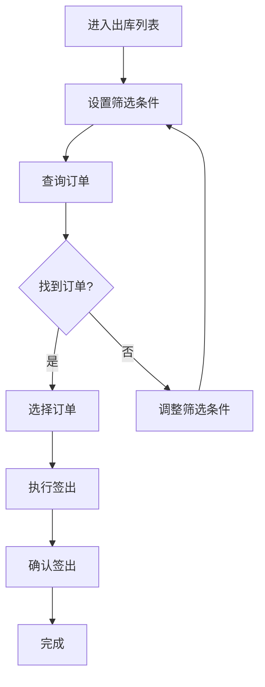
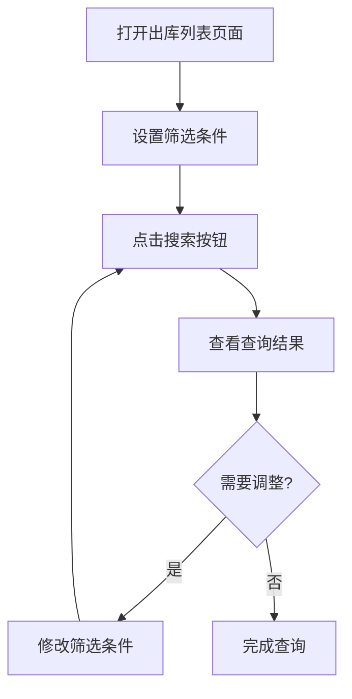
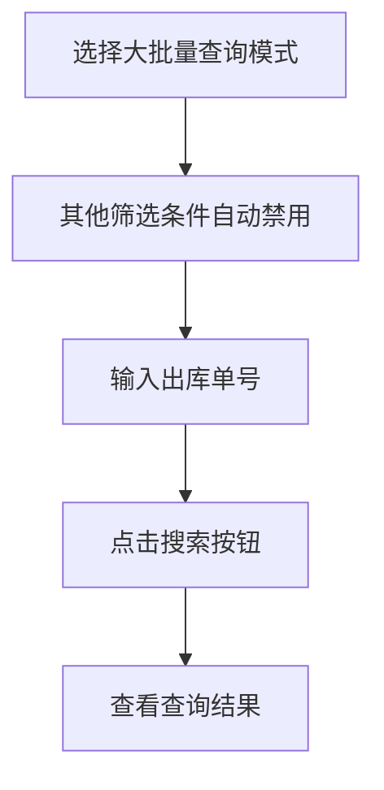
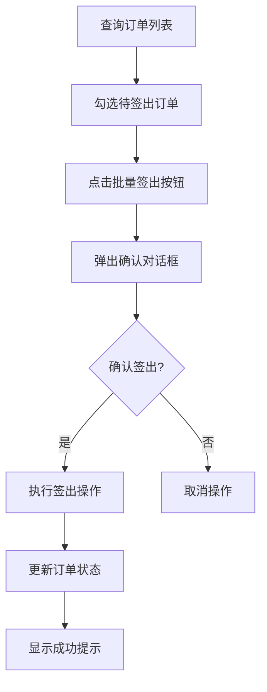

# 出库列表 PRD

| 版本 | 日期 | 变更内容 | 变更人 | 审核人 | 备注 |
|------|------|----------|--------|--------|------|
| V1.0 | 2024-01-15 | 初始版本 | zsw | - | - |

---

## 1. Executive Summary 执行摘要

### 1.1 Problem Statement 问题陈述

面向业务：出库管理业务，

现状：出库单据管理分散，缺乏统一的查询和管理界面，无法快速定位和处理出库订单。

痛点：
- 出库单据查询效率低，无法快速筛选和定位订单
- 批量操作功能缺失，需要逐个处理订单
- 缺少出库单号的批量查询功能，大批量订单处理困难
- 签出流程繁琐，缺少批量签出和一键签出功能

### 1.2 Proposed Solution 解决方案

1、构建统一的出库列表管理界面，支持多维度筛选查询，包括仓库、拣货类型、客户、SKU、配送渠道、出库单号、参考号、跟踪号等。

2、支持出库单号的大批量查询功能，选择该模式后自动禁用其他筛选条件，提升大批量订单查询效率。

3、提供批量签出和单行签出功能，支持快速处理多个出库订单。

4、集成展开/收起高级筛选条件，优化界面空间利用。

### 1.3 Success Criteria 成功指标

| 指标 | 目标值 |
|------|--------|
| 查询响应时间 | < 500ms（千级订单） |
| 批量签出处理时间 | < 2s（百级订单） |
| 大批量查询支持 | 支持1000+单号批量查询 |
| 筛选条件准确率 | 100% |
| 系统可用性 | >= 99.9% |

---

## 2. User Experience & User Flows 用户体验与用户流程

### 2.1 User Personas 用户画像

| 角色 | 描述 | 目标 | 痛点 |
|------|------|------|------|
| 仓库管理员 | 负责出库单据管理和签出操作 | 快速查询和处理出库订单 | 查询效率低、批量操作困难 |
| 客服人员 | 处理客户订单查询和问题 | 快速定位客户订单 | 订单信息分散、查询不便 |
| 财务人员 | 核对出库订单和费用 | 查看出库记录和费用明细 | 缺少费用明细导出功能 |
| 操作员 | 执行出库操作 | 快速签出订单 | 签出流程繁琐 |

### 2.2 User Journey Map 用户旅程图



### 2.3 User Flows 用户流程

#### 2.3.1 常规查询流程



**流程说明**：
- 用户可以设置多个筛选条件进行组合查询
- 支持精确查询和模糊查询模式
- 点击重置按钮可清空所有筛选条件

#### 2.3.2 大批量查询流程



**流程说明**：
- 选择"大批量查询"后，其他筛选条件自动禁用并清空
- 支持批量输入多个出库单号
- 切换回其他查询模式时，其他筛选条件恢复可用

#### 2.3.3 批量签出流程



**流程说明**：
- 支持单行签出和批量签出两种模式
- 签出前需要确认操作
- 签出成功后订单状态更新为"已出库"

---

## 3. Functional Modules 功能模块

### 3.0 功能清单汇总

| 功能模块 | 功能点 | 优先级 | 状态 |
|----------|--------|--------|------|
| 筛选查询 | 多维度筛选 | P0 | 已完成 |
| 筛选查询 | 大批量查询 | P0 | 已完成 |
| 筛选查询 | 高级筛选展开/收起 | P1 | 已完成 |
| 筛选查询 | 重置筛选条件 | P0 | 已完成 |
| 订单操作 | 单行签出 | P0 | 已完成 |
| 订单操作 | 批量签出 | P0 | 已完成 |
| 订单操作 | 查看订单详情 | P0 | 已完成 |
| 数据展示 | 订单列表展示 | P0 | 已完成 |
| 数据展示 | 分页功能 | P0 | 已完成 |
| 数据展示 | 全选/反选 | P0 | 已完成 |

### 3.1 筛选查询模块

#### 3.1.1 基础筛选条件

**功能描述**：
提供多维度的基础筛选条件，支持组合查询。

**筛选字段**：
- 仓库代码：下拉选择，支持多选
- 拣货类型：一单一件/一单多件
- 客户代码：下拉选择
- SKU：支持精确查询和模糊查询
- 配送渠道：发现快递/FedEx/UPS/DHL
- 出库单号：支持精确查询、模糊查询和大批量查询
- 参考号：支持精确查询和模糊查询
- 跟踪号：文本输入

**交互逻辑**：
- 所有筛选条件支持组合使用
- 点击搜索按钮执行查询
- 点击重置按钮清空所有筛选条件

#### 3.1.2 高级筛选条件

**功能描述**：
提供扩展的筛选条件，默认收起，点击展开按钮显示。

**筛选字段**：
- 创建时间：日期范围选择
- 隐藏已出库：是/否

**交互逻辑**：
- 默认收起状态
- 点击展开按钮显示高级筛选条件
- 点击收起按钮隐藏高级筛选条件

#### 3.1.3 大批量查询

**功能描述**：
支持批量输入多个出库单号进行查询，提升大批量订单查询效率。

**交互逻辑**：
- 选择"大批量查询"模式后，其他所有筛选条件自动禁用并清空
- 切换回其他查询模式时，其他筛选条件恢复可用
- 支持批量输入多个出库单号（换行分隔）

### 3.2 订单操作模块

#### 3.2.1 单行签出

**功能描述**：
对单个出库订单执行签出操作。

**前置条件**：
- 订单状态为待拣货、待揽收等可签出状态
- 订单未被取消或已完成

**操作流程**：
1. 点击操作列的"签出"按钮
2. 弹出确认对话框
3. 确认后执行签出操作
4. 订单状态更新为"已出库"

#### 3.2.2 批量签出

**功能描述**：
对多个选中的出库订单执行批量签出操作。

**前置条件**：
- 至少选中一条订单
- 选中的订单均为可签出状态

**操作流程**：
1. 勾选需要签出的订单
2. 点击"批量签出"按钮
3. 弹出确认对话框，显示选中订单数量
4. 确认后执行批量签出操作
5. 所有选中订单状态更新为"已出库"

#### 3.2.3 查看订单详情

**功能描述**：
查看出库订单的详细信息。

**操作方式**：
- 点击操作列的眼睛图标
- 跳转到订单详情页面

### 3.3 数据展示模块

#### 3.3.1 订单列表展示

**展示字段**：
- 复选框：用于批量选择
- 单号：出库单号、参考号、跟踪号
- 仓库：仓库代码
- SKU及数量：SKU信息和数量
- 拣货类型：一单一件/一单多件
- 配送渠道：物流渠道
- 物流产品：具体物流产品
- 创建时间：订单创建时间
- 创建人：订单创建人
- 操作：签出、查看详情

**状态标识**：
- 待拣货：可签出
- 待揽收：可签出
- 已出库：不可签出
- 已取消：不可签出
- 已送达：不可签出

#### 3.3.2 分页功能

**功能描述**：
支持分页浏览订单列表。

**交互逻辑**：
- 显示总记录数
- 支持上一页/下一页
- 支持跳转到指定页码
- 默认每页显示10条记录

#### 3.3.3 全选/反选

**功能描述**：
支持全选和反选当前页的所有订单。

**交互逻辑**：
- 点击表头的复选框，全选/反选当前页所有订单
- 单独勾选/取消勾选某个订单
- 批量操作按钮根据选中状态启用/禁用

---

## 4. Functional Logic Details 功能模块详细逻辑

### 4.1 筛选查询逻辑

#### 4.1.1 查询条件组合

**逻辑说明**：
- 所有筛选条件之间为AND关系
- 精确查询：完全匹配
- 模糊查询：包含匹配
- 大批量查询：支持多个单号，换行分隔

**示例**：
```
仓库代码 = 'CA008' AND 拣货类型 = '一单一件' AND 出库单号 LIKE '%DEMO%'
```

#### 4.1.2 大批量查询禁用逻辑

**触发条件**：
- 出库单号查询类型选择"大批量查询"

**禁用字段**：
- 仓库代码
- 拣货类型
- 客户代码
- SKU
- 配送渠道
- 参考号
- 跟踪号
- 创建时间
- 隐藏已出库

**恢复条件**：
- 出库单号查询类型切换为"精确查询"或"模糊查询"

### 4.2 签出逻辑

#### 4.2.1 签出前置校验

**校验规则**：
- 订单状态必须为待拣货、待揽收
- 订单未被取消
- 订单未完成出库

**错误提示**：
- "当前没有可签出的记录"
- "请至少选择一条记录进行签出"

#### 4.2.2 签出状态更新

**状态流转**：
```
待拣货 → 已出库
待揽收 → 已出库
```

**不可签出状态**：
- 已出库
- 已取消
- 已送达

### 4.3 分页逻辑

#### 4.3.1 分页计算

**计算公式**：
```
总页数 = Math.ceil(总记录数 / 每页记录数)
起始索引 = (当前页码 - 1) * 每页记录数
结束索引 = 起始索引 + 每页记录数
```

**边界处理**：
- 当前页码 < 1：设置为第1页
- 当前页码 > 总页数：设置为最后一页
- 总记录数为0：总页数为1

---

## 5. Non-Functional Requirements 非功能性需求

### 5.1 性能要求

| 指标 | 要求 |
|------|------|
| 页面加载时间 | < 1s |
| 查询响应时间 | < 500ms（千级订单） |
| 批量操作响应时间 | < 2s（百级订单） |

### 5.2 兼容性要求

- 浏览器：Chrome 90+、Firefox 88+、Safari 14+、Edge 90+
- 设备：PC端、平板端
- 分辨率：最小支持1366x768

### 5.3 安全要求

- 用户权限验证
- 操作日志记录
- 数据传输加密

---

## 6. Future Considerations 未来考虑

### 6.1 功能扩展

- 费用明细导出功能
- 发货证明下载功能
- 一键签出功能（签出当前筛选条件下的所有订单）
- 高级筛选条件扩展

### 6.2 性能优化

- 查询结果缓存
- 分页数据预加载
- 大批量查询性能优化

---

## 7. Appendix 附录

### 7.1 术语表

| 术语 | 说明 |
|------|------|
| 出库单号 | 出库订单的唯一标识 |
| 参考号 | 客户提供的订单参考号 |
| 跟踪号 | 物流跟踪号码 |
| 签出 | 确认出库操作 |
| 拣货类型 | 一单一件/一单多件 |
| 大批量查询 | 批量输入多个单号查询 |

### 7.2 相关文档

- 出库详情页面设计
- 出库流程设计文档
- 物流对接接口文档
