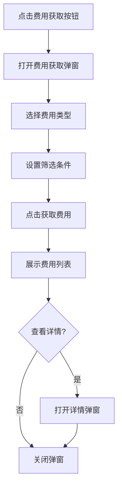
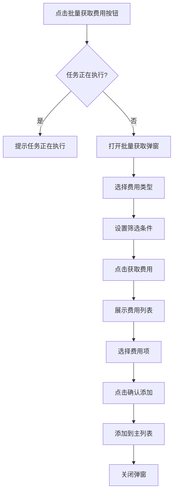

# 成本明细 PRD

| 版本 | 日期 | 变更内容 | 变更人 | 审核人 | 备注 |
|------|------|----------|--------|--------|------|
| V1.0 | 2026-02-27 | 初始版本 | zsw | - | - |
---

## 1. Executive Summary 执行摘要

### 1.1 Problem Statement 问题陈述

面向业务：海外仓费用对账业务，
现状：费用明细获取和对账工作主要依赖人工操作，需要从多个渠道收集费用数据，效率低下且容易出错。
痛点：
- 费用数据分散，难以统一获取和管理
- 批量获取费用流程复杂，需要手动筛选和核对
- 缺少统一的费用明细查看和管理界面
- 费用对账效率低，容易出现数据不一致

### 1.2 Proposed Solution 解决方案

1、构建成本明细获取系统，支持单条费用获取和批量费用获取两种模式。
2、提供灵活的筛选条件，支持按费用类型、客户、仓库、时间等多维度查询。
3、实现费用明细的统一展示和详情查看功能。
4、支持批量费用选择和添加，提升对账工作效率。

### 1.3 Success Criteria 成功指标

| 指标 | 目标值 |
|------|--------|
| 费用获取响应时间 | < 3s（单次获取） |
| 批量获取处理能力 | 支持1000条/次 |
| 费用数据准确率 | 100% |
| 用户操作效率提升 | 60%（相比纯人工操作） |
| 系统可用性 | >= 99.5% |

---

## 2. User Experience & User Flows 用户体验与用户流程

### 2.1 User Personas 用户画像

| 角色 | 描述 | 目标 | 痛点 |
|------|------|------|------|
| 财务对账员 | 负责日常费用对账工作 | 快速获取费用明细、高效完成对账 | 费用数据分散、手动操作繁琐 |
| 财务主管 | 负责费用审核和管理 | 查看费用汇总、监控费用情况 | 缺少统一视图、难以快速了解整体情况 |
| 运营人员 | 负责业务运营和成本分析 | 获取费用数据用于业务分析 | 获取数据困难、分析效率低 |

### 2.2 User Journey Map 用户旅程图


### 2.3 User Flows 用户流程

#### 2.3.1 单条费用获取流程



**流程说明**：
- 用户点击"费用获取"按钮打开弹窗
- 选择费用类型后，系统自动更新表头和筛选条件
- 设置筛选条件后点击"获取费用"查询数据
- 可以查看费用明细详情
- 确认后关闭弹窗，费用数据添加到主列表

#### 2.3.2 批量费用获取流程



**流程说明**：
- 点击"批量获取费用"按钮前检查是否有任务正在执行
- 打开弹窗后设置筛选条件并搜索
- 支持全选或单选费用项
- 未勾选任何项时默认添加全部搜索结果
- 确认后将选中的费用添加到主列表

---

## 3. Functional Modules 功能模块

### 3.0 功能清单汇总

| 模块名称 | 功能点 | 功能描述 | 优先级 |
|----------|--------|----------|--------|
| 主页面管理 | 费用列表展示 | 展示已获取的费用明细列表 | P0 |
| 主页面管理 | 筛选查询 | 支持多维度筛选和搜索费用 | P0 |
| 主页面管理 | 分页展示 | 支持分页浏览费用数据 | P0 |
| 主页面管理 | 导出功能 | 支持导出费用数据 | P1 |
| 费用获取 | 单条费用获取 | 打开费用获取弹窗，支持单条费用查询和添加 | P0 |
| 费用获取 | 动态表头 | 根据费用类型动态更新表格表头 | P0 |
| 费用获取 | 筛选条件配置 | 支持灵活配置筛选条件 | P0 |
| 费用获取 | 费用详情查看 | 支持查看费用明细详情 | P0 |
| 批量获取 | 批量费用获取 | 支持批量获取和添加费用 | P0 |
| 批量获取 | 费用选择 | 支持多选费用项 | P0 |
| 批量获取 | 金额合计 | 实时计算选中费用的金额合计 | P1 |

### 3.1 主页面管理

**模块概述**：提供费用明细的统一展示、查询和管理界面。

**功能列表**：
```
主页面管理
├── 费用列表展示
├── 筛选查询
├── 分页展示
└── 导出功能
```

**功能逻辑描述**：

| 按钮/操作 | 触发条件 | 约束条件 | 逻辑描述 | 预期结果 |
|-----------|----------|----------|----------|----------|
| 页面加载 | 用户进入页面 | 无 | 1.初始化页面 2.加载默认数据 3.渲染列表 | 展示费用列表 |
| 搜索 | 点击搜索按钮 | 筛选条件已设置 | 1.收集筛选条件 2.调用查询接口 3.更新列表 | 展示符合条件的费用 |
| 重置 | 点击重置按钮 | 无 | 1.清空筛选条件 2.加载默认数据 | 展示所有费用，筛选条件清空 |
| 导出 | 点击导出按钮 | 有数据可导出 | 1.收集当前数据 2.生成导出文件 3.下载 | 导出成功，文件下载 |

### 3.2 费用获取

**模块概述**：提供单条费用获取的功能，支持灵活的筛选和详情查看。

**功能列表**：
```
费用获取
├── 打开弹窗
├── 选择费用类型
├── 设置筛选条件
├── 获取费用
├── 查看详情
└── 确认添加
```

**功能逻辑描述**：

| 按钮/操作 | 触发条件 | 约束条件 | 逻辑描述 | 预期结果 |
|-----------|----------|----------|----------|----------|
| 费用获取 | 点击"费用获取"按钮 | 无 | 1.打开弹窗 2.初始化客户和仓库为全部 3.更新表头 | 弹窗打开，费用类型为空 |
| 选择费用类型 | 下拉选择费用类型 | 无 | 1.更新表格表头 2.更新筛选条件显示 | 表头和筛选条件动态更新 |
| 获取费用 | 点击"获取费用"按钮 | 费用类型已选择 | 1.收集筛选条件 2.调用查询接口 3.渲染费用列表 | 展示查询到的费用列表 |
| 查看详情 | 点击"查看"按钮 | 有选中的费用项 | 1.加载费用详情 2.打开详情弹窗 3.展示账单信息和明细 | 详情弹窗打开，展示完整信息 |
| 确认添加 | 点击"确认添加"按钮 | 无 | 1.关闭弹窗 2.将费用添加到主列表 3.刷新主列表 | 弹窗关闭，主列表更新 |
| 关闭 | 点击"关闭"或X按钮 | 无 | 1.关闭弹窗 | 弹窗关闭 |

### 3.3 批量获取

**模块概述**：提供批量费用获取的功能，支持高效的批量操作。

**功能列表**：
```
批量获取
├── 打开弹窗
├── 任务状态检查
├── 选择费用类型
├── 设置筛选条件
├── 获取费用
├── 选择费用项
├── 金额合计
└── 确认添加
```

**功能逻辑描述**：

| 按钮/操作 | 触发条件 | 约束条件 | 逻辑描述 | 预期结果 |
|-----------|----------|----------|----------|----------|
| 批量获取费用 | 点击"批量获取费用"按钮 | 无 | 1.检查是否有任务正在执行 2.如果有则提示 3.否则打开弹窗 | 弹窗打开或提示任务正在执行 |
| 选择费用类型 | 下拉选择费用类型 | 无 | 1.更新表格表头 2.更新筛选条件显示 | 表头和筛选条件动态更新 |
| 获取费用 | 点击"获取费用"按钮 | 费用类型已选择 | 1.收集筛选条件 2.调用查询接口 3.渲染费用列表 | 展示查询到的费用列表 |
| 全选/取消全选 | 点击表头复选框 | 有数据 | 1.切换所有行的选中状态 2.更新选中数量和金额合计 | 所有行选中状态切换 |
| 单选 | 点击行复选框 | 无 | 1.切换当前行选中状态 2.更新选中数量和金额合计 | 当前行选中状态切换 |
| 确认添加 | 点击"确认添加"按钮 | 无 | 1.获取选中的费用项（未选则取全部） 2.添加到主列表 3.关闭弹窗 4.刷新主列表 | 弹窗关闭，主列表更新 |
| 关闭 | 点击"关闭"或X按钮 | 无 | 1.关闭弹窗 | 弹窗关闭 |

---

## 4. Functional Logic Details 功能模块详细逻辑

### 4.1 主页面数据展示逻辑

#### 4.1.1 初始化页面数据展示逻辑

| 逻辑项 | 说明 | 数据来源 | 展示规则 |
|--------|------|----------|----------|
| 费用列表加载 | 页面加载时默认展示费用明细列表 | 费用明细表(expense_detail) | 按创建时间倒序展示，支持分页 |
| 筛选条件默认值 | 页面加载时设置筛选条件默认值 | 配置项 | 费用类型默认选择"出库+快递(YC)"，其他条件为空 |

#### 4.1.2 主页面按钮逻辑

| 按钮 | 位置 | 触发动作 | 前置条件 | 后续操作 |
|------|------|----------|----------|----------|
| 费用获取 | 主页面右上角 | 打开费用获取弹窗 | 无 | 填写表单后提交，刷新主列表 |
| 批量获取费用 | 主页面右上角 | 打开批量获取费用弹窗 | 无正在执行的任务 | 选择费用后确认添加，刷新主列表 |
| 搜索 | 筛选区域 | 执行查询 | 筛选条件已设置 | 查询并刷新列表 |
| 重置 | 筛选区域 | 清空筛选条件 | 无 | 清空条件并刷新列表 |
| 导出 | 主页面操作区 | 导出当前数据 | 有数据可导出 | 生成并下载导出文件 |

#### 4.1.3 主页面字段取值逻辑

| 字段 | 数据来源 | 取值规则 | 显示格式 |
|------|----------|----------|----------|
| 费用类型 | expense_detail.type | 直接取值 | 文本显示 |
| 客户代码 | expense_detail.customer_code | 直接取值 | 文本显示 |
| 费用金额 | expense_detail.amount | 直接取值 | 货币格式（保留2位小数） |
| 币种 | expense_detail.currency | 直接取值 | 文本显示（USD、CNY等） |
| 创建时间 | expense_detail.create_time | 时间戳转日期 | YYYY-MM-DD HH:mm:ss |

### 4.2 费用获取弹窗逻辑

#### 4.2.1 费用获取弹窗属性描述

**通用属性**：
| 字段 | 输入方式 | 必填 | 取值规则 |
|------|----------|------|----------|
| 费用类型 | 下拉选择 | 是 | 从下拉列表选择（出库+快递(YC)、出库+快递(TMS)、仓储费、快递赔付等） |
| 客户代码 | 下拉选择 | 否 | 支持多选，默认"全部" |
| 仓库代码 | 下拉选择 | 否 | 支持多选，默认"全部" |

**出库+快递(YC)特定属性**：
| 字段 | 输入方式 | 必填 | 取值规则 |
|------|----------|------|----------|
| 运输方式 | 下拉选择 | 否 | 从下拉列表选择（标准快递、快速快递等） |
| 创建时间 | 日期范围 | 否 | 开始日期和结束日期 |
| 出库时间 | 日期范围 | 否 | 开始日期和结束日期 |

**出库+快递(TMS)特定属性**：
| 字段 | 输入方式 | 必填 | 取值规则 |
|------|----------|------|----------|
| 渠道 | 下拉选择 | 否 | 从下拉列表选择（FEDEX_MPS、FEDEX_HOME_GROUND、UPS_GROUND等） |
| 创建时间 | 日期范围 | 否 | 开始日期和结束日期 |
| 出库时间 | 日期范围 | 否 | 开始日期和结束日期 |

**仓储费特定属性**：
| 字段 | 输入方式 | 必填 | 取值规则 |
|------|----------|------|----------|
| 结算日期 | 日期范围 | 否 | 开始日期和结束日期 |

**赔付类（快递赔付、库内赔付）特定属性**：
| 字段 | 输入方式 | 必填 | 取值规则 |
|------|----------|------|----------|
| 无特定属性 | - | - | - |

**充值特定属性**：
| 字段 | 输入方式 | 必填 | 取值规则 |
|------|----------|------|----------|
| 创建时间 | 日期范围 | 否 | 开始日期和结束日期 |
| 流水号 | 文本输入 | 否 | 字符串 |

**费用调整特定属性**：
| 字段 | 输入方式 | 必填 | 取值规则 |
|------|----------|------|----------|
| 创建时间 | 日期范围 | 否 | 开始日期和结束日期 |
| 订单号 | 文本输入 | 否 | 字符串 |

**其他特定属性**：
| 字段 | 输入方式 | 必填 | 取值规则 |
|------|----------|------|----------|
| 创建时间 | 日期范围 | 否 | 开始日期和结束日期 |

### 4.3 批量获取弹窗逻辑

#### 4.3.1 批量获取弹窗属性描述

**通用属性**：
| 字段 | 输入方式 | 必填 | 取值规则 |
|------|----------|------|----------|
| 费用类型 | 下拉选择 | 是 | 从下拉列表选择，与费用获取弹窗一致 |
| 客户代码 | 下拉选择 | 否 | 支持多选，默认"全部" |
| 仓库代码 | 下拉选择 | 否 | 支持多选，默认"全部" |
| 费用选择 | 复选框选择 | 否 | 支持全选和单选，未选则默认全部 |

**出库+快递(YC)特定筛选条件**：
| 字段 | 输入方式 | 必填 | 取值规则 |
|------|----------|------|----------|
| 运输方式 | 下拉选择 | 否 | 从下拉列表选择（标准快递、快速快递等） |
| 创建时间 | 日期范围 | 否 | 开始日期和结束日期 |
| 出库时间 | 日期范围 | 否 | 开始日期和结束日期 |

**出库+快递(TMS)特定筛选条件**：
| 字段 | 输入方式 | 必填 | 取值规则 |
|------|----------|------|----------|
| 渠道 | 下拉选择 | 否 | 从下拉列表选择（FEDEX_MPS、FEDEX_HOME_GROUND、UPS_GROUND等） |
| 创建时间 | 日期范围 | 否 | 开始日期和结束日期 |
| 出库时间 | 日期范围 | 否 | 开始日期和结束日期 |

**仓储费特定筛选条件**：
| 字段 | 输入方式 | 必填 | 取值规则 |
|------|----------|------|----------|
| 结算日期 | 日期范围 | 否 | 开始日期和结束日期 |

**赔付类（快递赔付、库内赔付）特定筛选条件**：
| 字段 | 输入方式 | 必填 | 取值规则 |
|------|----------|------|----------|
| 无特定筛选条件 | - | - | - |

**充值特定筛选条件**：
| 字段 | 输入方式 | 必填 | 取值规则 |
|------|----------|------|----------|
| 创建时间 | 日期范围 | 否 | 开始日期和结束日期 |
| 流水号 | 文本输入 | 否 | 字符串 |

**费用调整特定筛选条件**：
| 字段 | 输入方式 | 必填 | 取值规则 |
|------|----------|------|----------|
| 创建时间 | 日期范围 | 否 | 开始日期和结束日期 |
| 订单号 | 文本输入 | 否 | 字符串 |

**其他特定筛选条件**：
| 字段 | 输入方式 | 必填 | 取值规则 |
|------|----------|------|----------|
| 创建时间 | 日期范围 | 否 | 开始日期和结束日期 |

---

## 5. 附录

### 5.1 费用类型说明

| 费用类型 | 说明 |
|----------|------|
| 出库+快递(YC) | 出库费用和快递费用（YC渠道） |
| 出库+快递(TMS) | 出库费用和快递费用（TMS渠道） |
| 仓储费 | 仓储相关费用 |
| 快递赔付 | 快递赔付相关费用 |
| 库内赔付(错发) | 库内错发赔付费用 |
| 库内赔付(丢件) | 库内丢件赔付费用 |
| 库内赔付(其他) | 库内其他赔付费用 |
| 其他 | 其他类型费用 |
| 充值 | 充值相关记录 |
| 费用调整 | 费用调整记录 |
