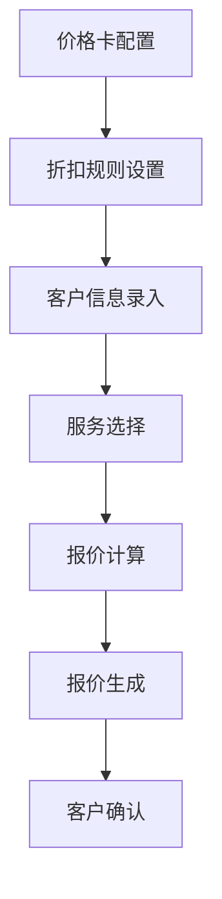
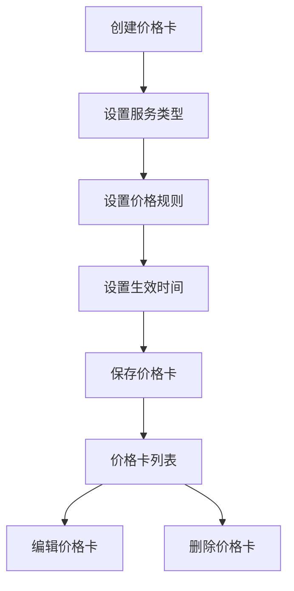
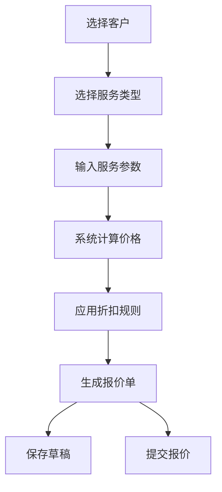

# 海外仓报价中心系统 - 报价模块 PRD

**版本**: V1.0  
**日期**: 2026-03-13  
**状态**: 待评审

---

## 1. Executive Summary 执行摘要

### 1.1 Problem Statement 问题陈述
- **面向业务**：海外仓业务
- **现状**：客户需要专业的报价管理系统来处理价格卡、折扣设置和报价生成
- **痛点**：价格管理混乱、折扣规则不清晰、报价生成效率低、无法满足不同客户的定制化需求

### 1.2 Proposed Solution 解决方案
1、构建海外仓报价中心系统，支持价格卡管理、客户折扣设置和定制化报价生成
2、提供专业的B2B企业级工具，确保价格计算准确、流程高效、数据透明

### 1.3 Success Criteria 成功指标
| 指标 | 目标值 |
|------|--------|
| 报价生成时间 | < 10秒/单 |
| 价格计算准确率 | 100% |
| 系统可用性 | >= 99.9% |
| 用户满意度 | >= 95% |

---

## 2. User Experience & User Flows 用户体验与用户流程

### 2.1 User Personas 用户画像
| 角色 | 描述 | 目标 | 痛点 |
|------|------|------|------|
| 报价管理员 | 负责系统配置和管理 | 维护价格卡、设置折扣规则 | 价格管理复杂、规则更新频繁 |
| 销售顾问 | 负责客户报价 | 快速生成准确报价、满足客户需求 | 报价计算复杂、客户要求多样 |
| 财务人员 | 负责价格审核 | 确保价格合规、成本可控 | 审核流程繁琐、数据不透明 |
| 客户 | 接收报价 | 获得清晰、透明的报价 | 报价不清晰、折扣不明确 |

### 2.2 User Journey Map 用户旅程图


### 2.3 User Flows 用户流程

#### 2.3.1 价格卡管理流程


#### 2.3.2 报价生成流程


---

## 3. Functional Modules 功能模块

### 3.0 功能清单汇总
| 模块名称 | 功能点 | 功能描述 | 优先级 |
|----------|--------|----------|--------|
| 价格卡管理 | 价格卡创建 | 创建不同类型的价格卡 | P0 |
| 价格卡管理 | 价格卡编辑 | 编辑现有价格卡信息 | P0 |
| 价格卡管理 | 价格卡查询 | 按条件查询价格卡 | P0 |
| 价格卡管理 | 价格卡状态管理 | 管理价格卡的生效状态 | P0 |
| 折扣设置 | 客户等级管理 | 设置不同等级的客户折扣 | P0 |
| 折扣设置 | 折扣规则管理 | 创建和管理折扣规则 | P0 |
| 折扣设置 | 折扣计算 | 自动计算适用的折扣 | P0 |
| 报价生成 | 客户信息管理 | 管理客户基本信息 | P0 |
| 报价生成 | 服务选择 | 选择和配置服务参数 | P0 |
| 报价生成 | 价格计算 | 基于价格卡和折扣计算价格 | P0 |
| 报价生成 | 报价单管理 | 生成、保存、导出报价单 | P0 |

### 3.1 价格卡管理
**模块概述**：负责创建、编辑、查询和管理价格卡，是报价系统的基础

**功能列表**：
```
价格卡管理
├── 价格卡创建（服务类型、价格规则、生效时间）
├── 价格卡编辑（修改价格卡信息）
├── 价格卡查询（按服务类型、状态筛选）
└── 价格卡状态管理（生效中、已过期）
```

### 3.2 折扣设置
**模块概述**：负责设置客户等级和折扣规则，实现差异化定价

**功能列表**：
```
折扣设置
├── 客户等级管理（普通客户、银卡客户、金卡客户）
├── 折扣规则管理（创建、编辑、删除折扣规则）
└── 折扣计算（自动应用适用的折扣）
```

### 3.3 报价生成
**模块概述**：负责根据客户需求和价格规则生成定制化报价

**功能列表**：
```
报价生成
├── 客户信息管理（客户选择、联系人信息）
├── 服务选择（仓储服务、操作服务、配送服务）
├── 价格计算（基于价格卡和折扣）
└── 报价单管理（生成、保存、导出）
```

---

## 4. Functional Logic Details 功能模块详细逻辑

### 4.1 价格卡管理

#### 4.1.1 初始化页面数据展示逻辑
| 逻辑项 | 说明 | 数据来源 | 展示规则 |
|--------|------|----------|----------|
| 价格卡列表加载 | 页面加载时默认展示所有价格卡 | 价格卡表(price_card) | 按创建时间倒序排列 |
| 服务类型筛选 | 顶部服务类型下拉框 | price_card.service_type | 全部/仓储服务/操作服务/配送服务 |
| 状态筛选 | 顶部状态下拉框 | price_card.status | 全部/生效中/已过期 |
| 价格卡名称搜索 | 顶部搜索框 | price_card.name | 模糊匹配 |

#### 4.1.2 模块按钮逻辑
| 按钮 | 位置 | 触发动作 | 前置条件 | 后续操作 |
|------|------|----------|----------|----------|
| 新增价卡 | 页面右上角 | 打开新增价卡弹窗 | 无 | 填写表单后提交，刷新列表 |
| 编辑 | 每行操作列 | 打开编辑价卡弹窗 | 无 | 填写表单后提交，更新列表 |
| 删除 | 每行操作列 | 确认弹窗 | 无 | 确认后删除，刷新列表 |

### 4.2 折扣设置

#### 4.2.1 初始化页面数据展示逻辑
| 逻辑项 | 说明 | 数据来源 | 展示规则 |
|--------|------|----------|----------|
| 客户等级卡片 | 页面加载时展示客户等级卡片 | 客户等级表(customer_tier) | 普通客户、银卡客户、金卡客户 |
| 折扣规则列表 | 页面加载时展示折扣规则 | 折扣规则表(discount_rule) | 按创建时间倒序排列 |

#### 4.2.2 模块按钮逻辑
| 按钮 | 位置 | 触发动作 | 前置条件 | 后续操作 |
|------|------|----------|----------|----------|
| 新增折扣规则 | 页面右上角 | 打开新增折扣规则弹窗 | 无 | 填写表单后提交，刷新列表 |
| 编辑 | 每行操作列 | 打开编辑折扣规则弹窗 | 无 | 填写表单后提交，更新列表 |
| 删除 | 每行操作列 | 确认弹窗 | 无 | 确认后删除，刷新列表 |

### 4.3 报价生成

#### 4.3.1 初始化页面数据展示逻辑
| 逻辑项 | 说明 | 数据来源 | 展示规则 |
|--------|------|----------|----------|
| 客户选择 | 客户信息下拉框 | 客户表(customer) | 按客户名称排序 |
| 客户等级显示 | 基于客户自动显示等级 | customer_tier表 | 显示客户对应的等级 |
| 服务选项 | 服务类型选择 | 服务类型表(service_type) | 仓储服务、操作服务、配送服务 |

#### 4.3.2 模块按钮逻辑
| 按钮 | 位置 | 触发动作 | 前置条件 | 后续操作 |
|------|------|----------|----------|----------|
| 保存草稿 | 页面底部 | 保存当前报价为草稿 | 填写必要信息 | 保存成功提示，可后续编辑 |
| 生成报价 | 页面底部 | 生成正式报价 | 填写完整信息 | 生成报价单，可导出 |

---

## 5. Data Model 数据模型

### 5.1 价格卡表 (price_card)
| 字段名 | 数据类型 | 描述 |
|--------|----------|------|
| id | BIGINT | 主键ID |
| name | VARCHAR(255) | 价格卡名称 |
| service_type | VARCHAR(50) | 服务类型 |
| price_rules | JSON | 价格规则 |
| start_date | DATE | 生效开始日期 |
| end_date | DATE | 生效结束日期 |
| status | VARCHAR(20) | 状态 |
| created_at | TIMESTAMP | 创建时间 |
| updated_at | TIMESTAMP | 更新时间 |

### 5.2 客户等级表 (customer_tier)
| 字段名 | 数据类型 | 描述 |
|--------|----------|------|
| id | BIGINT | 主键ID |
| name | VARCHAR(50) | 等级名称 |
| discount_rate | DECIMAL(5,2) | 折扣率 |
| min_transaction | DECIMAL(10,2) | 最低交易额 |
| created_at | TIMESTAMP | 创建时间 |

### 5.3 折扣规则表 (discount_rule)
| 字段名 | 数据类型 | 描述 |
|--------|----------|------|
| id | BIGINT | 主键ID |
| name | VARCHAR(255) | 规则名称 |
| customer_tier_id | BIGINT | 适用客户等级 |
| service_type | VARCHAR(50) | 适用服务类型 |
| discount_rate | DECIMAL(5,2) | 折扣率 |
| start_date | DATE | 生效开始日期 |
| end_date | DATE | 生效结束日期 |
| created_at | TIMESTAMP | 创建时间 |

### 5.4 客户表 (customer)
| 字段名 | 数据类型 | 描述 |
|--------|----------|------|
| id | BIGINT | 主键ID |
| name | VARCHAR(255) | 客户名称 |
| tier_id | BIGINT | 客户等级ID |
| contact_name | VARCHAR(100) | 联系人姓名 |
| phone | VARCHAR(20) | 联系电话 |
| created_at | TIMESTAMP | 创建时间 |

### 5.5 报价单表 (quote)
| 字段名 | 数据类型 | 描述 |
|--------|----------|------|
| id | BIGINT | 主键ID |
| quote_no | VARCHAR(50) | 报价编号 |
| customer_id | BIGINT | 客户ID |
| total_amount | DECIMAL(12,2) | 总金额 |
| status | VARCHAR(20) | 状态 |
| valid_until | DATE | 有效期至 |
| remark | TEXT | 备注 |
| created_at | TIMESTAMP | 创建时间 |

### 5.6 报价明细 (quote_item)
| 字段名 | 数据类型 | 描述 |
|--------|----------|------|
| id | BIGINT | 主键ID |
| quote_id | BIGINT | 报价单ID |
| service_type | VARCHAR(50) | 服务类型 |
| quantity | DECIMAL(10,2) | 数量 |
| unit_price | DECIMAL(10,2) | 单价 |
| amount | DECIMAL(10,2) | 金额 |
| discount_amount | DECIMAL(10,2) | 折扣金额 |

---

## 6. API Specifications API规范

### 6.1 价格卡管理API
| API路径 | 方法 | 功能描述 | 请求参数 | 响应格式 |
|---------|------|----------|----------|----------|
| /api/price-cards | GET | 获取价格卡列表 | service_type, status, keyword | JSON数组 |
| /api/price-cards | POST | 创建价格卡 | name, service_type, price_rules, start_date, end_date | JSON对象 |
| /api/price-cards/{id} | PUT | 更新价格卡 | name, service_type, price_rules, start_date, end_date | JSON对象 |
| /api/price-cards/{id} | DELETE | 删除价格卡 | id | 成功/失败消息 |

### 6.2 折扣设置API
| API路径 | 方法 | 功能描述 | 请求参数 | 响应格式 |
|---------|------|----------|----------|----------|
| /api/discount-rules | GET | 获取折扣规则列表 | customer_tier, service_type | JSON数组 |
| /api/discount-rules | POST | 创建折扣规则 | name, customer_tier_id, service_type, discount_rate, start_date, end_date | JSON对象 |
| /api/discount-rules/{id} | PUT | 更新折扣规则 | name, customer_tier_id, service_type, discount_rate, start_date, end_date | JSON对象 |
| /api/discount-rules/{id} | DELETE | 删除折扣规则 | id | 成功/失败消息 |

### 6.3 报价生成API
| API路径 | 方法 | 功能描述 | 请求参数 | 响应格式 |
|---------|------|----------|----------|----------|
| /api/quotes | GET | 获取报价单列表 | customer_id, status, start_date, end_date | JSON数组 |
| /api/quotes | POST | 创建报价单 | customer_id, items, valid_until, remark | JSON对象 |
| /api/quotes/{id} | GET | 获取报价单详情 | id | JSON对象 |
| /api/quotes/{id}/calculate | POST | 计算报价 | customer_id, items | JSON对象 |
| /api/quotes/{id}/export | GET | 导出报价单 | id, format | 文件下载 |

---

## 7. Non-functional Requirements 非功能需求

### 7.1 性能要求
- 报价计算响应时间：< 100ms
- 页面加载时间：< 2秒
- 系统支持并发用户数：100+ 同时在线

### 7.2 安全要求
- 数据传输加密：HTTPS
- 权限控制：基于角色的访问控制
- 数据备份：每日自动备份

### 7.3 可用性要求
- 系统可用性：>= 99.9%
- 计划维护时间：每月不超过4小时

### 7.4 兼容性要求
- 浏览器支持：Chrome 90+、Firefox 88+、Safari 14+、Edge 90+
- 响应式设计：支持桌面端和平板端

### 7.5 可维护性要求
- 代码结构清晰，注释完善
- 模块化设计，便于扩展
- 完整的测试覆盖

---

## 8. 验收标准

| 编号 | 验收项 | 验收标准 |
|------|--------|----------|
| 1 | 价格卡管理 | 能正确创建、编辑、删除价格卡，状态管理正常 |
| 2 | 折扣设置 | 能设置客户等级和折扣规则，折扣计算准确 |
| 3 | 报价生成 | 能根据客户需求生成准确的报价单 |
| 4 | 系统性能 | 报价计算响应时间 < 100ms |
| 5 | 数据准确性 | 价格计算准确率 100% |
| 6 | 用户体验 | 操作流程清晰，界面美观易用 |

---

## 9. 风险评估

| 风险 | 影响 | 缓解措施 |
|------|------|----------|
| 价格规则复杂 | 系统复杂度增加 | 采用模块化设计，清晰的规则配置界面 |
| 客户需求多样 | 定制化难度大 | 提供灵活的报价配置选项 |
| 数据安全 | 敏感价格信息泄露 | 加强权限控制和数据加密 |
| 系统集成 | 与其他系统集成困难 | 提供标准API接口 |

---

## 10. 项目计划

| 阶段 | 时间 | 任务 |
|------|------|------|
| 需求分析 | 1周 | 收集需求，编写PRD |
| 设计阶段 | 1周 | 系统设计，UI设计 |
| 开发阶段 | 2周 | 前端开发，后端开发 |
| 测试阶段 | 1周 | 功能测试，性能测试 |
| 部署阶段 | 1周 | 系统部署，用户培训 |

---

## 11. 变更记录

| 版本 | 日期 | 变更内容 | 变更人 |
|------|------|----------|--------|
| V1.0 | 2026-03-13 | 初始版本 | 系统管理员 |
