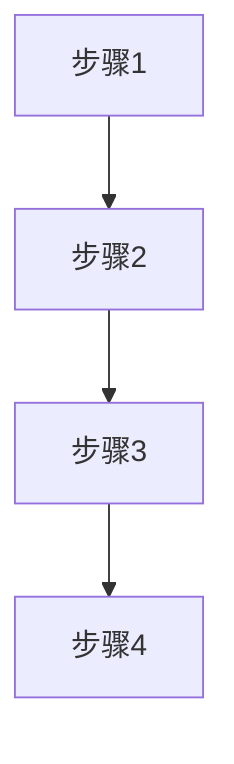

# 标准模块文档模板

## 📁 目录结构
```
[模块名称]/
├── prd.md              # 产品需求文档（必须）
├── index.html          # 原型实现（必须）
├── test-cases.md       # 测试用例（必须）
├── prompt.md           # AI提示词（可选）
└── README.md           # 模块说明（可选）
```

## 📋 PRD文档模板

### 1. Executive Summary 执行摘要

#### 1.1 Problem Statement 问题陈述
- 面向业务：
- 现状：
- 痛点：

#### 1.2 Proposed Solution 解决方案
- 1、
- 2、

#### 1.3 Success Criteria 成功指标
| 指标 | 目标值 |
|------|--------|
| 响应时间 | < 500ms |
| 数据准确率 | 100% |
| 系统可用性 | >= 99.9% |

### 2. User Experience & User Flows 用户体验与用户流程

#### 2.1 User Personas 用户画像
| 角色 | 描述 | 目标 | 痛点 |
|------|------|------|------|
| 管理员 | | | |
| 运营人员 | | | |
| 财务人员 | | | |

#### 2.2 User Journey Map 用户旅程图


#### 2.3 User Flows 用户流程

### 3. Functional Modules 功能模块

#### 3.0 功能清单汇总
| 模块名称 | 功能点 | 功能描述 | 优先级 |
|----------|--------|----------|--------|
| | | | P0 |

#### 3.1 模块1
**模块概述**：
**功能列表**：
**功能逻辑描述**：

### 4. Functional Logic Details 功能模块详细逻辑

### 5. Data Model 数据模型

### 6. API Specifications API规范

### 7. Non-functional Requirements 非功能需求

## 🎨 原型实现要求

### 1. 设计系统遵循
- 严格遵循 design-system.md 规范
- 使用指定的颜色、字体、间距、圆角等
- 实现所有交互效果和动画

### 2. 核心功能
- 标签切换功能（原型/PRD/测试用例）
- Markdown渲染（PRD和测试用例）
- Mermaid图表渲染和放大预览
- 模态框、表格交互等完整功能
- 响应式设计

### 3. 技术栈
- HTML5 + CSS3 + JavaScript
- Tailwind CSS（通过CDN）
- Font Awesome 4.7.0（通过CDN）
- Marked.js（Markdown解析）
- Mermaid.js（图表渲染）

## ✅ 测试用例模板

### 1. 测试概述
#### 1.1 测试范围
#### 1.2 测试类型
#### 1.3 测试环境

### 2. 功能测试用例
| 用例编号 | 测试项 | 前置条件 | 测试步骤 | 预期结果 | 优先级 |
|----------|--------|----------|----------|----------|--------|
| | | | | | P0 |

### 3. 集成测试用例

### 4. 性能测试用例

### 5. 用户体验测试用例

## 📝 版本控制

| 版本 | 日期 | 状态 | 变更内容 |
|------|------|------|----------|
| V1.0 | YYYY-MM-DD | 待评审 | 初始版本 |
