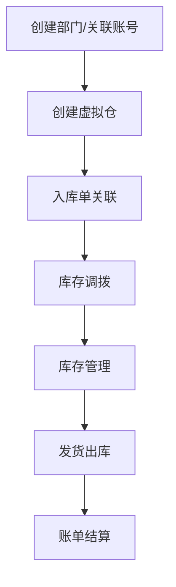
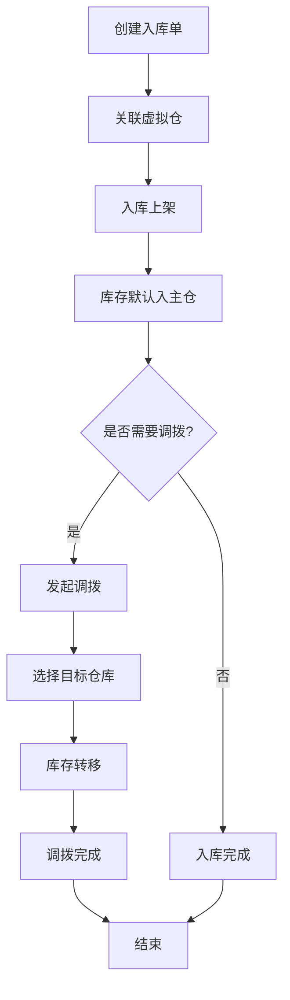
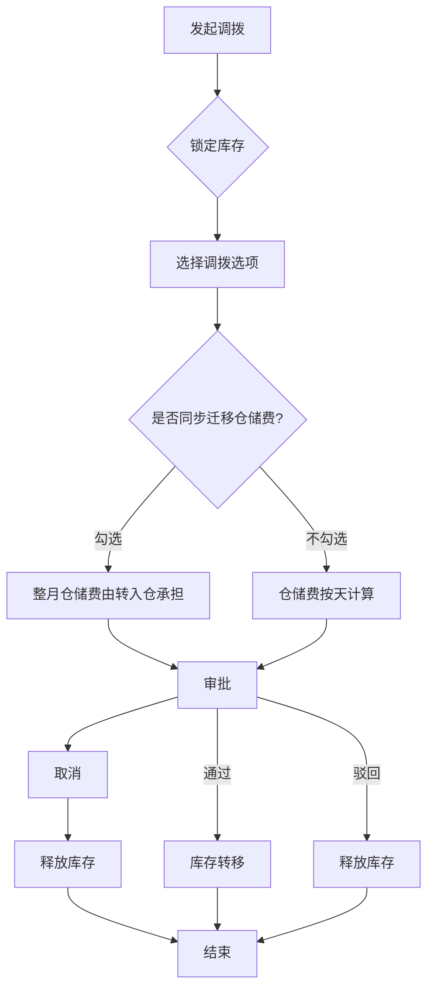
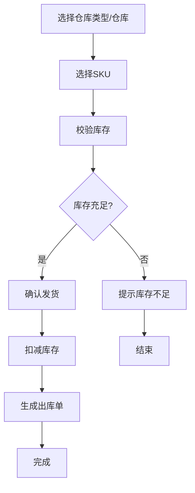
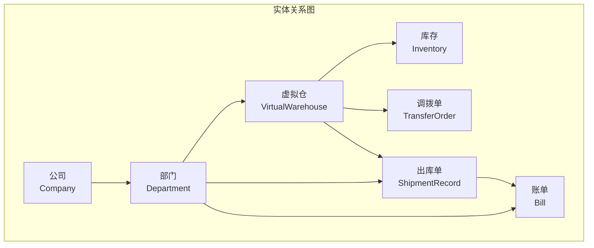

# 虚拟仓模块 PRD

**版本**: V1.1  
**日期**: 2026-03-11  
**状态**: 待评审

---

## 1. Executive Summary 执行摘要

### Problem Statement 问题陈述

面向业务：海外仓业务，
现状：客户库存统一归属在公司层面，无法按部门细分管理。
痛点：部门无法独立运营、查询库存、调配发货，导致库存管理混乱、账单无法分部门结算。

### Proposed Solution 解决方案

1、构建虚拟仓管理系统，支持客户自建组织架构（公司→部门），为每个部门关联独立虚拟仓库。
2、虚拟仓通过库位实现逻辑隔离，支持部门内/部门间库存调拨，按部门生成发货账单。

### Success Criteria 成功指标

| 指标 | 目标值 |
|------|--------|
| 库存查询响应时间 | < 500ms（万级SKU） |
| 数据隔离准确率 | 100%（无跨部门数据泄露） |
| 调拨处理时间 | < 2s |
| 账单生成准确率 | 100% |
| 系统可用性 | >= 99.9% |

---

## 2. User Experience & User Flows 用户体验与用户流程

### 2.1 User Personas 用户画像

| 角色 | 描述 | 目标 | 痛点 |
|------|------|------|------|
| 公司管理员 | 公司级账号，管理整体业务 | 查看所有部门库存、统筹调配 | 无法按部门查看库存、无法分部门结算 |
| 部门运营 | 部门级账号，负责日常运营 | 管理本部门虚拟仓、发货操作 | 库存无法隔离、发货无法独立 |
| 仓库操作员 | 执行出入库操作 | 根据虚拟仓指令操作实体库存 | 库存归属不清、操作混乱 |
| 财务人员 | 负责账单结算 | 按部门导出发货账单 | 无法按部门出账单、结算困难 |

### 2.2 User Journey Map 用户旅程图



### 2.3 User Flows 用户流程

#### 2.3.1 入库流程



**流程说明**：
- 入库单创建时需要关联虚拟仓
- 入库上架后，库存默认进入主仓
- 主仓库存可以调拨到其他虚拟仓
- 调拨完成后，库存归属变更到目标仓库


#### 2.3.2 调拨流程



**流程说明**：
- 发起调拨时，可选择是否同步迁移整月仓储费
- 勾选"同步迁移仓储费"后，调拨SKU的整月仓储费由转入仓承担
- 不勾选时，仓储费按天计算，调出仓承担调拨前的仓储费
- 调拨完成后，库存归属变更到目标仓库

#### 2.3.3 出库流程



---

## 3. Functional Modules 功能模块

### 3.0 功能清单汇总

| 模块名称 | 功能点 | 功能描述 | 优先级 |
|----------|--------|----------|--------|
| 组织架构管理 | 公司管理 | 创建、查看、编辑公司信息 | P0 |
| 组织架构管理 | 部门管理 | 创建、编辑、删除部门，支持多级部门结构 | P0 |
| 组织架构管理 | 账号管理 | 创建、编辑、删除账号，关联部门 | P0 |
| 组织架构管理 | 关联用户管理 | 为部门关联用户，支持增删改查 | P1 |
| 虚拟仓管理 | 主仓管理 | 公司创建时自动生成主仓，支持配置 | P0 |
| 虚拟仓管理 | 虚拟仓创建 | 创建渠道仓、备货仓等虚拟仓 | P0 |
| 虚拟仓管理 | 虚拟仓配置 | 绑定实体仓、分配库位、设置参数 | P0 |
| 虚拟仓管理 | 虚拟仓查询 | 按权限过滤查询虚拟仓列表 | P0 |
| 入库管理 | 创建入库单 | 创建入库单，关联SKU和数量 | P0 |
| 入库管理 | 入库上架 | 确认入库上架，库存默认进入主仓 | P0 |
| 入库管理 | 入库查询 | 查询入库单列表和详情 | P0 |
| 入库管理 | 入库记录 | 查看入库流水和操作记录 | P1 |
| 库存管理 | 库存查询 | 按虚拟仓、SKU、库位查询库存 | P0 |
| 库存管理 | 库存汇总 | 按部门、虚拟仓汇总库存数据 | P0 |
| 库存管理 | 库存锁定 | 查看库存锁定状态和原因 | P1 |
| 库存管理 | 库存报表 | 导出库存报表、查看库存流水 | P1 |
| 调拨管理 | 发起调拨 | 发起部门内或部门间调拨，支持仓储费迁移 | P0 |
| 调拨管理 | 调拨确认 | 确认调拨入库，完成库存转移 | P0 |
| 调拨管理 | 调拨取消 | 取消待确认的调拨单 | P1 |
| 调拨管理 | 调拨查询 | 查询调出、调入、全部调拨记录 | P0 |
| 调拨管理 | 仓储费迁移 | 支持调拨时同步迁移整月仓储费 | P1 |
| 出库管理 | 可用仓库查询 | 按权限过滤查询可用仓库 | P0 |
| 出库管理 | 发货出库 | 选择仓库、校验库存、扣减库存 | P0 |
| 出库管理 | 发货记录 | 查询发货明细、导出发货记录 | P0 |
| 出库管理 | 库存扣减 | 实时扣减可用库存数量 | P0 |
| 账单管理 | 账单生成 | 按部门、时间范围生成账单 | P0 |
| 账单管理 | 账单查询 | 查询账单列表、查看账单详情 | P0 |
| 账单管理 | 账单导出 | 导出Excel、PDF格式账单 | P1 |

**优先级说明**：
- **P0（核心功能）**：系统必须实现的基础功能，影响核心业务流程
- **P1（重要功能）**：提升用户体验和系统效率的功能

---

### 3.1 组织架构管理

**模块概述**：负责公司、部门、账号的组织架构管理，支持多级权限控制

**功能列表**：
```
组织架构管理
├── 公司管理（创建、查看、编辑）
├── 部门管理（创建、编辑、删除）
└── 账号管理（创建、编辑、删除）
```

**功能逻辑描述**：

| 按钮/操作 | 触发条件 | 约束条件 | 逻辑描述 | 预期结果 |
|-----------|----------|----------|----------|----------|
| 新建部门 | 点击"新建部门" | 公司管理员权限 | 1.打开弹窗 2.填写信息 3.校验 4.保存 | 创建成功 |
| 编辑部门 | 点击编辑 | 公司管理员权限 | 1.预填数据 2.修改 3.保存 | 更新成功 |
| 删除部门 | 点击删除 | 无关联虚拟仓 | 1.确认 2.软删除 | 状态变为停用 |

---

### 3.2 虚拟仓管理

**模块概述**：负责虚拟仓的创建、配置、库位分配，是库存逻辑隔离的核心

**功能列表**：
```
虚拟仓管理
├── 主仓（公司创建时自动）
├── 虚拟仓创建（渠道仓/备货仓）
├── 虚拟仓配置（绑定实体仓、分配库位）
└── 虚拟仓查询（按权限过滤）
```

---

### 3.3 库存管理

**模块概述**：负责库存查询、汇总、锁定状态查看

**功能列表**：
```
库存管理
├── 库存查询（按虚拟仓/SKU/库位）
├── 库存汇总（按部门/虚拟仓）
├── 库存锁定（查看锁定状态/原因）
└── 库存报表（导出/流水）
```

---

### 3.4 调拨管理

**模块概述**：负责部门内/部门间的库存调拨

**功能列表**：
```
调拨管理
├── 发起调拨（部门内直接/部门间需确认）
├── 调拨确认（确认入库）
├── 调拨取消（发起方取消）
└── 调拨查询（调出/调入/全部记录）
```

**功能逻辑描述**：

| 按钮/操作 | 触发条件 | 约束条件 | 逻辑描述 | 预期结果 |
|-----------|----------|----------|----------|----------|
| 新建调拨 | 点击"新建调拨" | 库存充足 | 1.选择调出/入仓 2.选择SKU 3.数量 4.选择仓储费迁移选项 5.校验 6.锁定 | 调拨单创建 |
| 同步迁移仓储费 | 新建调拨时勾选 | 调拨跨仓库 | 1.勾选后整月仓储费由转入仓承担 2.不勾选按天计算 | 仓储费归属明确 |
| 确认调拨 | 点击确认 | 调入方、待确认 | 1.校验 2.转移归属 3.仓储费迁移 4.释放锁定 | 调拨完成 |
| 取消调拨 | 点击取消 | 发起方、待确认 | 1.校验 2.释放锁定 3.更新状态 | 取消成功 |

---

### 3.4 入库管理

**模块概述**：负责商品入库操作，库存默认进入主仓，再由主仓调拨到各虚拟仓

**功能列表**：
```
入库管理
├── 创建入库单（填写SKU、数量、供应商等信息）
├── 入库上架（确认入库，库存进入主仓）
├── 入库查询（查询入库单列表和详情）
└── 入库记录（查看入库流水和操作记录）
```

**功能逻辑描述**：

| 按钮/操作 | 触发条件 | 约束条件 | 逻辑描述 | 预期结果 |
|-----------|----------|----------|----------|----------|
| 创建入库单 | 点击"创建入库单" | 无 | 1.打开弹窗 2.填写SKU/数量/供应商 3.校验 4.保存 | 入库单创建成功 |
| 入库上架 | 点击"入库上架" | 入库单状态为待上架 | 1.校验 2.库存进入主仓 3.更新状态 | 上架成功 |
| 查看详情 | 点击查看 | 无 | 显示入库单详细信息 | 详情展示 |

**核心规则**：
- 所有入库商品默认进入公司主仓
- 主仓库存可以通过调拨功能转移到其他虚拟仓
- 入库单支持批量SKU录入
- 入库上架后生成库存流水记录

---

### 3.5 出库管理

**模块概述**：负责从虚拟仓发货出库

**功能列表**：
```
出库管理
├── 可用仓库查询（权限过滤）
├── 发货出库（选择仓库、校验库存、扣减）
├── 发货记录（明细查询、导出）
└── 库存扣减（实时扣减可用数量）
```

---

### 3.6 账单管理

**模块概述**：负责按部门生成发货账单

**功能列表**：
```
账单管理
├── 账单生成（按部门、按时间范围）
├── 账单查询（列表、详情）
└── 账单导出（Excel/PDF）
```

---

## 4. Functional Logic Details 功能模块详细逻辑

### 4.1 组织机构管理

#### 4.1.1 初始化页面数据展示逻辑

| 逻辑项 | 说明 | 数据来源 | 展示规则 |
|--------|------|----------|----------|
| 部门树加载 | 页面加载时默认展示部门树形结构 | 部门表(department) | 一级部门→二级部门→三级部门，按层级缩进展示 |
| 根部门展示 | 根部门为"NBFX"，默认展开 | 部门表 | 根部门固定在顶部，不可删除 |
| 子部门展示 | 点击展开按钮显示子部门 | 部门表parent_id关联 | 二级部门在父部门下方缩进显示 |
| 三级部门展示 | 三级部门为最末级，不可再添加子部门 | 部门表level=3 | 缩进更多，与二级部门区分 |
| 部门名称查询 | 顶部部门名称搜索框 | 部门表name | 模糊匹配 |

#### 4.1.2 模块按钮逻辑

| 按钮 | 位置 | 触发动作 | 前置条件 | 后续操作 |
|------|------|----------|----------|----------|
| 新建部门 | 部门管理页面右上角 | 打开新建部门弹窗 | 无 | 填写表单后提交，刷新部门树 |
| 编辑 | 每行数据操作列 | 打开编辑部门弹窗，填充当前数据 | 无 | 填写表单后提交，更新部门树 |
| 删除 | 每行数据操作列 | 确认弹窗 | 是否有下级部门/关联虚拟仓 | 确认后删除，刷新部门树 |
| 展开/收起 | 部门名称前展开图标 | 切换子部门显示隐藏 | 该部门有子部门 | 切换图标方向 |

#### 4.1.3 字段取值逻辑

| 字段 | 数据来源 | 取值规则 | 显示格式 |
|------|----------|----------|----------|
| 部门名称 | department.name | 直接取值 | 文本显示 |
| 部门编码 | department.code | 自动生成，格式：父编码-序号 | NBFX001-01-01 |
| 虚拟仓数量 | warehouse表count | 统计该部门关联的虚拟仓数量 | 数字 |
| 创建时间 | department.create_time | 时间戳转日期 | YYYY-MM-DD |

---

### 4.2 虚拟仓管理

#### 4.2.1 初始化页面数据展示逻辑

| 逻辑项 | 说明 | 数据来源 | 展示规则 |
|--------|------|----------|----------|
| 虚拟仓列表加载 | 页面加载时展示所有虚拟仓 | warehouse表 | 按创建时间倒序排列 |
| 主仓标识 | 主仓显示"（授权）"标识 | warehouse.type='main' | 主仓名称后加授权标识 |
| 仓库类型筛选 | 顶部仓库类型下拉框 | warehouse.type | 全部/主仓/渠道仓/备货仓 |
| 所属部门展示 | 每条数据显示所属部门名称 | warehouse.department_id关联department.name | 文本显示 |
| 实体仓关联展示 | 显示关联的实体仓编号 | warehouse.entity_warehouse_id | 文本显示 |
| 虚拟仓名称查询 | 顶部虚拟仓名称搜索框 | warehouse.name | 模糊匹配 |
| 实体仓筛选 | 顶部实体仓下拉选择框 | warehouse.entity_warehouse_id | 全部/各实体仓编号 |

#### 4.2.2 模块按钮逻辑

| 按钮 | 位置 | 触发动作 | 前置条件 | 后续操作 |
|------|------|----------|----------|----------|
| 新建虚拟仓 | 页面右上角 | 打开新建弹窗 | 无 | 选择仓库类型（不含主仓），提交后刷新列表 |
| 编辑 | 每行操作列 | 打开编辑弹窗，填充数据 | 主仓不允许编辑 | 提交后刷新列表 |
| 删除 | 每行操作列 | 确认弹窗 | 主仓不允许删除 | 确认后删除，刷新列表 |

#### 4.2.3 字段取值逻辑

| 字段 | 数据来源 | 取值规则 | 显示格式 |
|------|----------|----------|----------|
| 虚拟仓名称 | warehouse.name | 直接取值 | 文本显示，主仓加"（授权）" |
| 仓库类型 | warehouse.type | main=主仓, channel=渠道仓, stock=备货仓 | 文本显示 |
| 所属部门 | department.name | 通过department_id关联查询 | 文本显示 |
| 关联实体仓 | warehouse.entity_warehouse_id | 直接取值 | 文本显示 |

---

### 4.3 库存管理

#### 4.3.1 初始化页面数据展示逻辑

| 逻辑项 | 说明 | 数据来源 | 展示规则 |
|--------|------|----------|----------|
| 库存列表加载 | 页面加载展示所有库存数据 | inventory表 | 按更新时间倒序 |
| 虚拟仓筛选 | 顶部虚拟仓下拉框 | warehouse表 | 全部/各虚拟仓名称 |
| 部门筛选 | 顶部部门下拉框 | department表 | 全部/各部门名称 |
| 预警标识 | 库存低于安全库存时标红 | inventory.quantity < inventory.min_stock | 红色文字提示 |

#### 4.3.2 模块按钮逻辑

| 按钮 | 位置 | 触发动作 | 前置条件 | 后续操作 |
|------|------|----------|----------|----------|
| 新增库存 | 页面右上角 | 打开新增弹窗 | 无 | 填写SKU/商品/虚拟仓/数量，提交后刷新 |
| 编辑 | 每行操作列 | 打开编辑弹窗 | 无 | 提交后刷新列表 |
| 删除 | 每行操作列 | 确认弹窗 | 无 | 确认后删除，刷新列表 |

#### 4.3.3 字段取值逻辑

| 字段 | 数据来源 | 取值规则 | 显示格式 |
|------|----------|----------|----------|
| SKU | inventory.sku | 直接取值 | 文本显示 |
| 商品名称 | inventory.name | 直接取值 | 文本显示 |
| 虚拟仓 | warehouse.name | 通过warehouse_id关联 | 文本显示 |
| 所属部门 | department.name | 通过warehouse.department_id关联 | 文本显示 |
| 库存数量 | inventory.quantity | 直接取值 | 数字，低于安全库存标红 |
| 可用数量 | inventory.available_quantity | 直接取值 | 数字 |
| 预留数量 | inventory.reserved_quantity | 直接取值 | 数字 |
| 更新时间 | inventory.update_time | 时间戳转日期时间 | YYYY-MM-DD HH:mm:ss |

---

### 4.4 调拨管理

#### 4.4.1 初始化页面数据展示逻辑

| 逻辑项 | 说明 | 数据来源 | 展示规则 |
|--------|------|----------|----------|
| 调拨单列表 | 页面加载展示所有调拨单 | transfer表 | 按创建时间倒序 |
| 状态筛选 | 顶部状态下拉框 | transfer.status | 全部/待处理/已审批/已完成/已拒绝 |
| 调拨单号搜索 | 顶部搜索框 | transfer.transfer_no | 模糊匹配 |

#### 4.4.2 模块按钮逻辑

| 按钮 | 位置 | 触发动作 | 前置条件 | 后续操作 |
|------|------|----------|----------|----------|
| 新增调拨 | 页面右上角 | 打开新增调拨弹窗 | 无 | 选择调出/调入仓库，填写SKU/数量 |
| 编辑 | 每行操作列 | 打开编辑弹窗 | 已完成状态不允许编辑 | 提交后刷新列表 |
| 删除 | 每行操作列 | 确认弹窗 | 无 | 确认后删除，刷新列表 |
| 审批 | 状态为"待处理"时显示 | 审批通过/拒绝 | 仅待处理状态 | 审批后刷新列表 |

#### 4.4.3 字段取值逻辑

| 字段 | 数据来源 | 取值规则 | 显示格式 |
|------|----------|----------|----------|
| 调拨单号 | transfer.transfer_no | 自动生成，格式：TRANSFER+时间戳 | 文本显示 |
| 调出仓库 | from_warehouse.name | 通过from_warehouse_id关联 | 文本显示 |
| 调入仓库 | to_warehouse.name | 通过to_warehouse_id关联 | 文本显示 |
| SKU | transfer.sku | 直接取值 | 文本显示 |
| 调拨数量 | transfer.quantity | 直接取值 | 数字 |
| 同步迁移仓储费 | transfer.migrate_storage_fee | 勾选=1，不勾选=0 | 复选框显示 |
| 仓储费承担方 | 根据migrate_storage_fee计算 | 勾选时=转入仓，不勾选时=调出仓 | 文本显示 |
| 状态 | transfer.status | pending=待处理, approved=已审批, completed=已完成, rejected=已拒绝 | 彩色标签 |
| 创建时间 | transfer.create_time | 时间戳转日期时间 | YYYY-MM-DD HH:mm:ss |
| 操作人 | transfer.operator | 直接取值或当前登录用户 | 文本显示 |

#### 弹窗属性描述

| 字段 | 输入方式 | 必填 | 取值规则 |
|------|----------|------|----------|
| 调出仓库 | 手工选择 | 是 | 从下拉列表选择，仅显示有库存的虚拟仓 |
| 调入仓库 | 手工选择 | 是 | 从下拉列表选择，不能与调出仓库相同 |
| SKU | 手工选择 | 是 | 从下拉列表选择，仅显示调出仓库中有库存的SKU |
| 调拨数量 | 键盘输入 | 是 | 必须大于0且不超过调出仓库中该SKU的可用数量 |
| 同步迁移仓储费 | 复选框 | 否 | 勾选后整月仓储费由转入仓承担，不勾选按天计算由调出仓承担 |

---

### 4.5 入库管理

#### 4.5.1 初始化页面数据展示逻辑

| 逻辑项 | 说明 | 数据来源 | 展示规则 |
|--------|------|----------|----------|
| 入库单列表 | 页面加载展示所有入库单 | inbound_order表 | 按创建时间倒序 |
| 状态筛选 | 顶部状态下拉框 | inbound_order.status | 全部/待上架/已上架/已取消 |
| 入库单号搜索 | 顶部搜索框 | inbound_order.inbound_no | 模糊匹配 |
| 仓库筛选 | 顶部仓库下拉框 | inbound_order.warehouse_id | 全部/主仓（入库单只显示主仓） |
| 供应商筛选 | 顶部供应商下拉框 | inbound_order.supplier | 全部/各供应商名称 |

#### 4.7.2 模块按钮逻辑

| 按钮 | 位置 | 触发动作 | 前置条件 | 后续操作 |
|------|------|----------|----------|----------|
| 创建入库单 | 页面右上角 | 打开创建入库单弹窗 | 无 | 填写SKU/数量/供应商等信息，提交后刷新列表 |
| 入库上架 | 状态为"待上架"时显示 | 确认上架，库存进入主仓 | 仅待上架状态 | 上架后更新库存，刷新列表 |
| 查看详情 | 每行操作列 | 打开详情弹窗 | 无 | 显示入库单详细信息 |
| 取消入库 | 状态为"待上架"时显示 | 取消入库单 | 仅待上架状态 | 取消后更新状态，刷新列表 |

#### 4.7.3 字段取值逻辑

| 字段 | 数据来源 | 取值规则 | 显示格式 |
|------|----------|----------|----------|
| 入库单号 | inbound_order.inbound_no | 自动生成，格式：IN+时间戳 | 文本显示 |
| 仓库 | warehouse.name | 通过warehouse_id关联，固定为主仓 | 文本显示 |
| 所属部门 | department.name | 通过warehouse.department_id关联 | 文本显示 |
| SKU | inbound_order.sku | 直接取值 | 文本显示 |
| 商品名称 | product.name | 通过sku关联product表 | 文本显示 |
| 入库数量 | inbound_order.quantity | 直接取值 | 数字 |
| 供应商 | inbound_order.supplier | 直接取值 | 文本显示 |
| 状态 | inbound_order.status | pending=待上架, received=已上架, cancelled=已取消 | 彩色标签 |
| 创建时间 | inbound_order.create_time | 时间戳转日期时间 | YYYY-MM-DD HH:mm:ss |
| 操作人 | inbound_order.operator | 直接取值或当前登录用户 | 文本显示 |

#### 弹窗属性描述

| 字段 | 输入方式 | 必填 | 取值规则 |
|------|----------|------|----------|
| SKU | 手工选择或输入 | 是 | 从下拉列表选择或手动输入SKU |
| 商品名称 | 根据SKU自动填充 | 否 | 系统根据SKU自动填充，不可编辑 |
| 入库数量 | 键盘输入 | 是 | 必须大于0 |
| 供应商 | 键盘输入 | 否 | 输入供应商名称 |
| 备注 | 文本域 | 否 | 输入库备注信息 |

**核心业务规则**：
1. **默认入库仓库**：所有入库单的仓库默认为主仓，不可修改
2. **库存归属**：入库上架后，库存归属到公司主仓
3. **调拨流转**：主仓库存通过调拨功能转移到其他虚拟仓
4. **批量入库**：支持在一个入库单中添加多个SKU
5. **状态流转**：待上架 → 已上架（完成）/ 已取消

---

### 4.6 出库管理

#### 4.6.1 初始化页面数据展示逻辑

| 逻辑项 | 说明 | 数据来源 | 展示规则 |
|--------|------|----------|----------|
| 出库单列表 | 页面加载展示所有出库单 | shipment表 | 按创建时间倒序 |
| 状态筛选 | 顶部状态下拉框 | shipment.status | 全部/待处理/已审批/已完成/已拒绝 |
| 出库单号搜索 | 顶部搜索框 | shipment.shipment_no | 模糊匹配 |

#### 4.5.2 模块按钮逻辑

| 按钮 | 位置 | 触发动作 | 前置条件 | 后续操作 |
|------|------|----------|----------|----------|
| 新增出库 | 页面右上角 | 打开新增出库弹窗 | 无 | 选择虚拟仓，填写SKU/出库数量 |
| 编辑 | 每行操作列 | 打开编辑弹窗 | 已完成不允许编辑 | 提交后刷新列表 |
| 删除 | 每行操作列 | 确认弹窗 | 无 | 确认后删除，刷新列表 |

#### 4.5.3 字段取值逻辑

| 字段 | 数据来源 | 取值规则 | 显示格式 |
|------|----------|----------|----------|
| 出库单号 | shipment.shipment_no | 自动生成，格式：SHIP+时间戳 | 文本显示 |
| 虚拟仓 | warehouse.name | 通过warehouse_id关联 | 文本显示 |
| 所属部门 | department.name | 通过warehouse.department_id关联 | 文本显示 |
| SKU | shipment.sku | 直接取值 | 文本显示 |
| 出库数量 | shipment.quantity | 直接取值 | 数字 |
| 状态 | shipment.status | pending=待处理, approved=已审批, completed=已完成, rejected=已拒绝 | 彩色标签 |
| 创建时间 | shipment.create_time | 时间戳转日期时间 | YYYY-MM-DD HH:mm:ss |
| 操作人 | shipment.operator | 直接取值或当前登录用户 | 文本显示 |

---

### 4.7 对账管理

#### 4.7.1 初始化页面数据展示逻辑

| 逻辑项 | 说明 | 数据来源 | 展示规则 |
|--------|------|----------|----------|
| 账单列表 | 页面加载展示所有账单 | bill表 | 按创建时间倒序 |
| 部门筛选 | 顶部部门下拉框 | bill.department_id | 全部/各部门名称 |
| 账单编号搜索 | 顶部搜索框 | bill.bill_no | 模糊匹配 |
| 账单周期 | 显示账单对应的日期范围 | bill.start_date ~ bill.end_date | 文本显示 |

#### 4.6.2 模块按钮逻辑

| 按钮 | 位置 | 触发动作 | 前置条件 | 后续操作 |
|------|------|----------|----------|----------|
| 生成账单 | 页面右上角 | 打开生成账单弹窗 | 无 | 选择部门、开始/结束日期，生成账单 |
| 查看 | 每行操作列 | 打开账单详情弹窗或新页面 | 无 | 显示账单明细 |
| 删除 | 每行操作列 | 确认弹窗 | 无 | 确认后删除，刷新列表 |
| 导出 | 页面右上角 | 导出Excel/CSV | 无 | 导出当前筛选条件下的所有账单 |

#### 4.6.3 字段取值逻辑

| 字段 | 数据来源 | 取值规则 | 显示格式 |
|------|----------|----------|----------|
| 账单编号 | bill.bill_no | 自动生成，格式：BILL+时间戳 | 文本显示 |
| 部门 | department.name | 通过department_id关联 | 文本显示 |
| 账单周期 | bill.start_date, bill.end_date | 拼接日期范围 | YYYY-MM-DD 至 YYYY-MM-DD |
| 总金额 | bill.total_amount | 汇总该部门所有出库费用 | 货币格式 ¥#,##0.00 |
| 状态 | bill.status | pending=待结算, settled=已结算 | 彩色标签 |
| 创建时间 | bill.create_time | 时间戳转日期 | YYYY-MM-DD |

---

### 4.8 用户体验优化建议

| 优化项 | 说明 |
|--------|------|
| 加载状态 | 列表数据加载中显示骨架屏或Loading动画 |
| 空数据 | 无数据时显示"暂无数据"提示和插图 |
| 操作反馈 | 按钮点击后显示Loading状态，操作完成后Toast提示 |
| 表单验证 | 实时校验输入，错误信息显示在字段下方 |
| 批量操作 | 支持多选批量删除/导出，提升操作效率 |
| 快捷搜索 | 支持回车搜索，支持历史搜索记录 |
| 数据脱敏 | 敏感信息（如金额）支持点击查看/复制 |

---

## 5. Acceptance Criteria 验收标准

### 5.1 功能验收

| 功能 | 验收条件 | 测试方法 | 优先级 |
|------|----------|----------|--------|
| 创建公司/部门 | 创建成功，数据唯一 | 单元测试 | P0 |
| 账号权限 | 公司级可见全部，部门级仅本部门 | 集成测试 | P0 |
| 创建虚拟仓 | 绑定实体仓，分配库位成功 | 单元测试 | P0 |
| 库存查询 | 按虚拟仓/SKU查询，返回正确 | UI测试 | P0 |
| 调拨管理 | 部门内直接完成，部门间需确认 | 集成测试 | P0 |
| 发货出库 | 库存充足才能发货，扣减正确 | 集成测试 | P0 |
| 账单生成 | 按部门汇总，正确计算费用 | 集成测试 | P0 |
| 账单导出 | Excel格式，内容正确 | 手动测试 | P1 |

### 5.2 性能验收

| 指标 | 目标值 | 阈值 | 说明 |
|------|--------|------|------|
| 库存查询 | < 300ms | < 500ms | 万级SKU |
| 调拨发起 | < 200ms | < 500ms | 含库存锁定 |
| 账单生成 | < 3s | < 5s | 月度账单 |

### 5.3 数据隔离验收

| 场景 | 验收标准 | 测试方法 |
|------|----------|----------|
| 部门级账号查询 | 仅返回本部门虚拟仓库存 | 集成测试 |
| 跨部门调拨 | 需对方确认，隔离生效 | 集成测试 |
| 账单隔离 | 仅见本部门账单 | 集成测试 |

---

## 6. Data Isolation Rules 数据隔离规则

| 账号层级 | 可见虚拟仓 | 可操作范围 |
|----------|------------|------------|
| 公司级 | 全部虚拟仓+主仓 | 全部操作 |
| 部门级 | 本部门虚拟仓+主仓 | 本部门库存/调拨/发货/账单 |

---

## 7. 信息架构

### 实体关系图 (ER图)



### 关系说明

| 关系 | 描述 | 基数 |
|------|------|------|
| Company → Department | 公司包含多个部门 | 1:N |
| Department → VirtualWarehouse | 部门可以有多个虚拟仓 | 1:N |
| VirtualWarehouse → Inventory | 虚拟仓包含多个库存记录 | 1:N |
| VirtualWarehouse → TransferOrder | 虚拟仓可以发起/接收调拨 | N:N (通过from/to字段) |
| VirtualWarehouse → ShipmentRecord | 虚拟仓可以产生发货记录 | 1:N |
| Department → ShipmentRecord | 部门可以产生发货记录 | 1:N |
| Department → Bill | 部门可以生成账单 | 1:N |

---

## 8. 风险与路线图

### 分阶段交付

| 版本 | 时间 | 范围 |
|------|------|------|
| **Phase 1** | Week 1-2 | 组织架构、虚拟仓、库存管理 |
| **Phase 2** | Day 4-9 | 出库管理、账单管理、库存查询 |
| **Phase 3** | Day 10-15 | 调拨管理、权限管理 |

### 技术风险

| 风险 | 影响 | 缓解措施 |
|------|------|----------|
| 库存并发更新冲突 | 数据不一致 | 数据库行锁 + 乐观锁 |
| 调拨双方同时操作 | 状态混乱 | 分布式锁 + 状态机校验 |
| 数据隔离泄露 | 业务风险 | 统一权限拦截器 |

---

## 9. 附录

### 术语表

| 术语 | 定义 |
|------|------|
| 虚拟仓 | 逻辑仓库，用于库存归属隔离，对应实体仓中的库位集合 |
| 实体仓 | 物理仓库，实际存储货物的场所 |
| 主仓 | 公司级公共虚拟仓，各部门可共享调用 |
| 渠道仓 | 用于特定销售渠道的虚拟仓 |
| 备货仓 | 用于备货的虚拟仓 |
| 库位 | 实体仓内的存储位置标识 |
| 调拨 | 虚拟仓之间的库存转移 |
| 出库 | 从虚拟仓中发运商品 |
| 账单 | 按部门汇总的发货费用 |