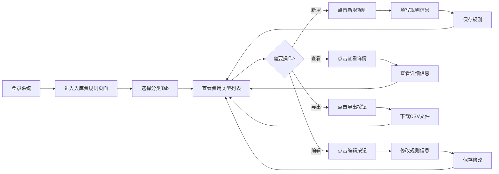
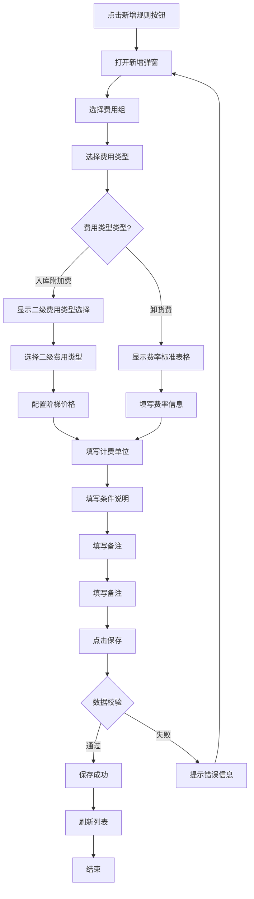
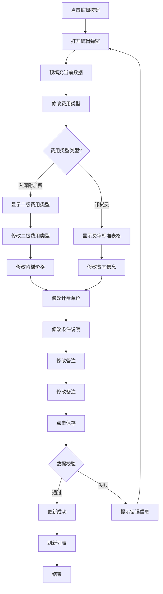

# 入库费规则管理 PRD

| 版本 | 日期 | 变更内容 | 变更人 | 审核人 | 备注 |
|------|------|----------|--------|--------|------|
| V1.0 | 2026-05-22 | 初始版本 | 产品经理 | 技术负责人 | - |

---

## 1. Executive Summary 执行摘要

### 1.1 Problem Statement 问题陈述

面向业务：海外仓入库业务，

现状：入库费规则配置分散，缺乏统一的分类管理，无法清晰展示二级费用类型，操作记录追溯困难。

痛点：
- 入库费规则按分类展示不清晰，用户需要在多个页面切换
- 二级费用类型（如SKU超量费、超重费等）无法在主表中直观展示
- 缺少操作人和操作时间记录，无法追溯规则变更历史
- 新增和编辑弹窗逻辑不一致，用户体验差

### 1.2 Proposed Solution 解决方案

1、构建分类Tab展示模式，将入库费规则按三大分类（整柜入库、快递散货入库、托盘入库）进行Tab页展示，用户可快速切换查看。

2、优化主表结构，添加二级分类列，清晰展示费用类型的细分类型；添加操作人和操作时间列，完整记录规则的创建和更新信息。

3、统一新增和编辑弹窗逻辑，确保用户在新增和编辑时有一致的操作体验，支持费率标准表格录入和阶梯价格配置。

### 1.3 Success Criteria 成功指标

| 指标 | 目标值 |
|------|--------|
| 规则查询响应时间 | < 300ms（千级规则） |
| 分类切换响应时间 | < 100ms |
| 数据准确性 | 100%（无数据丢失或错误） |
| 操作记录完整性 | 100%（所有操作均有记录） |
| 系统可用性 | >= 99.9% |

---

## 2. User Experience & User Flows 用户体验与用户流程

### 2.1 User Personas 用户画像

| 角色 | 描述 | 目标 | 痛点 |
|------|------|------|------|
| 财务人员 | 负责费用规则配置和账单管理 | 快速配置入库费规则、查看费用明细 | 规则分类不清晰、无法追溯变更历史 |
| 仓库管理员 | 负责入库操作和费用核对 | 了解入库费计算规则、核对费用准确性 | 无法快速找到对应分类的费用规则 |
| 系统管理员 | 负责系统配置和维护 | 确保规则配置正确、系统稳定运行 | 规则变更无法追溯、问题排查困难 |

### 2.2 User Journey Map 用户旅程图



### 2.3 User Flows 用户流程

#### 2.3.1 新增入库费规则流程



**流程说明**：
- 新增规则时，费用组默认为当前选中的Tab分类
- 费用类型选择"卸货费"时，展示费率标准表格，支持添加多个规格价格
- 费用类型选择"入库附加费"时，需要选择二级费用类型，并配置阶梯价格
- 保存时自动记录创建人和创建时间

#### 2.3.2 编辑入库费规则流程



**流程说明**：
- 编辑弹窗预填充当前规则的所有信息
- 支持修改费用类型、二级分类、计费单位等所有字段
- 保存时自动更新更新人和更新时间

---

## 3. Functional Modules 功能模块

### 3.0 功能清单汇总

| 模块名称 | 功能点 | 功能描述 | 优先级 |
|----------|--------|----------|--------|
| 分类展示 | 分类Tab切换 | 通过Tab切换查看不同分类的入库费规则 | P0 |
| 分类展示 | 费用类型列表展示 | 展示当前分类下的所有费用类型 | P0 |
| 规则管理 | 新增规则 | 新增入库费规则，支持费率标准和阶梯价格配置 | P0 |
| 规则管理 | 编辑规则 | 编辑已有入库费规则 | P0 |
| 规则管理 | 删除规则 | 删除入库费规则 | P0 |
| 规则管理 | 查看详情 | 查看费用类型详细信息 | P1 |
| 数据导出 | 导出CSV | 导出当前分类下的费用类型数据 | P1 |

### 3.1 分类展示模块

**模块概述**：通过Tab页展示三大入库分类，用户可快速切换查看不同分类的收费规则。

**功能列表**：
```
分类展示
├── 分类Tab切换
├── 费用类型列表展示
└── 统计信息展示
```

**功能逻辑描述**：

| 按钮/操作 | 触发条件 | 约束条件 | 逻辑描述 | 预期结果 |
|-----------|----------|----------|----------|----------|
| Tab切换 | 点击分类Tab | 无 | 1.更新当前分类<br>2.筛选该分类下的费用类型<br>3.刷新列表 | 显示对应分类的费用类型 |
| 列表加载 | 页面初始化/Tab切换 | 无 | 1.获取数据<br>2.渲染表格<br>3.更新统计信息 | 显示费用类型列表 |

### 3.2 规则管理模块

**模块概述**：提供入库费规则的新增、编辑、删除、查看功能，支持费率标准和阶梯价格配置。

**功能列表**：
```
规则管理
├── 新增规则
├── 编辑规则
├── 删除规则
└── 查看详情
```

**功能逻辑描述**：

| 按钮/操作 | 触发条件 | 约束条件 | 逻辑描述 | 预期结果 |
|-----------|----------|----------|----------|----------|
| 新增规则 | 点击"新增规则"按钮 | 无 | 1.打开弹窗<br>2.填写表单<br>3.校验数据<br>4.保存规则 | 新增成功，刷新列表 |
| 编辑规则 | 点击编辑按钮 | 无 | 1.打开弹窗<br>2.预填充数据<br>3.修改表单<br>4.保存修改 | 更新成功，刷新列表 |
| 删除规则 | 点击删除按钮 | 无 | 1.确认对话框<br>2.删除规则<br>3.刷新列表 | 删除成功 |
| 查看详情 | 点击查看按钮 | 无 | 1.打开详情弹窗<br>2.展示所有信息 | 显示详细信息 |

---

## 4. Functional Logic Details 功能模块详细逻辑

### 4.1 初始化页面数据展示逻辑

| 逻辑项 | 说明 | 数据来源 | 展示规则 |
|--------|------|----------|----------|
| 分类Tab加载 | 页面加载时展示三大分类Tab | 入库费规则配置表 | 默认选中第一个Tab（整柜入库） |
| 费用类型列表加载 | 根据选中的分类Tab展示对应费用类型 | 入库费规则配置表 | 按创建时间倒序排列 |
| 统计信息展示 | 显示当前分类下的费用类型总数 | 前端计算 | 格式：[分类名称] - 共 X 个费用类型 |

### 4.2 模块按钮逻辑

| 按钮 | 位置 | 触发动作 | 前置条件 | 后续操作 |
|------|------|----------|----------|----------|
| 新增规则 | 页面右上角 | 打开新增收费规则弹窗 | 无 | 填写表单后保存，刷新列表 |
| 导出 | 页面右上角 | 导出当前分类下的费用类型数据为CSV文件 | 当前分类下有数据 | 下载CSV文件 |
| 查看详情 | 每行操作列 | 打开费用类型详情弹窗 | 无 | 展示详细信息，只读模式 |
| 编辑 | 每行操作列 | 打开编辑收费规则弹窗，预填充当前数据 | 无 | 修改后保存，刷新列表 |
| 删除 | 每行操作列 | 弹出确认对话框 | 无 | 确认后删除，刷新列表 |

### 4.3 字段取值逻辑

| 字段 | 数据来源 | 取值规则 | 显示格式 |
|------|----------|----------|----------|
| 序号 | 前端计算 | 从1开始递增 | 数字 |
| 费用类型 | 键盘输入 | 从下拉列表选择：卸货费、入库附加费 | 文本显示 |
| 二级分类 | 手工选择 | 当费用类型为"入库附加费"时显示，可选：SKU超量费、超重费、清单费等 | 文本显示 |
| 计费单位 | 手工选择 | 从下拉列表选择：柜、票、件、箱、托、KG、个 | 文本显示 |
| 创建人 | 系统生成 | 新增时自动获取当前登录用户 | 文本显示 |
| 创建时间 | 系统生成 | 新增时自动生成当前时间 | YYYY-MM-DD HH:mm:ss |
| 更新人 | 系统生成 | 编辑保存时自动获取当前登录用户 | 文本显示 |
| 更新时间 | 系统生成 | 编辑保存时自动更新为当前时间 | YYYY-MM-DD HH:mm:ss |

### 4.4 弹窗属性描述

#### 新增/编辑规则弹窗

| 字段 | 输入方式 | 必填 | 取值规则 |
|------|----------|------|----------|
| 费用组 | 禁用 | - | 显示当前选中的Tab分类，不可修改 |
| 费用类型 | 下拉选择 | 是 | 从下拉列表选择：卸货费、入库附加费 |
| 二级费用类型 | 下拉选择 | 条件必填 | 当费用类型为"入库附加费"时必填，可选：SKU超量费、超重费、清单费、轻点费、分货费、拆拖、分货、超重、清点、SKU超重费 |
| 计费单位 | 下拉选择 | 是 | 从下拉列表选择：柜、票、件、箱、托、KG、个 |
| 费率标准 | 表格录入 | 条件必填 | 当费用类型为"卸货费"时显示，支持添加多行：规格、价格、备注 |
| 阶梯价格 | 表格录入 | 条件必填 | 当选择二级费用类型时显示，支持添加多行：开始量、结束量、价格 |
| 条件说明 | 文本输入 | 否 | 描述收费规则的适用条件 |
| 备注 | 文本输入 | 否 | 提供计费示例说明 |
| 备注 | 文本输入 | 否 | 补充说明信息 |

### 4.5 新增弹窗交互逻辑

| 触发条件 | 交互逻辑 | 展示内容 |
|----------|----------|----------|
| 打开新增弹窗 | 1. 费用组默认为当前选中的Tab分类<br>2. 根据分类加载对应的费用类型选项<br>3. 默认显示第一个费用类型 | 显示新增弹窗，费用组字段禁用 |
| 选择费用类型="卸货费" | 1. 显示"费率标准"表格区域<br>2. 隐藏"二级费用类型"选择框<br>3. 隐藏"阶梯价格"表格<br>4. 显示"费率规则"、"重量阶梯"等文本输入区 | 费率标准表格（规格、价格、备注） |
| 选择费用类型="入库附加费" | 1. 显示"二级费用类型"选择框<br>2. 隐藏"费率标准"表格<br>3. 显示"费率规则"、"重量阶梯"等文本输入区 | 二级费用类型下拉选择框 |
| 选择二级费用类型 | 1. 显示"阶梯价格"表格<br>2. 隐藏"费率规则"、"重量阶梯"等文本输入区 | 阶梯价格表格（开始量、结束量、价格） |
| 点击"添加费率"按钮 | 在费率标准表格中新增一行空白行 | 新增一行：规格输入框、价格输入框、备注输入框、删除按钮 |
| 点击"添加阶梯"按钮 | 在阶梯价格表格中新增一行空白行 | 新增一行：开始量输入框、结束量输入框、价格输入框、删除按钮 |
| 点击"保存"按钮 | 1. 校验必填字段<br>2. 收集表单数据<br>3. 自动设置创建人、创建时间<br>4. 保存到数据源<br>5. 刷新列表 | 保存成功提示，关闭弹窗，刷新主表 |

### 4.6 新增弹窗字段详细说明

| 字段 | 说明 | 数据来源 | 取值规则 | 显示格式 | 存储长度 | 属性存储类型 |
|------|------|----------|----------|----------|----------|--------------|
| 费用组 | 费用类型所属分类 | 系统生成 | 默认为当前选中的Tab分类，禁用不可修改 | 文本显示 | 64 | 字符型 |
| 费用类型 | 费用类型目名称 | 手工选择 | 从下拉列表选择：卸货费、入库附加费；选择后触发不同的表单展示逻辑 | 下拉选择 | 64 | 字符型 |
| 二级费用类型 | 费用类型的二级分类 | 手工选择 | 当费用类型为"入库附加费"时显示并必填；可选：SKU超量费、超重费、清单费、轻点费、分货费、拆拖、分货、超重、清点、SKU超重费 | 下拉选择 | 64 | 字符型 |
| 计费单位 | 收费的计价单位 | 手工选择 | 从下拉列表选择：柜、票、件、箱、托、KG、个 | 下拉选择 | 32 | 字符型 |
| 费率标准 | 不同规格的价格标准 | 键盘输入 | 当费用类型为"卸货费"时显示表格，支持添加多行：规格（如20GP）、价格（数字）、备注（文本） | 表格录入 | - | JSON |
| 阶梯价格 | 按数量范围的价格阶梯 | 键盘输入 | 当选择二级费用类型时显示表格，支持添加多行：开始量（数字）、结束量（数字）、价格（数字） | 表格录入 | - | JSON |
| 费率规则 | 费率规则文本描述 | 键盘输入 | 当费用类型为"入库附加费"但未选择二级费用类型时显示，每行一条：规格\|价格\|备注 | 多行文本 | 512 | 字符型 |
| 重量阶梯 | 重量阶梯价格描述 | 键盘输入 | 可选，每行一条：范围\|价格\|单位 | 多行文本 | 512 | 字符型 |
| 条件说明 | 收费规则的适用条件 | 键盘输入 | 可选，描述收费规则的适用条件，如"单箱重量超过35kg时收取超重费" | 多行文本 | 256 | 字符型 |
| 备注 | 计费示例说明 | 键盘输入 | 可选，提供计费示例说明，帮助用户理解计费规则 | 多行文本 | 512 | 字符型 |
| 备注 | 规则补充说明 | 键盘输入 | 可选，规则说明或特殊条件 | 多行文本 | 256 | 字符型 |

---

## 5. 非功能性需求

### 5.1 性能要求

- 页面加载时间 < 1秒
- Tab切换响应时间 < 100ms
- 数据保存响应时间 < 500ms
- 支持千级数据量的流畅展示

### 5.2 安全要求

- 所有操作需登录认证
- 敏感操作（删除）需二次确认
- 操作日志完整记录

### 5.3 兼容性要求

- 支持Chrome、Firefox、Safari、Edge主流浏览器
- 支持响应式布局，适配不同屏幕尺寸

---

## 6. 附录

### 6.1 术语表

| 术语 | 说明 |
|------|------|
| 入库费 | 货物入库时产生的费用，包括卸货费、入库附加费等 |
| 整柜入库 | 以集装箱为单位的入库方式 |
| 快递散货入库 | 以快递包裹为单位的散货入库方式 |
| 托盘入库 | 以托盘为单位的入库方式 |
| 二级分类 | 费用类型的细分类型，如SKU超量费、超重费等 |
| 费率标准 | 不同规格对应的价格标准，如20GP、40HQ等柜型价格 |
| 阶梯价格 | 根据数量范围的不同价格，如0-100件、101-500件等 |

### 6.2 参考文档

- TOB产品设计模板规范
- 入库费规则数据结构设计
- 海外仓业务流程文档
