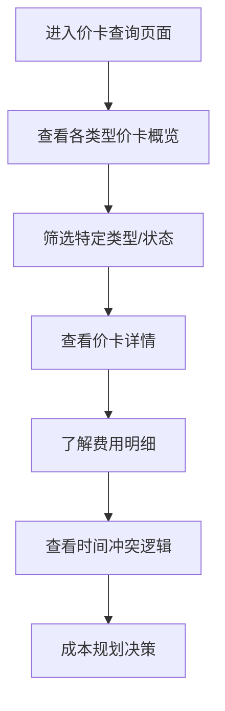
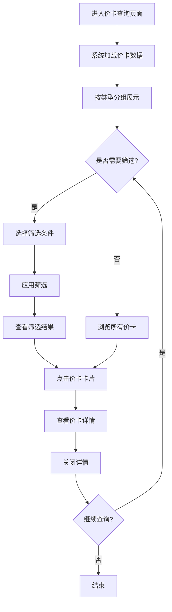
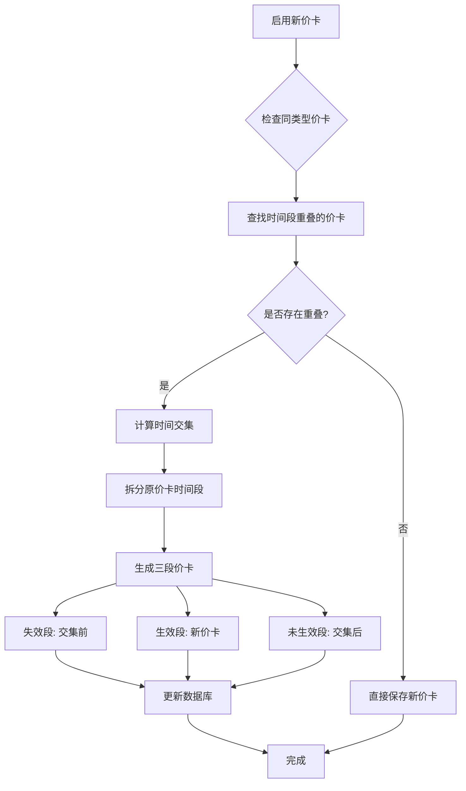
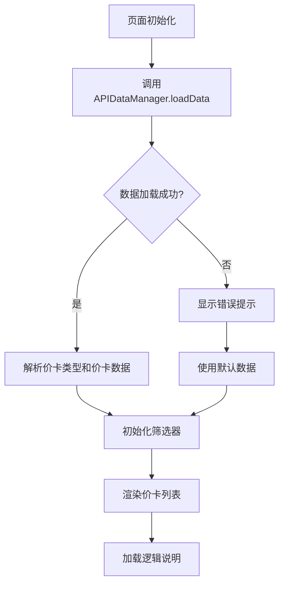

# 价卡查询 PRD

| 版本 | 日期 | 变更内容 | 变更人 | 审核人 | 备注 |
|------|------|----------|--------|--------|------|
| V1.0 | 2024-05-07 | 初始版本 | 产品经理 | - | - |

---

## 1. Executive Summary 执行摘要

### 1.1 Problem Statement 问题陈述

面向业务：海外仓业务，

现状：客户无法直观查看各物流环节的费用价卡信息，缺乏价格透明度。

痛点：
- 客户无法快速了解当前生效的费用标准
- 历史价卡信息分散，查询不便
- 无法预知未来价卡变化，影响成本规划
- 价卡时间冲突处理逻辑不透明，客户难以理解费用变化原因

### 1.2 Proposed Solution 解决方案

1、构建价卡查询模块，按物流环节类型（头程运费、尾程运费、仓储费、操作费）分组展示价卡信息。

2、实现价卡时间冲突处理逻辑的可视化展示，让客户清晰了解价卡的时间拆分规则。

3、提供多维筛选功能，支持按类型、状态、时间范围快速定位价卡信息。

### 1.3 Success Criteria 成功指标

| 指标 | 目标值 |
|------|--------|
| 价卡查询响应时间 | < 500ms |
| 数据展示准确率 | 100% |
| 时间冲突逻辑准确率 | 100% |
| 用户满意度 | >= 90% |
| 系统可用性 | >= 99.9% |

---

## 2. User Experience & User Flows 用户体验与用户流程

### 2.1 User Personas 用户画像

| 角色 | 描述 | 目标 | 痛点 |
|------|------|------|------|
| 海外仓客户 | 使用海外仓服务的商家 | 了解各环节费用标准、规划成本 | 价格不透明、无法预知费用变化 |
| 财务人员 | 负责成本核算和对账 | 查看历史价卡、核对费用 | 历史数据分散、查询困难 |
| 采购人员 | 负责物流成本控制 | 对比不同时段价卡、优化成本 | 无法快速对比、缺乏决策依据 |

### 2.2 User Journey Map 用户旅程图



### 2.3 User Flows 用户流程

#### 2.3.1 价卡查询流程



**流程说明**：
- 用户进入页面后，系统自动加载并按类型分组展示价卡
- 支持按类型、状态、时间范围进行筛选
- 点击价卡卡片可查看详细信息
- 可反复查询，无需刷新页面

---

## 3. Functional Modules 功能模块

### 3.0 功能清单汇总

| 功能模块 | 功能点 | 优先级 | 状态 |
|----------|--------|--------|------|
| 价卡展示 | 按类型分组展示 | P0 | 已实现 |
| 价卡展示 | 状态标识（生效/失效/未生效） | P0 | 已实现 |
| 价卡展示 | 时间轴指示器 | P1 | 已实现 |
| 筛选功能 | 按类型筛选 | P0 | 已实现 |
| 筛选功能 | 按状态筛选 | P0 | 已实现 |
| 筛选功能 | 按时间范围筛选 | P1 | 已实现 |
| 详情查看 | 查看价卡基本信息 | P0 | 已实现 |
| 详情查看 | 查看费用明细 | P0 | 已实现 |
| 逻辑说明 | 时间冲突处理逻辑说明 | P0 | 已实现 |

### 3.1 价卡类型展示模块

**功能描述**：
按物流环节类型分组展示价卡信息，每个类型独立显示统计数据。

**价卡类型**：
1. **头程运费**：从发货地到海外仓的运输费用
2. **尾程运费**：从海外仓到客户手中的运输费用
3. **仓储费**：货物在海外仓的存储费用
4. **操作费**：货物的入库、出库、分拣等操作费用

**展示内容**：
- 类型名称和描述
- 统计数据：生效中、已失效、未生效的价卡数量
- 该类型下所有价卡列表

**交互逻辑**：
- 每个类型独立成卡片，可折叠展开
- 价卡按状态排序：生效 > 未生效 > 失效
- 同状态下按开始时间倒序排列

### 3.2 价卡状态管理模块

**功能描述**：
标识价卡的生效状态，使用时间轴指示器直观展示。

**状态定义**：
- **生效**：当前时间在价卡有效期内，正在执行的费用标准（绿色）
- **失效**：价卡已超过有效期，不再执行（红色）
- **未生效**：价卡尚未到达生效时间（橙色）

**展示方式**：
- 状态徽章：显示在价卡卡片右上角
- 时间轴指示器：价卡卡片左侧彩色条

### 3.3 筛选功能模块

**功能描述**：
提供多维筛选功能，帮助客户快速定位价卡信息。

**筛选条件**：
1. **价卡类型**：下拉选择，支持全部类型
2. **状态**：下拉选择，支持全部状态、生效、失效、未生效
3. **时间范围**：日期选择器，选择开始和结束日期

**交互逻辑**：
- 点击"搜索"按钮应用筛选条件
- 点击"重置"按钮清空所有筛选条件
- 筛选结果实时更新展示

### 3.4 价卡详情查看模块

**功能描述**：
点击价卡卡片，查看价卡的详细信息。

**详情内容**：
1. **基本信息**：价卡名称、类型、状态、时间范围
2. **费用详情**：基础费用、单位费用、费用说明
3. **备注信息**：价卡的特殊说明
4. **时间信息**：创建时间、更新时间

**交互逻辑**：
- 点击价卡卡片打开详情模态框
- 点击"关闭"按钮或按ESC键关闭模态框

### 3.5 逻辑说明模块

**功能描述**：
展示价卡时间冲突处理逻辑，帮助客户理解费用变化原因。

**核心逻辑**：
- 同一时间段内，同类型价卡仅存在一个生效的价卡
- 启用新价卡时，系统自动拆分原价卡时间段

**展示方式**：
- 可折叠的逻辑说明区域
- 使用Mermaid流程图展示拆分逻辑
- 包含详细的文字说明和示例

---

## 4. Functional Logic Details 功能模块详细逻辑

### 4.1 价卡时间冲突处理逻辑

#### 4.1.1 冲突规则

**规则定义**：
- 同一时间段内，同类型价卡仅存在一个生效的价卡
- 当启用新价卡时，系统会自动处理时间重叠问题

#### 4.1.2 时间拆分场景

**场景示例**：
- 原价卡A：2024-01-01 至 2024-12-31（全年生效）
- 新启用价卡B：2024-04-01 至 2024-06-30

**系统自动拆分结果**：
1. **价卡A-失效段**：2024-01-01 至 2024-03-31（状态：失效）
2. **价卡B-生效段**：2024-04-01 至 2024-06-30（状态：生效）
3. **价卡A-未生效段**：2024-07-01 至 2024-12-31（状态：未生效）

#### 4.1.3 拆分逻辑流程图



#### 4.1.4 拆分逻辑详细说明

**步骤1：检查同类型价卡**
- 查询数据库中同类型的所有价卡
- 筛选出与新价卡时间段有重叠的价卡

**步骤2：计算时间交集**
- 确定重叠的时间段范围
- 计算原价卡被拆分的三个时间段

**步骤3：拆分原价卡**
- 将原价卡拆分为三段：
  - 失效段：新价卡开始前的部分
  - 生效段：被新价卡替代的部分（标记为失效）
  - 未生效段：新价卡结束后的部分

**步骤4：保存新价卡**
- 新价卡状态标记为"生效"
- 更新所有相关价卡的状态和时间范围

**步骤5：更新数据库**
- 保存所有变更
- 记录操作日志

### 4.2 数据加载与渲染逻辑

#### 4.2.1 数据加载流程



#### 4.2.2 渲染逻辑

**分组渲染**：
- 按价卡类型分组
- 每个类型独立渲染为一个卡片
- 计算每个类型的统计数据

**排序规则**：
- 价卡按状态排序：生效 > 未生效 > 失效
- 同状态下按开始时间倒序排列

**筛选逻辑**：
- 应用筛选条件后，重新计算filteredCards数组
- 仅渲染符合条件的价卡

---

## 5. Non-Functional Requirements 非功能性需求

### 5.1 性能要求

| 指标 | 要求 |
|------|------|
| 页面加载时间 | < 1s |
| 数据查询响应时间 | < 500ms |
| 筛选响应时间 | < 200ms |
| 支持并发用户数 | >= 100 |

### 5.2 安全要求

- 客户仅能查看自己的价卡信息
- 所有数据传输使用HTTPS加密
- 敏感操作记录审计日志

### 5.3 可用性要求

- 系统可用性 >= 99.9%
- 支持主流浏览器（Chrome、Firefox、Safari、Edge）
- 响应式设计，支持移动端访问

---

## 6. Technical Specifications 技术规格

### 6.1 技术栈

- **前端框架**：原生JavaScript + Tailwind CSS
- **数据持久化**：Node.js + JSON文件
- **图表渲染**：Mermaid.js
- **Markdown渲染**：Marked.js

### 6.2 数据结构

**价卡类型数据结构**：
```json
{
  "id": 1,
  "name": "头程运费",
  "description": "从发货地到海外仓的运输费用",
  "icon": "fa-ship"
}
```

**价卡数据结构**：
```json
{
  "id": 1,
  "name": "标准头程运费价卡A",
  "type": "头程运费",
  "typeId": 1,
  "startDate": "2024-01-01",
  "endDate": "2024-03-31",
  "status": "失效",
  "fees": {
    "baseFee": 100,
    "unitFee": 10,
    "currency": "USD",
    "description": "基础费用100美元，每公斤10美元"
  },
  "remark": "已被新价卡替代",
  "createdAt": "2024-01-01T00:00:00.000Z",
  "updatedAt": "2024-04-01T00:00:00.000Z"
}
```

---

## 7. Risks and Mitigation 风险与应对

| 风险 | 影响 | 概率 | 应对措施 |
|------|------|------|----------|
| 数据量过大导致性能下降 | 高 | 中 | 实现分页加载、虚拟滚动 |
| 时间冲突逻辑复杂导致错误 | 高 | 低 | 充分测试、增加日志 |
| 客户不理解时间拆分逻辑 | 中 | 中 | 提供详细的逻辑说明和示例 |
| 浏览器兼容性问题 | 低 | 低 | 使用成熟的polyfill |

---

## 8. Future Enhancements 未来增强

### 8.1 短期优化（1-3个月）

- 增加价卡对比功能
- 支持导出价卡信息为Excel
- 增加价卡变更通知功能

### 8.2 中期规划（3-6个月）

- 增加价卡申请流程
- 支持自定义价卡类型
- 增加价卡审批流程

### 8.3 长期愿景（6-12个月）

- 价卡智能推荐
- 成本预测分析
- 与其他模块深度集成

---

## 9. Appendix 附录

### 9.1 术语表

| 术语 | 定义 |
|------|------|
| 价卡 | 定义特定时间段内费用标准的配置项 |
| 头程运费 | 从发货地到海外仓的运输费用 |
| 尾程运费 | 从海外仓到客户手中的运输费用 |
| 时间冲突 | 同类型价卡在同一时间段内重叠的情况 |
| 时间拆分 | 将原价卡的时间段拆分为多个段的处理过程 |

### 9.2 参考资料

- [TOB产品设计模板](/.trae/skills/Template/SKILL.md)
- [海外仓业务流程规范](/)
