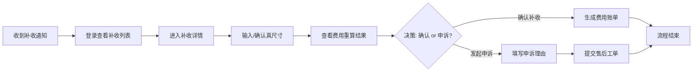
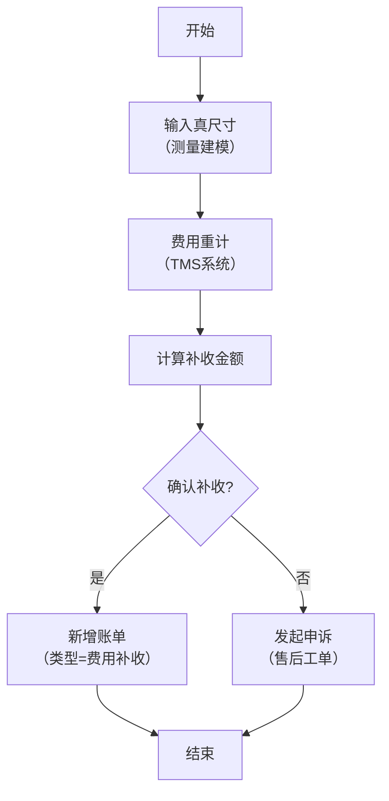
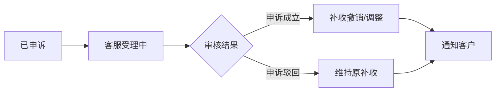

# 费用补收流程 PRD

| 版本 | 日期 | 变更内容 | 变更人 | 审核人 | 备注 |
|------|------|----------|--------|--------|------|
| V1.0 | 2026-06-24 | 初始版本 | AI Assistant | 待审核 | 基于流程图需求澄清 |

---

## 1. Executive Summary 执行摘要

### 1.1 Problem Statement 问题陈述

面向业务：海外仓仓储服务，
现状：客户货物入库时按申报尺寸计费，但实际测量后发现尺寸差异导致费用计算不准确
痛点：
- 客户对补收金额来源不清晰，缺乏透明度
- 补收处理流程分散在多个系统，客户操作不便
- 缺乏自助确认或申诉通道，依赖人工沟通
- 补收历史记录难以追溯

### 1.2 Proposed Solution 解决方案

1、构建费用补收自助流程系统，提供从真尺寸输入到最终处理的端到端体验
2、集成 TMS 费用重算能力，自动计算并展示补收明细
3、提供双向选择机制：客户可确认补收生成账单，或发起申诉进入工单流程
4、全流程状态可视化，支持历史记录查询和追踪

### 1.3 Success Criteria 成功指标

| 指标 | 目标值 |
|------|--------|
| 流程完成率 | >= 85%（进入流程的客户完成确认或申诉） |
| 客户满意度 | >= 4.0/5.0（补收透明度评价） |
| 操作时长 | <= 5分钟（从进入流程到完成操作） |
| 数据准确率 | 100%（补收金额计算无误） |
| 申诉响应时效 | < 24小时（申诉工单首次响应） |

---

## 2. User Experience & User Flows 用户体验与用户流程

### 2.1 User Personas 用户画像

| 角色 | 描述 | 目标 | 痛点 |
|------|------|------|------|
| 客户 | 使用仓储服务的商家，负责库存和费用管理 | 快速了解补收原因、便捷处理补收事项 | 不清楚为何要补收、不知道如何申诉、找不到历史记录 |
| 客服人员（间接） | 处理客户咨询和申诉工单 | 高效解答客户疑问、快速处理申诉 | 需反复解释补收计算逻辑、缺少统一视图 |

### 2.2 User Journey Map 用户旅程图



### 2.3 User Flows 用户流程

#### 2.3.1 主流程：费用补收处理



**流程说明**：
- 客户收到补收通知后，进入系统查看待处理任务
- 第一步需要输入或确认货物的真实尺寸信息（长、宽、高、重量）
- 系统调用 TMS 根据新尺寸重新计算仓储费用
- 展示原费用、新费用和补收金额的对比明细
- 客户可选择确认补收（生成正式账单）或发起申诉（创建售后工单）
- 不支持部分确认，必须全额确认或全额申诉
- 申诉后不可撤回，进入工单处理流程

#### 2.3.2 异常流程：尺寸验证失败

```mermaid
graph TD
    A["输入真尺寸"] --> B{"尺寸是否合理?"}
    B -->|"是"| C["继续费用重计"]
    B -->|"否"| D["提示错误原因"]
    D --> E{"是否修正?"}
    E -->|"是"| A
    E -->|"否"| F["暂停流程<br>联系客服"}
```

---

## 3. Functional Modules 功能模块

### 3.0 功能清单汇总

| 模块名称 | 功能点 | 功能描述 | 优先级 |
|----------|--------|----------|--------|
| 补收列表 | 任务列表展示 | 展示待处理、已处理、已申诉的补收任务列表 | P0 |
| 补收列表 | 状态筛选 | 按状态筛选：待输入/待确认/已完成/已申诉 | P0 |
| 补收列表 | 搜索功能 | 按订单号、任务ID搜索 | P1 |
| 补收详情 | 详情展示 | 展示完整的补收任务信息和处理进度 | P0 |
| 尺寸输入 | 表单录入 | 输入长、宽、高、重量等尺寸信息 | P0 |
| 尺寸输入 | 图片上传 | 可选上传尺寸测量证明图片 | P1 |
| 尺寸输入 | 测量规范提示 | 展示标准测量方法和注意事项 | P1 |
| 费用对比 | 重算结果展示 | 对比原费用和新费用，展示补收金额 | P0 |
| 费用对比 | 明细展开 | 支持查看费用计算的详细构成（仓储费、操作费等） | P0 |
| 确认操作 | 确认补收 | 客户确认补收金额并生成账单 | P0 |
| 确认操作 | 二次确认弹窗 | 确认前弹出二次确认对话框 | P0 |
| 申诉功能 | 申诉表单 | 填写申诉理由、上传证据图片 | P0 |
| 申诉功能 | 工单创建 | 提交后自动创建售后工单 | P0 |
| 历史记录 | 记录查询 | 查看历史补收任务的详细信息 | P1 |
| 历史记录 | 状态追踪 | 追踪申诉工单的处理状态 | P1 |

### 3.1 补收列表模块

**模块概述**：展示所有补收任务，支持状态筛选和搜索，作为流程入口。

**功能列表**：
```
补收列表模块
├── 任务列表展示
├── 状态筛选器
├── 搜索框
└── 任务卡片/表格行
```

**页面元素**：

| 元素 | 类型 | 说明 |
|------|------|------|
| 页面标题 | 文本 | "费用补收" |
| 状态Tab栏 | Tab组件 | 全部 / 待输入 / 待确认 / 已完成 / 已申诉 |
| 搜索框 | 输入框 | 支持订单号、任务ID模糊搜索 |
| 任务列表 | 表格/卡片 | 展示任务关键信息 |
| 任务数量 | 徽标 | 各状态下的任务数量 |

**功能逻辑描述**：

| 按钮/操作 | 触发条件 | 约束条件 | 逻辑描述 | 预期结果 |
|-----------|----------|----------|----------|----------|
| 点击任务 | 任务行可点击 | 无 | 打开补收详情页 | 进入详情页 |
| 切换状态Tab | 点击Tab | 无 | 过滤对应状态的任务 | 列表刷新 |
| 搜索 | 输入关键词+回车 | 无 | 按订单号/任务ID模糊匹配 | 列表过滤 |

### 3.2 补收详情模块

**模块概述**：展示单个补收任务的完整信息，包含流程步骤指引、尺寸信息、费用对比和操作区域。

**功能列表**：
```
补收详情模块
├── 流程步骤条（Step Indicator）
├── 订单基本信息
├── 原尺寸 vs 新尺寸对比
├── 费用对比明细
└── 操作按钮区（确认/申诉）
```

**页面布局**：

```
┌─────────────────────────────────────────────┐
│  < 返回列表    费用补收详情                   │
│  任务ID: SUP-20260624-001                    │
├─────────────────────────────────────────────┤
│  步骤条：                                    │
│  ✓ 输入尺寸 → ✓ 费用重计 → ○ 确认补收 → ○ 完成 │
├─────────────────────────────────────────────┤
│  【订单信息】                                │
│  订单号: ORD-20260601-123                    │
│  创建时间: 2026-06-20 10:30                 │
│  截止时间: 2026-06-25 23:59 (剩余1天12小时)  │
├─────────────────────────────────────────────┤
│  【尺寸对比】                                │
│  ┌──────────┬──────────┬──────────┐         │
│  │          │ 原申报值  │ 真实测量值 │         │
│  ├──────────┼──────────┼──────────┤         │
│  │ 长(cm)   │   50     │   55     │         │
│  │ 宽(cm)   │   40     │   42     │         │
│  │ 高(cm)   │   30     │   35     │         │
│  │ 重量(kg) │   20     │   22     │         │
│  └──────────┴──────────┴──────────┘         │
│  [编辑尺寸] [上传证明图片]                     │
├─────────────────────────────────────────────┤
│  【费用对比】                                │
│  ┌─────────────────────────────────────┐    │
│  │ 原费用（按申报尺寸）      ¥ 800.00   │    │
│  │ 新费用（按真实尺寸）      ¥ 950.00   │    │
│  │ ───────────────────────────────── │    │
│  │ 补收金额                ¥ 150.00   │    │
│  └─────────────────────────────────────┘    │
│  [查看费用明细]                              │
├─────────────────────────────────────────────┤
│  【操作区】                                  │
│  [确认补收并生成账单]    [发起申诉]          │
└─────────────────────────────────────────────┘
```

**功能逻辑描述**：

| 按钮/操作 | 触发条件 | 约束条件 | 逻辑描述 | 预期结果 |
|-----------|----------|----------|----------|----------|
| 编辑尺寸 | 点击"编辑尺寸"按钮 | 状态为"待输入"或"待确认" | 打开尺寸编辑弹窗 | 弹窗显示当前尺寸值 |
| 上传证明图片 | 点击"上传证明图片" | 无 | 打开文件选择器 | 选择后预览并可删除 |
| 查看费用明细 | 点击"查看费用明细" | 费用重算已完成 | 展开或跳转到费用明细区域 | 显示详细费用构成 |
| 确认补收 | 点击主按钮 | 必须已输入真实尺寸且费用已重算 | 弹出二次确认对话框 | 确认后生成账单，状态变更为"已完成" |
| 发起申诉 | 点击次按钮 | 无 | 打开申诉表单弹窗 | 填写后提交工单，状态变更为"已申诉" |

### 3.3 尺寸输入模块

**模块概述**：用于录入或修改货物的真实尺寸信息。

**功能列表**：
```
尺寸输入模块
├── 尺寸表单（长/宽/高/重量）
├── 图片上传区域
├── 测量规范说明
└── 表单校验
```

**弹窗属性描述**：

| 字段 | 输入方式 | 必填 | 取值规则 |
|------|----------|------|----------|
| 长度 (cm) | 数字输入框 | 是 | > 0，最多1位小数，<= 500 |
| 宽度 (cm) | 数字输入框 | 是 | > 0，最多1位小数，<= 500 |
| 高度 (cm) | 数字输入框 | 是 | > 0，最多1位小数，<= 500 |
| 重量 (kg) | 数字输入框 | 是 | > 0，最多2位小数，<= 1000 |
| 证明图片 | 文件上传 | 否 | 支持 JPG/PNG，最大5MB，最多3张 |
| 备注 | 文本域 | 否 | 最多200字 |

**校验规则**：

| 校验项 | 规则 | 错误提示 |
|--------|------|----------|
| 数值范围 | 所有尺寸必须大于0 | "请输入有效的尺寸数值" |
| 精度限制 | 长宽高最多1位小数，重量最多2位 | "小数位数超出限制" |
| 合理性检查 | 体积变化不超过原体积的200% | "尺寸差异过大，请核实后重新输入" |
| 图片格式 | 仅支持 JPG/PNG | "仅支持 JPG 或 PNG 格式" |
| 图片大小 | 单张不超过 5MB | "图片大小不能超过 5MB" |

### 3.4 费用对比模块

**模块概述**：清晰展示费用重算结果，帮助客户理解补收金额的来源。

**功能列表**：
```
费用对比模块
├── 费用汇总对比（原费用 vs 新费用 vs 补收）
├── 费用明细展开/收起
│   ├── 仓储费明细
│   ├── 操作费明细
│   └── 其他费用明细
└── 计算公式说明
```

**费用明细表格字段**：

| 字段名 | 说明 | 示例 |
|--------|------|------|
| 费用类别 | 仓储费/操作费/其他 | 仓储费 |
| 费用项目 | 具体收费项目 | 月度仓储费 |
| 原费用（申报尺寸） | 按原始申报尺寸计算的费用 | ¥500.00 |
| 新费用（真实尺寸） | 按真实测量尺寸计算的费用 | ¥600.00 |
| 差额 | 新费用 - 原费用 | ¥100.00 |
| 计算说明 | 简要说明计算依据 | 体积增大导致仓储费增加 |

**特殊展示规则**：

- 补收金额 > 0 时，显示红色突出显示
- 提供费用计算公式的 tooltip 说明
- 支持"导出费用明细"功能（P2）

### 3.5 确认操作模块

**模块概述**：提供确认补收的交互，包含二次确认机制。

**功能列表**：
```
确认操作模块
├── 确认补收按钮
├── 二次确认弹窗
│   ├── 补收金额汇总
│   ├── 账单信息预览
│   ├── 协议条款勾选
│   └── 确认/取消按钮
└── 成功提示
```

**二次确认弹窗内容**：

```markdown
# 确认补收

您即将确认以下补收金额：

**补收金额**: ¥150.00
**订单号**: ORD-20260601-123
**付款截止日期**: 2026-07-05

确认后将生成正式费用账单，请在截止日期前完成支付。

☐ 我已阅读并同意《费用补收协议》

[取消]  [确认补收]
```

**功能逻辑描述**：

| 按钮/操作 | 触发条件 | 约束条件 | 逻辑描述 | 预期结果 |
|-----------|----------|----------|----------|----------|
| 确认补收 | 点击弹窗内"确认补收" | 必须勾选协议条款 | 1.校验勾选 2.提交确认 3.更新状态 | 生成账单号，显示成功提示 |
| 取消 | 点击"取消"或关闭弹窗 | 无 | 关闭弹窗 | 返回详情页，无状态变更 |

### 3.6 申诉功能模块

**模块概述**：当客户对补收有异议时，提供申诉渠道。

**功能列表**：
```
申诉功能模块
├── 申诉表单弹窗
│   ├── 申诉类型选择
│   ├── 申诉理由文本域
│   ├── 证据图片上传
│   └── 提交按钮
├── 工单创建
└── 申诉成功提示
```

**弹窗属性描述**：

| 字段 | 输入方式 | 必填 | 取值规则 |
|------|----------|------|----------|
| 申诉类型 | 下拉选择 | 是 | 尺寸测量有误 / 费用计算错误 / 其他原因 |
| 申诉理由 | 多行文本域 | 是 | 10-500字，说明具体异议原因 |
| 证据图片 | 文件上传 | 是（至少1张） | 支持 JPG/PNG/PDF，最大10MB，最多5张 |
| 联系电话 | 电话输入框 | 是 | 11位手机号 |
| 期望处理时间 | 日期选择 | 否 | 不早于明天 |

**功能逻辑描述**：

| 按钮/操作 | 触发条件 | 约束条件 | 逻辑描述 | 预期结果 |
|-----------|----------|----------|----------|----------|
| 提交申诉 | 点击"提交申诉" | 所有必填项已填写且通过校验 | 1.表单校验 2.创建工单 3.更新任务状态 | 显示工单号，任务状态变为"已申诉" |
| 保存草稿 | 点击"保存草稿" | 至少填写了申诉理由 | 保存当前填写内容 | 提示草稿已保存，可下次继续 |

**申诉后的状态流转**：



---

## 4. Functional Logic Details 功能模块详细逻辑

### 4.1 初始化页面数据展示逻辑

#### 4.1.1 补收列表页初始化

| 逻辑项 | 说明 | 数据来源 | 展示规则 |
|--------|------|----------|----------|
| 任务列表加载 | 页面加载时获取当前客户的补收任务 | supplement_tasks.json | 默认显示"全部"状态的任务，按创建时间倒序 |
| 状态统计 | 统计各状态的任务数量 | 同上 | 在 Tab 标签上显示数量徽标 |
| 默认选中 | 自动定位到有待处理任务的Tab | 同上 | 如果有"待输入"或"待确认"任务，默认切换到该Tab |

#### 4.1.2 补收详情页初始化

| 逻辑项 | 说明 | 数据来源 | 展示规则 |
|--------|------|----------|----------|
| 任务详情加载 | 根据 task_id 加载完整任务信息 | supplement_task-{id}.json | 展示所有字段信息 |
| 步骤条状态 | 根据任务状态确定步骤条的当前步骤 | task.status | pending_input→步骤1高亮, pending_confirm→步骤2高亮, confirmed/appealed→步骤3高亮 |
| 费用对比数据 | 加载费用重算结果 | recalculated_fee.json | 如果尚未重算，显示"等待费用重算中..." |
| 倒计时显示 | 计算距离截止时间的剩余时间 | task.deadline | < 24小时显示红色，< 72小时显示橙色 |

### 4.2 模块按钮逻辑

#### 4.2.1 补收列表页按钮

| 按钮 | 位置 | 触发动作 | 前置条件 | 后续操作 |
|------|------|----------|----------|----------|
| 任务行点击 | 列表每行 | 跳转到详情页 | 无 | 携带 task_id 参数打开详情页 |
| 状态Tab | 页面顶部 | 切换列表过滤 | 无 | 重新加载对应状态的数据 |
| 搜索 | 搜索框右侧 | 执行搜索 | 输入内容非空 | 过滤列表，高亮匹配文字 |
| 清空搜索 | 搜索框内右侧图标 | 清空搜索词 | 搜索框非空 | 恢复完整列表 |

#### 4.2.2 补收详情页按钮

| 按钮 | 位置 | 触发动作 | 前置条件 | 后续操作 |
|------|------|----------|----------|----------|
| 返回列表 | 左上角 | 返回列表页 | 无 | 导航回列表页 |
| 编辑尺寸 | 尺寸对比区域 | 打开尺寸编辑弹窗 | status in ['pending_input', 'pending_confirm'] | 弹窗内显示当前尺寸值 |
| 上传证明图片 | 尺寸对比区域下方 | 打开文件选择器 | 无 | 选择后立即预览 |
| 查看费用明细 | 费用对比区域 | 展开/收起费用明细 | 费用已重算完成 | 平滑动画展开明细表格 |
| 确认补收 | 底部主按钮（醒目样式） | 弹出二次确认弹窗 | 已输入尺寸 && 费用已重算 && status='pending_confirm' | 显示确认弹窗 |
| 发起申诉 | 底部次按钮 | 打开申诉表单弹窗 | 无 | 显示申诉表单弹窗 |

#### 4.2.3 尺寸编辑弹窗按钮

| 按钮 | 位置 | 触发动作 | 前置条件 | 后续操作 |
|------|------|----------|----------|----------|
| 保存 | 弹窗底部右侧 | 校验并保存尺寸 | 通过所有校验规则 | 关闭弹窗，触发费用重算，更新详情页数据 |
| 取消 | 弹窗底部左侧 | 关闭弹窗 | 无 | 关闭弹窗，不保存任何修改 |
| 重置 | 弹窗内表单上方 | 恢复原始值 | 无 | 将所有字段恢复为打开弹窗时的值 |

#### 4.2.4 二次确认弹窗按钮

| 按钮 | 位置 | 触发动作 | 前置条件 | 后续操作 |
|------|------|----------|----------|----------|
| 确认补收 | 弹窗底部右侧 | 执行确认操作 | 已勾选协议条款 | 关闭弹窗，生成账单号，显示成功Toast，状态变为'confirmed' |
| 取消 | 弹窗底部左侧 | 关闭弹窗 | 无 | 关闭弹窗，返回详情页 |

#### 4.2.5 申诉表单弹窗按钮

| 按钮 | 位置 | 触发动作 | 前置条件 | 后续操作 |
|------|------|----------|----------|----------|
| 提交申诉 | 弹窗底部右侧 | 提交申诉工单 | 所有必填项已填且校验通过 | 关闭弹窗，创建工单号，显示成功提示，状态变为'appealed' |
| 保存草稿 | 弹窗底部左侧 | 保存草稿 | 至少填写了申诉理由 | 提示"草稿已保存"，关闭弹窗 |
| 取消 | 弹窗顶部关闭图标 | 关闭弹窗 | 有未保存内容时需确认 | 关闭弹窗（如有修改则先提示确认） |

### 4.3 字段取值逻辑

#### 4.3.1 补收列表页字段

| 字段 | 数据来源 | 取值规则 | 显示格式 |
|------|----------|----------|----------|
| 任务ID | task.task_id | 直接取值 | SUP-YYYYMMDD-NNN |
| 订单号 | task.order_id | 直接取值 | ORD-YYYYMMDD-NNN |
| 补收金额 | task.supplement_amount | 计算：recalculated_fee - original_fee | ¥ XXX.XX（红色，保留2位小数） |
| 当前状态 | task.status | 映射显示名称 | 待输入/待确认/已完成/已申诉（带颜色标签） |
| 创建时间 | task.created_at | 时间戳转日期 | YYYY-MM-DD HH:mm |
| 截止时间 | task.deadline | 时间戳转日期 | YYYY-MM-DD HH:mm（临近时倒计时） |

#### 4.3.2 补收详情页字段

| 字段 | 数据来源 | 取值规则 | 显示格式 |
|------|----------|----------|----------|
| 原长度 | task.original_dimensions.length | 直接取值 | XX.X cm |
| 新长度 | task.actual_dimensions.length | 直接取值 | XX.X cm |
| 尺寸差异百分比 | 计算 | (新体积-原体积)/原体积*100 | +XX.X%（绿色表示减小，红色表示增大） |
| 原费用 | task.original_fee | 直接取值 | ¥ XXX.XX |
| 新费用 | task.recalculated_fee | TMS返回或前端模拟计算 | ¥ XXX.XX |
| 补收金额 | task.supplement_amount | recalculated_fee - original_fee | ¥ XXX.XX（加粗红色） |
| 处理进度 | task.status + history | 根据状态历史计算 | 步骤条 + 百分比 |
| 剩余时间 | task.deadline - now() | 动态计算 | X天X小时X分钟（<24h红色） |

#### 4.3.3 费用明细字段

| 字段 | 数据来源 | 取值规则 | 显示格式 |
|------|----------|----------|----------|
| 费用类别 | fee_detail.category | 枚举映射 | 仓储费/操作费/其他 |
| 项目名称 | fee_detail.item_name | 直接取值 | 如"月度仓储费" |
| 单价 | fee_detail.unit_price | 直接取值 | ¥ XX.XX /单位 |
| 数量 | fee_detail.quantity | 直接取值 | XX.XX（带单位） |
| 原费用小计 | fee_detail.original_subtotal | unit_price * quantity（原尺寸） | ¥ XXX.XX |
| 新费用小计 | fee_detail.new_subtotal | unit_price * quantity（新尺寸） | ¥ XXX.XX |
| 差额 | new_subtotal - original_subtotal | 计算 | +¥ XX.XX（红色）或 -¥ XX.XX（绿色） |

### 4.4 业务规则

#### 4.4.1 补收计算规则

```
补收金额 = 新费用（基于真实尺寸） - 原费用（基于申报尺寸）

约束：
1. 补收金额必须 > 0（本流程仅处理正向补收）
2. 若新费用 ≤ 原费用，则不应触发此流程（属于退款场景，本期不做）
3. 费用重算由 TMS 系统执行，前端仅展示结果
4. 费用保留2位小数，采用四舍五入
```

#### 4.4.2 状态流转规则

```
pending_input（待输入）
    ↓ 用户输入真实尺寸并保存
pending_confirm（待确认）
    ↓ TMS 完成费用重算
pending_confirm（待确认）
    ↓ 用户点击"确认补收"
confirmed（已完成，已生成账单）
    ↓
completed（结束）

pending_confirm（待确认）
    ↓ 用户点击"发起申诉"
appealed（已申诉，已创建工单）
    ↓ 等待工单处理结果
（终态，后续由人工处理）
```

#### 4.4.3 校验规则汇总

| 规则名称 | 应用场景 | 规则内容 | 错误提示 |
|----------|----------|----------|----------|
| 尺寸正值校验 | 尺寸输入 | length > 0 && width > 0 && height > 0 && weight > 0 | "所有尺寸必须大于0" |
| 尺寸上限校验 | 尺寸输入 | 各维度不超过合理上限 | "尺寸超出合理范围，请联系客服" |
| 体积突变检测 | 尺寸输入 | \|新体积-原体积\| / 原体积 ≤ 200% | "尺寸差异过大，请核实测量数据" |
| 申诉理由长度 | 申诉表单 | 10 ≤ reason.length ≤ 500 | "申诉理由需要在10-500字之间" |
| 证据图片数量 | 申诉表单 | 1 ≤ images.length ≤ 5 | "请上传1-5张证据图片" |
| 手机号格式 | 申诉表单 | 正则：/^1[3-9]\d{9}$/ | "请输入正确的11位手机号码" |
| 截止时间校验 | 申诉期望时间 | expected_date > tomorrow | "期望处理时间不能早于明天" |

### 4.5 异常处理

#### 4.5.1 网络异常

| 场景 | 处理方式 | 用户提示 |
|------|----------|----------|
| 加载列表失败 | 显示错误状态，提供重试按钮 | "加载失败，请检查网络后重试" |
| 提交操作失败 | 回滚本地状态，保留用户输入 | "提交失败，请稍后重试" |
| 费用重算超时 | 显示加载中状态，30秒后超时提示 | "费用计算耗时较长，请稍后刷新页面" |

#### 4.5.2 业务异常

| 场景 | 处理方式 | 用户提示 |
|------|----------|----------|
| 任务已被处理 | 刷新页面，更新最新状态 | "该任务已被处理，页面已刷新" |
| 任务已过期 | 禁用操作按钮，显示过期提示 | "该补收任务已过期，请联系客服处理" |
| 并发冲突 | 采用乐观锁，后提交者被拒绝 | "数据已被更新，请刷新后重试" |

---

## 5. 非功能性需求

### 5.1 性能要求

| 指标 | 要求 |
|------|------|
| 页面加载时间 | ≤ 2秒（首屏） |
| 列表渲染时间 | ≤ 1秒（100条以内） |
| 弹窗打开时间 | ≤ 300ms |
| 表单提交响应 | ≤ 1秒（含校验） |

### 5.2 兼容性要求

| 项目 | 要求 |
|------|------|
| 浏览器 | Chrome 90+, Firefox 88+, Safari 14+, Edge 90+ |
| 分辨率 | 支持 1280x720 及以上 |
| 移动适配 | 响应式布局，支持主流手机浏览器 |

### 5.3 安全要求

| 项目 | 要求 |
|------|------|
| XSS防护 | 所有用户输入进行转义处理 |
| CSRF保护 | 敏感操作携带token（原型阶段模拟） |
| 数据权限 | 仅能查看和处理自己名下的补收任务 |

### 5.4 可用性要求

| 项目 | 要求 |
|------|------|
| 操作引导 | 新手引导提示（首次使用时） |
| 错误提示 | 友好清晰的错误信息，避免技术术语 |
| 帮助文档 | 提供 FAQ 和操作手册入口 |
| 反馈机制 | 操作成功/失败均有明确的视觉反馈（Toast提示） |

---

## 6. 数据模型

### 6.1 补收任务主表 (supplement_task)

```json
{
  "task_id": "SUP-20260624-001",
  "order_id": "ORD-20260601-123",
  "customer_id": "CUST-001",
  "customer_name": "测试客户A",
  "status": "pending_confirm",
  "original_dimensions": {
    "length": 50.0,
    "width": 40.0,
    "height": 30.0,
    "weight": 20.0,
    "volume": 0.06,
    "unit": "cm/kg"
  },
  "actual_dimensions": {
    "length": 55.0,
    "width": 42.0,
    "height": 35.0,
    "weight": 22.0,
    "volume": 0.08085,
    "unit": "cm/kg"
  },
  "evidence_images": [
    {
      "file_name": "measure_001.jpg",
      "url": "/images/evidence/measure_001.jpg",
      "upload_time": "2026-06-24 14:30:00"
    }
  ],
  "original_fee": 800.00,
  "recalculated_fee": 950.00,
  "supplement_amount": 150.00,
  "fee_details": [
    {
      "category": "仓储费",
      "item_name": "月度仓储费",
      "unit_price": 5.00,
      "unit": "元/立方米/月",
      "quantity_original": 0.06,
      "quantity_actual": 0.08085,
      "original_subtotal": 300.00,
      "new_subtotal": 404.25,
      "difference": 104.25
    },
    {
      "category": "操作费",
      "item_name": "入库操作费",
      "unit_price": 15.00,
      "unit": "元/立方米",
      "quantity_original": 0.06,
      "quantity_actual": 0.08085,
      "original_subtotal": 500.00,
      "new_subtotal": 545.75,
      "difference": 45.75
    }
  ],
  "created_at": "2026-06-20 10:30:00",
  "updated_at": "2026-06-24 14:35:00",
  "deadline": "2026-06-25 23:59:59",
  "bill_info": null,
  "appeal_info": null,
  "history": [
    {
      "action": "create",
      "operator": "system",
      "timestamp": "2026-06-20 10:30:00",
      "detail": "创建补收任务"
    },
    {
      "action": "input_dimensions",
      "operator": "customer",
      "timestamp": "2026-06-24 14:30:00",
      "detail": "输入真实尺寸"
    },
    {
      "action": "recalculate_fee",
      "operator": "system",
      "timestamp": "2026-06-24 14:32:00",
      "detail": "TMS费用重算完成"
    }
  ]
}
```

### 6.2 账单信息 (bill_info) - 确认后生成

```json
{
  "bill_id": "BILL-20260624-001",
  "task_id": "SUP-20260624-001",
  "bill_type": "费用补收",
  "amount": 150.00,
  "status": "unpaid",
  "created_at": "2026-06-24 15:00:00",
  "due_date": "2026-07-05 23:59:59",
  "payment_methods": ["在线支付", "银行转账"]
}
```

### 6.3 申诉信息 (appeal_info) - 申诉后生成

```json
{
  "ticket_id": "TK-20260624-001",
  "task_id": "SUP-20260624-001",
  "appeal_type": "尺寸测量有误",
  "reason": "我们使用专业测量工具多次核实，尺寸应为50*40*30cm，与申报一致。贵司测量的55*42*35cm可能有误。",
  "evidence_images": [
    {
      "file_name": "proof_001.jpg",
      "url": "/images/appeal/proof_001.jpg"
    },
    {
      "file_name": "proof_002.jpg",
      "url": "/images/appeal/proof_002.jpg"
    }
  ],
  "contact_phone": "13800138000",
  "expected_resolve_time": "2026-06-26",
  "status": "pending_review",
  "created_at": "2026-06-24 16:00:00",
  "review_history": []
}
```

---

## 7. 附录

### 7.1 术语表

| 术语 | 定义 |
|------|------|
| TMS | Transportation Management System，运输管理系统，此处指费用计算引擎 |
| 真实尺寸 | 经实际测量得到的货物长、宽、高、重量 |
| 申报尺寸 | 客户入库时申报的货物尺寸 |
| 补收 | 因尺寸差异导致的额外费用 |
| 申诉 | 客户对补收金额提出异议并请求复核 |

### 7.2 参考文档

- [需求澄清文档](discovery.md)
- [测试用例](test-cases.md)
- [设计规范](../Design-core/design-tokens.md)

### 7.3 变更日志

| 版本 | 日期 | 变更内容 | 作者 |
|------|------|----------|------|
| V1.0 | 2026-06-24 | 初始版本 | AI Assistant |
