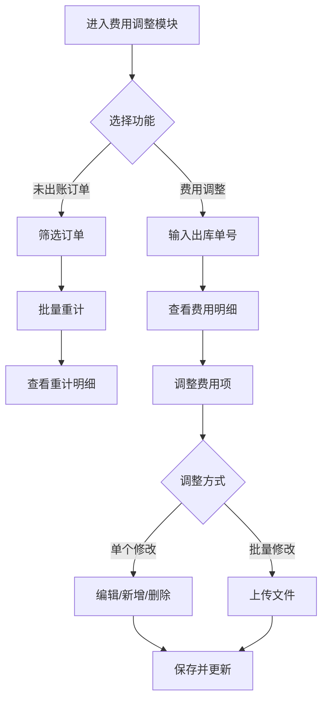
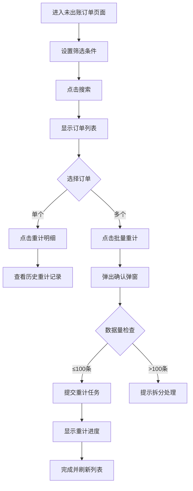
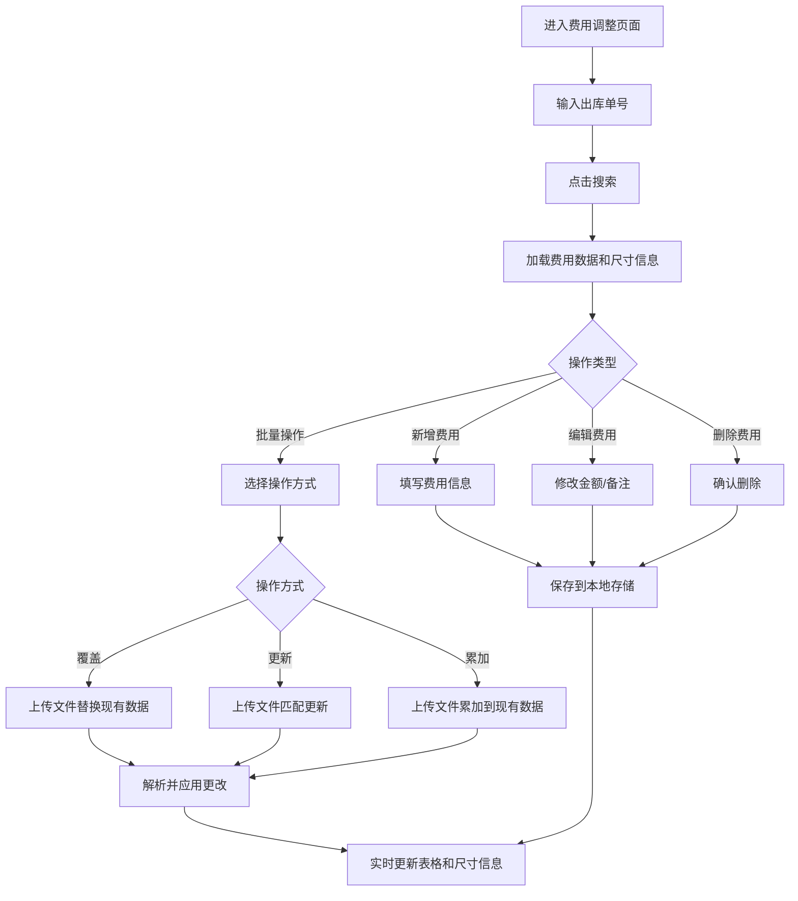
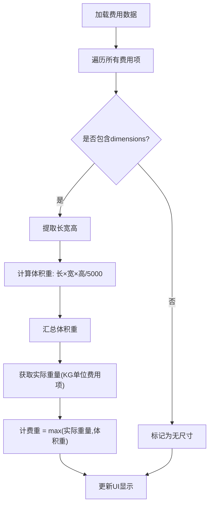

# 费用调整模块 PRD

**版本**: V1.0  
**日期**: 2026-05-19  
**状态**: 已完成  
**作者**: System  
**基于代码实现**: index.html, order-audit.html, js/main.js

---

## 1. Executive Summary 执行摘要

### Problem Statement 问题陈述

面向业务:海外仓财务管理,
现状:未出账订单的费用计算可能存在误差,需要支持重计;出库单费用明细需要人工调整以应对特殊场景(如超长超重、偏远地区附加费等)。
痛点:缺乏灵活的费用调整机制,无法批量处理费用修正,费用明细不够透明。

### Proposed Solution 解决方案

1、构建费用调整系统,包含两大核心功能:
   - **未出账订单管理**:支持订单筛选、批量重计费用、查看重计明细
   - **出库单费用明细调整**:支持单个/批量费用项的新增、编辑、删除和文件导入调整

2、提供完整的尺寸信息展示(长宽高、体积重、计费重),确保费用计算的透明度。
3、通过文件上传支持批量操作(覆盖、更新、累加),提高运营效率。

### Success Criteria 成功指标

| 指标 | 目标值 |
|------|--------|
| 订单查询响应时间 | < 500ms（千级订单） |
| 费用项CRUD操作响应 | < 200ms |
| 批量重计处理能力 | 支持100+订单同时重计 |
| 文件上传成功率 | >= 99%（格式正确的情况下） |
| 数据准确性 | 费用计算准确率100% |

---

## 2. User Experience & User Flows 用户体验与用户流程

### 2.1 User Personas 用户画像

| 角色 | 描述 | 目标 | 痛点 |
|------|------|------|------|
| 财务人员 | 负责费用核对和账单管理 | 快速定位异常订单、批量调整费用 | 手工调整效率低、易出错 |
| 运营人员 | 处理日常订单和费用问题 | 灵活调整费用、批量处理异常 | 缺乏批量工具、操作繁琐 |
| 仓库管理员 | 管理出库单和仓储费 | 查看重计结果、确认费用明细 | 费用不透明、难以追溯 |

### 2.2 User Journey Map 用户旅程图



### 2.3 User Flows 用户流程

#### 2.3.1 未出账订单重计流程



**流程说明**:
- 支持按订单号(精确/模糊)、客户代码、仓库、配送渠道筛选
- 批量重计时需校验数据量,超过100条提示用户拆分处理
- 重计明细支持按状态(全部/重计中/成功/失败)筛选

#### 2.3.2 出库单费用调整流程



**流程说明**:
- 搜索时自动加载该出库单的所有费用项和包裹尺寸信息
- 新增/编辑费用项时实时验证数据有效性(如金额必须为数字)
- 批量操作支持三种模式:覆盖(完全替换)、更新(按字段匹配更新)、累加(数值累加)
- 所有操作均使用localStorage持久化,页面刷新后数据保留

#### 2.3.3 尺寸信息计算逻辑



---

## 3. User Stories 用户故事

### 3.1 未出账订单模块

#### Story 1: 订单筛选与搜索

**As a** 财务人员,
**I want to** 通过多维度条件筛选未出账订单,
**so that** 我能快速定位需要处理的订单。

**Acceptance Criteria**:
- [ ] 支持订单号精确/模糊搜索
- [ ] 支持客户代码下拉选择
- [ ] 支持仓库下拉选择
- [ ] 支持配送渠道下拉选择
- [ ] 搜索结果实时展示,响应时间<500ms
- [ ] 支持重置所有筛选条件

#### Story 2: 批量重计费用

**As a** 运营人员,
**I want to** 选择多个订单进行批量重计,
**so that** 我能高效处理大量异常订单。

**Acceptance Criteria**:
- [ ] 支持全选/取消全选
- [ ] 支持勾选单个或多个订单
- [ ] 点击"批量重计"按钮触发确认弹窗
- [ ] 弹窗显示已选订单数量
- [ ] 数据量>100条时提示拆分处理
- [ ] 确认后提交重计任务并显示进度
- [ ] 重计完成后自动刷新列表

#### Story 3: 查看重计明细

**As a** 仓库管理员,
**I want to** 查看某个订单的重计历史记录,
**so that** 我能追溯费用变更原因。

**Acceptance Criteria**:
- [ ] 点击"重计明细"按钮打开模态框
- [ ] 模态框显示该订单的所有重计记录
- [ ] 支持按状态筛选(全部/重计中/成功/失败)
- [ ] 显示原金额、重计金额、状态、失败原因等字段
- [ ] 支持分页浏览(10/20/50条每页)

#### Story 4: 数据导出

**As a** 财务人员,
**I want to** 导出订单数据,
**so that** 我能进行离线分析或存档。

**Acceptance Criteria**:
- [ ] 点击"导出"按钮触发下载
- [ ] 导出当前筛选条件下的所有数据
- [ ] 导出格式为Excel(.xlsx)
- [ ] 文件名包含导出时间戳

### 3.2 费用调整模块

#### Story 5: 查询出库单费用

**As a** 运营人员,
**I want to** 通过出库单号查询费用明细,
**so that** 我能了解该订单的完整费用构成。

**Acceptance Criteria**:
- [ ] 输入框支持输入出库单号(如HYNB-240126-0059)
- [ ] 点击搜索后加载该订单的费用数据
- [ ] 同时显示包裹尺寸信息(长宽高、体积重、计费重)
- [ ] 无数据时显示空状态提示

#### Story 6: 新增费用项

**As a** 运营人员,
**I want to** 为出库单添加新的费用项,
**so that** 我能记录特殊费用(如超长费、偏远地区附加费)。

**Acceptance Criteria**:
- [ ] 点击"新增费用项"按钮打开表单
- [ ] 表单包含:费用名称(下拉选择)、计费单位、原金额、新金额、币别、备注
- [ ] 费用名称选项:超长费、超重费、燃油附加费、偏远地区附加费、仓储费、其他费用
- [ ] 金额字段必须为有效数字
- [ ] 保存后立即在表格中显示新费用项
- [ ] 自动更新尺寸信息区域

#### Story 7: 编辑费用项

**As a** 财务人员,
**I want to** 修改已有费用项的金额和备注,
**so that** 我能纠正错误的费用记录。

**Acceptance Criteria**:
- [ ] 每行费用项有编辑按钮
- [ ] 点击后在行内或弹窗中编辑
- [ ] 可修改:新金额、备注
- [ ] 原金额字段只读,不可修改
- [ ] 保存后实时更新表格显示

#### Story 8: 删除费用项

**As a** 运营人员,
**I want to** 删除错误的费用项,
**so that** 我能保持费用数据的准确性。

**Acceptance Criteria**:
- [ ] 每行费用项有删除按钮
- [ ] 点击后弹出二次确认对话框
- [ ] 确认后从列表中移除该项
- [ ] 自动更新尺寸信息区域

#### Story 9: 批量操作(文件上传)

**As a** 高级用户,
**I want to** 通过Excel/CSV文件批量调整费用,
**so that** 我能一次性处理大量费用修改。

**Acceptance Criteria**:
- [ ] 点击"批量操作"按钮展开下拉菜单
- [ ] 菜单选项:覆盖、更新、累加
- [ ] 选择后打开文件上传模态框
- [ ] 支持拖拽或点击选择文件
- [ ] 文件格式:.xlsx, .xls, .csv
- [ ] 文件大小限制:≤10MB
- [ ] 上传前显示已选文件信息(名称、大小)
- [ ] 可移除已选文件重新选择
- [ ] 点击"开始上传"后解析文件并应用更改
- [ ] 操作完成后显示成功/失败提示

#### Story 10: 尺寸信息自动计算

**As a** 运营人员,
**I want to** 系统自动计算并显示包裹的体积重和计费重,
**so that** 我能快速判断费用是否合理。

**Acceptance Criteria**:
- [ ] 页面顶部显示蓝色背景的尺寸信息卡片
- [ ] 包含三个指标:长宽高(cm³)、体积重(kg)、计费重(kg)
- [ ] 从费用项的dimensions字段提取长宽高
- [ ] 体积重 = 长×宽×高/5000
- [ ] 计费重 = max(实际重量, 体积重)
- [ ] 实际重量从单位为KG的费用项的金额字段获取
- [ ] 无尺寸数据时显示"-"
- [ ] 费用数据变化时自动重新计算

---

## 4. Non-Goals 非目标

以下内容**不在本次实现范围内**:

- ❌ 不支持在线支付功能
- ❌ 不支持多币种自动换算(仅展示,不转换)
- ❌ 不支持费用审批工作流
- ❌ 不支持历史版本对比和回滚
- ❌ 不支持与其他ERP系统的实时对接(当前为原型演示)
- ❌ 不支持移动端原生App(仅响应式Web)

---

## 5. Technical Specifications 技术规格

### 5.1 Architecture Overview 架构概览

```
费用调整模块架构
├── 前端展示层 (Presentation Layer)
│   ├── index.html          # 未出账订单主页面
│   ├── order-audit.html    # 费用调整页面
│   ├── css/styles.css      # 自定义样式
│   └── js/main.js          # 核心交互逻辑
├── 数据层 (Data Layer)
│   ├── localStorage        # 客户端数据持久化
│   ├── data/recalculation-data.json  # 静态模拟数据
│   └── APIDataManager      # 统一数据管理器(可选)
├── 第三方库 (Third-party Libraries)
│   ├── Tailwind CSS v3     # 样式框架
│   ├── Marked.js v4        # Markdown解析
│   ├── Mermaid.js v10      # 流程图渲染
│   └── Font Awesome 4.7    # 图标库
└── 文档层 (Documentation Layer)
    ├── prd.md              # 产品需求文档(本文件)
    ├── test-cases.md       # 测试用例文档
    └── spec.md             # 技术规格文档
```

### 5.2 Data Models 数据模型

#### 5.2.1 订单数据结构 (Order)

```javascript
{
  id: Number,                // 唯一标识
  orderTime: String,         // 下单时间 "YYYY-MM-DD HH:mm:ss"
  billType: String,          // 账单类型 "出库单" | "仓储费"
  warehouse: String,         // 仓库代码 "DE001" | "DE002" | "DE003"
  customerCode: String,      // 客户代码 "DEMO - demo"
  orderNo: String,           // 订单号 "ORD+时间戳+序号"
  logisticsProduct: String,  // 物流产品 "FEDEX_MPS" | "FEDEX_HOME_GROUND" | "ZYBQ"
  amount: Number,            // 计费总金额
  currency: String           // 币种 "USD" | "EUR" | "GBP"
}
```

#### 5.2.2 费用项数据结构 (FeeItem)

```javascript
{
  id: String,                // 唯一标识(UUID)
  name: String,              // 费用名称 "超长费" | "超重费" | "燃油附加费" | ...
  unit: String,              // 计费单位 "KG" | "箱" | "票" | "件"
  amount: Number,            // 原金额(只读)
  newAmount: Number|null,    // 新金额(可编辑)
  currency: String,          // 币别 "USD"
  dimensions: String|null,   // 尺寸 "长x宽x高" 如 "120x80x60"
  volumeWeight: Number|null, // 体积重(kg)
  remark: String             // 备注
}
```

#### 5.2.3 重计记录数据结构 (RecalculationRecord)

```javascript
{
  id: Number,
  operateTime: String,       // 操作时间
  operator: String,          // 操作人
  warehouse: String,         // 仓库代码
  customerCode: String,      // 客户代码
  orderNo: String,           // 订单号
  logisticsProduct: String,  // 物流产品
  chargeType: String,        // 计费类型
  originalAmount: Number,    // 原金额
  amount: Number,            // 重计金额
  status: String,            // 状态 "processing" | "success" | "failed"
  failReason: String|null    // 失败原因
}
```

### 5.3 API Interfaces 接口设计 (未来扩展)

> 注:当前为前端原型,数据通过localStorage和静态JSON模拟,以下为预留接口规范

#### 5.3.1 订单查询接口

```
GET /api/orders/recalculation?page=1&pageSize=10&orderNo=xxx&customerCode=xxx&warehouse=xxx&channel=xxx

Response:
{
  success: true,
  data: [
    { /* Order对象 */ }
  ],
  total: 150
}
```

#### 5.3.2 批量重计接口

```
POST /api/orders/batch-recalculate
Body:
{
  orderIds: ["1", "2", "3"],
  operator: "admin"
}

Response:
{
  success: true,
  taskId: "task_123456",
  message: "重计任务已提交",
  totalCount: 3
}
```

#### 5.3.3 费用项CRUD接口

```
# 查询费用项
GET /api/fees/{orderNo}

# 新增费用项
POST /api/fees
Body: { FeeItem }

# 更新费用项
PUT /api/fees/{id}
Body: { newAmount, remark }

# 删除费用项
DELETE /api/fees/{id}
```

#### 5.3.4 批量操作接口

```
POST /api/fees/batch
FormData:
- file: Excel/CSV文件
- action: "cover" | "update" | "accumulate"
- orderNo: 目标出库单号

Response:
{
  success: true,
  processedCount: 50,
  failedCount: 2,
  errors: [{ row: 3, reason: "金额格式错误" }]
}
```

### 5.4 核心算法

#### 5.4.1 体积重计算

```javascript
function calculateVolumeWeight(dimensions) {
  // dimensions格式: "120x80x60"
  const [length, width, height] = dimensions.split('x').map(Number);
  // 体积重公式: 长×宽×高 / 5000 (国际快递标准)
  return (length * width * height) / 5000;
}
```

#### 5.4.2 计费重确定

```javascript
function determineChargeableWeight(actualWeight, volumeWeight) {
  // 计费重取实际重量和体积重的较大值
  return Math.max(actualWeight, volumeWeight);
}
```

#### 5.4.3 批量操作逻辑

```javascript
// 覆盖模式:完全替换现有数据
function coverMode(existingData, newData) {
  return newData;
}

// 更新模式:按ID匹配,存在则更新,不存在则跳过
function updateMode(existingData, newData) {
  return existingData.map(item => {
    const match = newData.find(n => n.id === item.id);
    return match ? { ...item, ...match } : item;
  });
}

// 累加模式:数值字段相加
function accumulateMode(existingData, newData) {
  return existingData.map(item => {
    const match = newData.find(n => n.id === item.id);
    if (match) {
      return {
        ...item,
        newAmount: (item.newAmount || 0) + (match.newAmount || 0),
        amount: item.amount + (match.amount || 0)
      };
    }
    return item;
  });
}
```

---

## 6. UI/UX Design Specifications UI/UX设计规范

### 6.1 设计令牌 (Design Tokens)

#### 颜色系统

```css
:root {
  /* 主色 */
  --primary: #2a3b7d;
  --primary-light: #3a4ca7;
  
  /* 功能色 */
  --secondary: #36CFC9;
  --success: #00B42A;
  --warning: #FF7D00;
  --danger: #F53F3F;
  
  /* 中性色 */
  --gray-100: #F2F3F5;
  --gray-200: #E5E6EB;
  --gray-300: #C9CDD4;
  --gray-400: #86909C;
  --gray-500: #4E5969;
  --gray-600: #272E3B;
  --gray-700: #1D2129;
}
```

#### 间距系统

- 基础单位: 4px
- 常用间距: 4px, 8px, 12px, 16px, 24px, 32px

#### 字体系统

```css
font-family: 'Inter', system-ui, -apple-system, sans-serif;

/* 标题 */
h1: 24px (1.5rem), font-semibold, text-gray-900
h2: 20px (1.25rem), font-medium, text-gray-800
h3: 18px (1.125rem), font-medium, text-gray-700

/* 正文 */
body: 14px (0.875rem), text-gray-700
small: 12px (0.75rem), text-gray-500
```

### 6.2 组件规范

#### 按钮组件

```html
<!-- 主按钮 -->
<button class="erp-btn erp-btn-primary">
  <i class="fa fa-search mr-2"></i>搜索
</button>

<!-- 次要按钮 -->
<button class="erp-btn erp-btn-secondary">
  取消
</button>

<!-- 警告按钮 -->
<button class="erp-btn erp-btn-warning">
  <i class="fa fa-cog mr-2"></i>批量操作
</button>

<!-- 危险按钮 -->
<button class="erp-btn erp-btn-danger">
  删除
</button>
```

#### 表格组件

```html
<div class="table-card">
  <table class="w-full text-sm data-table">
    <thead>
      <tr class="bg-gray-50 text-left">
        <th class="px-4 py-3 font-medium text-gray-500">列名</th>
      </tr>
    </thead>
    <tbody>
      <tr class="border-t border-gray-100 hover:bg-gray-50">
        <td class="px-4 py-3">数据</td>
      </tr>
    </tbody>
  </table>
</div>
```

#### 卡片组件

```html
<!-- 搜索卡片 -->
<div class="search-card bg-white rounded shadow-sm p-4 mb-4">
  <!-- 内容 -->
</div>

<!-- 信息卡片(蓝色背景) -->
<div class="bg-blue-50 border border-blue-200 rounded-lg p-4">
  <!-- 尺寸信息 -->
</div>
```

### 6.3 交互反馈

#### 加载状态

```javascript
showLoading('加载数据中...');
// 显示旋转图标 + 文字提示
hideLoading();
```

#### Toast提示

```javascript
showToast('操作成功', 'success');  // 绿色
showToast('操作失败', 'error');    // 红色
showToast('注意', 'warning');      // 黄色
showToast('提示', 'info');         // 蓝色
```

#### 模态框

- 打开时:背景半透明遮罩(黑色50%),内容居中显示
- 关闭方式:点击关闭按钮、点击遮罩层(可选)、按ESC键
- 动画:淡入淡出(300ms transition)

---

## 7. Security & Privacy 安全与隐私

### 7.1 数据安全

- ✅ 所有数据存储在客户端localStorage,不传输到服务器(原型阶段)
- ✅ 敏感操作(删除、批量重计)需要二次确认
- ✅ 文件上传限制类型和大小,防止恶意文件
- ⚠️ 未来生产环境需添加:
  - HTTPS加密传输
  - JWT Token认证
  - RBAC角色权限控制
  - 操作日志审计

### 7.2 输入验证

```javascript
// 金额验证
function validateAmount(value) {
  const num = parseFloat(value);
  if (isNaN(num) || num < 0) {
    showToast('请输入有效的金额', 'warning');
    return false;
  }
  return true;
}

// 文件验证
function validateFile(file) {
  const allowedTypes = [
    'application/vnd.openxmlformats-officedocument.spreadsheetml.sheet',
    'application/vnd.ms-excel',
    'text/csv'
  ];
  const maxSize = 10 * 1024 * 1024; // 10MB
  
  if (!allowedTypes.includes(file.type)) {
    showToast('仅支持Excel和CSV文件', 'error');
    return false;
  }
  
  if (file.size > maxSize) {
    showToast('文件大小不能超过10MB', 'error');
    return false;
  }
  
  return true;
}
```

---

## 8. Performance Requirements 性能要求

### 8.1 前端性能指标

| 指标 | 目标值 | 测量方法 |
|------|--------|----------|
| 首屏加载时间(FCP) | < 1.5s | Lighthouse |
| 可交互时间(TTI) | < 3s | Lighthouse |
| 搜索响应时间 | < 500ms | Performance API |
| 表格渲染(100行) | < 100ms | Console.time |
| 文件解析(10MB) | < 2s | Performance API |

### 8.2 性能优化策略

1. **事件委托**:使用事件委托减少事件监听器数量
   ```javascript
   document.getElementById('feeTableBody').addEventListener('click', function(e) {
     if (e.target.matches('.edit-btn')) { /* 编辑 */ }
     if (e.target.matches('.delete-btn')) { /* 删除 */ }
   });
   ```

2. **DOM批处理**:使用DocumentFragment减少重排重绘
   ```javascript
   const fragment = document.createDocumentFragment();
   data.forEach(item => {
     const tr = createRow(item);
     fragment.appendChild(tr);
   });
   tbody.appendChild(fragment); // 一次性插入
   ```

3. **懒加载**:PRD和测试用例仅在用户展开时才加载
   ```javascript
   function togglePrdLogic(pageId) {
     const content = document.getElementById(pageId + '-logic-content');
     content.classList.toggle('hidden');
     
     if (!content.classList.contains('hidden') && !prdLoaded) {
       loadPRD(); // 仅首次展开时加载
     }
   }
   ```

4. **防抖节流**:搜索输入使用防抖,避免频繁请求
   ```javascript
   let debounceTimer;
   searchInput.addEventListener('input', function() {
     clearTimeout(debounceTimer);
     debounceTimer = setTimeout(handleSearch, 300);
   });
   ```

---

## 9. Testing Strategy 测试策略

### 9.1 单元测试 (Unit Tests)

核心函数测试覆盖率目标: >= 80%

- `calculateVolumeWeight()` - 体积重计算
- `determineChargeableWeight()` - 计费重确定
- `validateAmount()` - 金额验证
- `validateFile()` - 文件验证
- `coverMode()`, `updateMode()`, `accumulateMode()` - 批量操作逻辑

### 9.2 集成测试 (Integration Tests)

- 订单搜索 → 结果展示完整流程
- 费用项CRUD → localStorage持久化 → 页面刷新数据保留
- 文件上传 → 解析 → 应用更改 → UI更新

### 9.3 E2E测试 (End-to-End Tests)

使用Playwright或Cypress:

1. **未出账订单主流程**
   - 打开页面 → 输入筛选条件 → 搜索 → 选择订单 → 批量重计 → 确认 → 查看结果

2. **费用调整主流程**
   - 打开页面 → 输入出库单号 → 搜索 → 新增费用 → 编辑费用 → 删除费用 → 批量上传

### 9.4 兼容性测试

- Chrome >= 90
- Firefox >= 88
- Safari >= 14
- Edge >= 90

分辨率适配:
- 1920x1080 (Full HD)
- 1366x768 (HD)
- 1440x900 (MacBook)
- 移动端: 375x667 (iPhone SE), 414x896 (iPhone 11)

---

## 10. Risks & Mitigation 风险与缓解

### 10.1 技术风险

| 风险 | 可能性 | 影响 | 缓解措施 |
|------|--------|------|----------|
| 大文件上传导致浏览器卡死 | 中 | 高 | 限制文件大小≤10MB,前端分片读取 |
| localStorage容量溢出(5MB限制) | 低 | 中 | 监控存储用量,超出时提示清理 |
| Mermaid图表渲染失败 | 低 | 低 | try-catch包裹,降级为文本展示 |
| Marked XSS攻击 | 低 | 高 | 使用DOMPurify sanitize HTML |

### 10.2 业务风险

| 风险 | 可能性 | 影响 | 缓解措施 |
|------|--------|------|----------|
| 费用计算错误导致财务损失 | 中 | 高 | 多层验证+二次确认+操作日志 |
| 批量操作误操作 | 中 | 中 | 确认弹窗+可撤销机制(未来) |
| 并发编辑冲突 | 低 | 中 | 乐观锁/版本控制(未来服务端实现) |

---

## 11. Roadmap 版本规划

### Phase 1: MVP (已完成 ✅)

- [x] 未出账订单基础功能(搜索、列表、分页)
- [x] 单个/批量重计功能
- [x] 重计明细查看
- [x] 费用项CRUD(新增、编辑、删除)
- [x] 文件上传批量操作
- [x] 尺寸信息自动计算
- [x] 本地存储持久化

### Phase 2: v1.1 (计划中)

- [ ] 对接后端API,替换localStorage
- [ ] 添加用户认证和权限控制
- [ ] 操作日志和审计追踪
- [ ] 数据导出功能完善(Excel/PDF)
- [ ] 费用变更通知(邮件/站内信)

### Phase 3: v2.0 (远期规划)

- [ ] 工作流引擎集成(审批流)
- [ ] 多币种自动换算
- [ ] 费用预测和分析报表
- [ ] 移动端原生App
- [ ] 与ERP/WMS深度集成

---

## 12. Glossary 术语表

| 术语 | 英文 | 定义 |
|------|------|------|
| 出库单 | Outbound Order | 仓库发货的单据,关联物流信息和费用 |
| 体积重 | Volumetric Weight | 根据包裹尺寸计算的理论重量,公式:长×宽×高/5000 |
| 计费重 | Chargeable Weight | 实际取max(实际重量,体积重)作为计费依据 |
| 重计 | Recalculation | 重新计算费用的操作,通常因价格调整或数据修正 |
| 批量操作 | Batch Operation | 一次性处理多条数据的操作,提高效率 |
| 超长费 | Oversize Length Surcharge | 包裹任一边超过规定长度产生的附加费 |
| 超重费 | Overweight Surcharge | 包裹重量超过规定限制产生的附加费 |
| 燃油附加费 | Fuel Surcharge | 根据油价波动调整的附加费用 |
| 偏远地区附加费 | Remote Area Surcharge | 配送地址位于偏远地区产生的额外费用 |
| 仓储费 | Storage Fee | 货物在仓库存放期间产生的费用 |

---

## 13. Appendix 附录

### Appendix A: 文件清单

```
费用调整/
├── index.html              # 未出账订单主页面
├── order-audit.html        # 费用调整页面
├── prd.md                  # 产品需求文档(本文件)
├── test-cases.md           # 测试用例文档
├── spec.md                 # 技术规格文档
├── css/
│   └── styles.css          # 自定义样式
├── js/
│   └── main.js             # 核心交互逻辑
└── data/
    └── recalculation-data.json  # 模拟数据
```

### Appendix B: 第三方依赖

| 库名 | 版本 | 用途 | CDN链接 |
|------|------|------|---------|
| Tailwind CSS | v3 | 样式框架 | cdn.tailwindcss.com |
| Font Awesome | 4.7 | 图标库 | cdn.jsdelivr.net/npm/font-awesome@4.7.0 |
| Marked | v4 | Markdown解析 | cdn.jsdelivr.net/npm/marked@4 |
| Mermaid | v10 | 流程图渲染 | cdn.jsdelivr.net/npm/mermaid@10 |

### Appendix C: 参考资料

- [Tailwind CSS官方文档](https://tailwindcss.com/docs)
- [Marked.js GitHub](https://github.com/markedjs/marked)
- [Mermaid.js官方文档](https://mermaid-js.github.io/mermaid/)
- [国际快递体积重计算标准](https://www.fedex.com/en-us/shipping/volumetric-weight.html)

---

**文档结束**

*最后更新: 2026-05-19*  
*审核状态: 待审核*  
*下一步: 基于本PRD开发测试用例文档*
